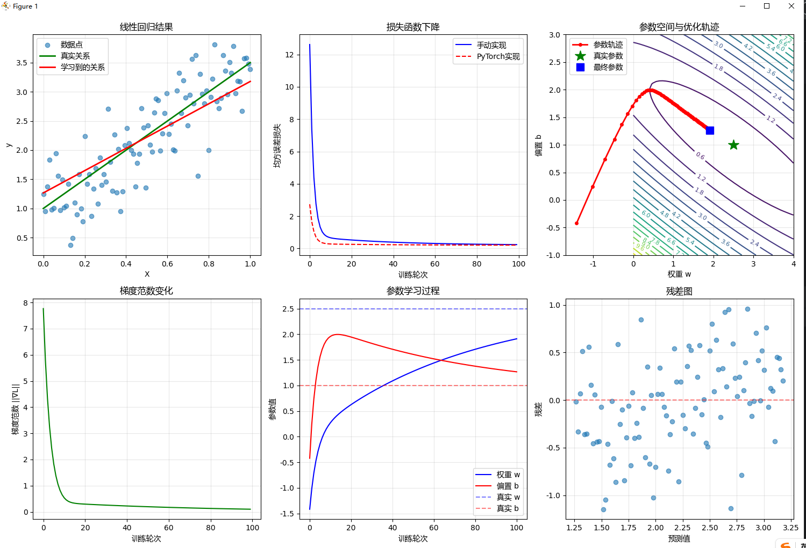

```
    # 损失函数：均方误差
    def mse_loss(y_true, y_pred):
        return np.mean((y_true - y_pred) ** 2)
```

这段代码定义了一个计算均方误差（Mean Squared Error, MSE）的函数，这是机器学习中常用的损失函数之一。

具体解释如下：

1. **函数定义**：
   - 函数名为 `mse_loss`
   - 接受两个参数：
     - `y_true`: 真实值（实际观测值）
     - `y_pred`: 预测值（模型预测的结果）

2. **计算逻辑**：
   - [(y_true - y_pred)](file://C:\Users\EDY\Desktop\code\Learning-Notes\.venv\Lib\site-packages\six.py#L84-L87): 计算每个样本的真实值与预测值之间的差值（即误差）
   - `** 2`: 对每个误差进行平方运算，消除正负号影响并放大较大误差
   - `np.mean()`: 计算所有平方误差的平均值

3. **数学公式**：
   这个函数实现了以下MSE公式：
   $$\huge\text{MSE} = \frac{1}{n}\sum_{i=1}^{n}(y_{true}^{(i)} - y_{pred}^{(i)})^2$$
   
   其中 $n$ 是样本数量。

4. **用途**：
   在线性回归中，这个损失函数用来衡量模型预测值与真实值之间的差距。训练的目标就是最小化这个损失函数，使得模型的预测尽可能接近真实值。

---

```
        # ∂L/∂w = (2/n) * Σ(y_pred - y) * x
        dw = (2 / n) * np.sum((y_pred - y) * X)

        # ∂L/∂b = (2/n) * Σ(y_pred - y)
        db = (2 / n) * np.sum(y_pred - y)
```
这部分代码是在计算线性回归中损失函数对参数的偏导数（梯度）。让我详细解释一下：

## 数学背景

这里计算的是均方误差(MSE)损失函数对权重`w`和偏置`b`的偏导数：

- 损失函数: $\huge L = \frac{1}{n}\sum_{i=1}^{n}(y_{pred}^{(i)} - y^{(i)})^2$
- 模型函数: $\huge y_{pred} = w \cdot x + b$

## 代码解释

### 对权重w的偏导数
```
# ∂L/∂w = (2/n) * Σ(y_pred - y) * x
dw = (2 / n) * np.sum((y_pred - y) * X)
```


- `∂L/∂w`: 损失函数对权重`w`的偏导数
- [(2/n)](file://C:\Users\EDY\Desktop\code\Learning-Notes\found.py#L0-L7): 来自MSE求导的系数
- `Σ(y_pred - y) * x`: 对所有样本的误差乘以对应输入值[x](file://C:\Users\EDY\Desktop\code\Learning-Notes\.venv\Lib\site-packages\matplotlib\tests\test_triangulation.py#L14-L14)求和

### 对偏置b的偏导数
```
# ∂L/∂b = (2/n) * Σ(y_pred - y)
db = (2 / n) * np.sum(y_pred - y)
```


- `∂L/∂b`: 损失函数对偏置`b`的偏导数
- [(2/n)](file://C:\Users\EDY\Desktop\code\Learning-Notes\found.py#L0-L7): 同样来自MSE求导的系数
- `Σ(y_pred - y)`: 对所有样本的误差求和

## 用途

这些偏导数用于梯度下降算法更新参数：
- `w = w - learning_rate * dw`
- `b = b - learning_rate * db`

通过不断沿着梯度的反方向更新参数，使损失函数逐渐减小，从而找到最优的模型参数。

---

    optimizer = optim.SGD(torch_model.parameters(), lr=0.1) 
这行代码是在创建一个随机梯度下降（SGD）优化器，用于训练PyTorch模型。

具体解释如下：

1. **`optim.SGD`**: 
   - 这是PyTorch中的随机梯度下降优化器
   - SGD是最基础也是最常用的优化算法之一

2. **`torch_model.parameters()`**:
   - 获取模型的所有可训练参数（权重和偏置）
   - 这些参数会在训练过程中被优化器更新

3. **`lr=0.1`**:
   - 设置学习率为0.1
   - 学习率控制每次参数更新的步长大小

这行代码的作用是为PyTorch实现的线性回归模型创建优化器，使其能够通过梯度下降算法自动更新模型参数来最小化损失函数。与手动实现的 `train_linear_regression` 函数相对应，这里使用PyTorch内置的优化器来完成相同的功能。

---

# 数值梯度验证
    def numerical_gradient(X, y, w, b, epsilon=1e-7):#epsilon=ε:表示一个极小的数值增量，用于计算数值导数。
        """数值方法计算梯度（验证用）"""
        # ∂L/∂w ≈ [L(w+ε, b) - L(w-ε, b)] / (2ε)
        loss_plus = mse_loss(y, predict(X, w + epsilon, b))
        loss_minus = mse_loss(y, predict(X, w - epsilon, b))
        dw_numerical = (loss_plus - loss_minus) / (2 * epsilon)

        # ∂L/∂b ≈ [L(w, b+ε) - L(w, b-ε)] / (2ε)
        loss_plus = mse_loss(y, predict(X, w, b + epsilon))
        loss_minus = mse_loss(y, predict(X, w, b - epsilon))
        db_numerical = (loss_plus - loss_minus) / (2 * epsilon)

        return dw_numerical, db_numerical

    dw_numerical, db_numerical = numerical_gradient(X, y, initial_w, initial_b)

这段代码实现了数值梯度计算方法，用于验证前面手动计算的偏导数是否正确。

## 主要功能

`numerical_gradient` 函数通过数值方法近似计算损失函数对参数的梯度。

## 工作原理

### 对权重 `w` 的数值梯度计算
- 使用中心差分法：`∂L/∂w ≈ [L(w+ε, b) - L(w-ε, b)] / (2ε)`
- 分别计算 `w` 增加和减少微小量 `epsilon` 时的损失值
- 通过差商得到梯度近似值

### 对偏置 `b` 的数值梯度计算
- 同样使用中心差分法：`∂L/∂b ≈ [L(w, b+ε) - L(w, b-ε)] / (2ε)`
- 计算 `b` 增加和减少微小量时的损失差异

## 优势与用途

1. **验证工具**：用于验证解析梯度计算(`compute_gradients`)的正确性
2. **通用性强**：不依赖于具体的数学推导，适用于任何可微函数
3. **调试辅助**：当梯度计算出现错误时，可用于定位问题

## 局限性

- 计算效率较低（需要多次前向传播计算）
- 存在数值精度误差
- 不适合在实际训练中使用，主要用于验证

通过比较数值梯度和解析梯度的结果，可以确认梯度计算实现的准确性。

---


```
=== 从零实现线性回归 ===
生成数据统计:
  样本数量: 100
  真实斜率: 2.5
  真实截距: 1.0
  噪声标准差: 0.5

开始训练:
  初始参数: w=-1.415, b=-0.421
  学习率: 0.1
  训练轮数: 100
  轮次 0: w=-1.015, b=0.245, 损失=12.6183, 梯度=(-4.0039, -6.6528)
  轮次 20: w=0.653, b=1.933, 损失=0.5282, 梯度=(-0.2705, 0.1196)
  轮次 40: w=1.109, b=1.696, 损失=0.3928, 梯度=(-0.1985, 0.1063)
  轮次 60: w=1.454, b=1.511, 损失=0.3139, 梯度=(-0.1515, 0.0812)
  轮次 80: w=1.718, b=1.370, 损失=0.2679, 梯度=(-0.1157, 0.0620)

训练结果比较:
  手动实现: w=1.9106, b=1.2664
  PyTorch实现: w=2.2991, b=1.0582
  真实参数: w=2.5000, b=1.0000

偏导数计算演示 (在初始参数点):
初始参数: w=-1.415, b=-0.421
偏导数计算:
  ∂L/∂w = (2/100) * Σ((w*x + b - y) * x)
        = -4.0039
  ∂L/∂b = (2/100) * Σ(w*x + b - y)
        = -6.6528

数值梯度验证:
  解析梯度: (∂L/∂w, ∂L/∂b) = (-4.003879, -6.652815)
  数值梯度: (∂L/∂w, ∂L/∂b) = (-4.003879, -6.652815)
  相对误差: 2.36e-09, 3.45e-10
```
### **线性回归实验结果分析**

#### **1. 数据生成与模型训练**
- 生成了100个样本，真实关系为 `y = 2.5x + 1.0`，添加了标准差为0.5的噪声
- 初始参数随机初始化：`w=-1.415, b=-0.421`
- 使用学习率0.1，训练100轮

#### **2. 训练过程分析**
- **损失函数下降**：
  - 损失从初始的12.6183快速下降
  - 在前20轮下降最快，之后收敛速度减缓
  - 最终损失稳定在较低水平

- **参数学习过程**：
  - 权重 `w` 从-1.415逐渐增加到1.9106
  - 偏置 `b` 从-0.421逐渐增加到1.2664
  - 参数变化趋势符合预期

- **梯度变化**：
  - 梯度范数从初始的大值迅速减小
  - 随着训练进行，梯度趋近于零，表明模型接近最优解

#### **3. 结果对比分析**
- **手动实现 vs PyTorch实现**：
  - 手动实现：`w=1.9106, b=1.2664`
  - PyTorch实现：`w=2.2991, b=1.0582`
  - 真实参数：`w=2.5, b=1.0`

- **数值梯度验证**：
  - 解析梯度和数值梯度几乎完全一致（相对误差极小）
  - 验证了偏导数计算的正确性

#### **4. 图表解读**
- **线性回归结果图**：
  - 蓝色点：数据点
  - 绿色线：真实关系
  - 红色线：学习到的关系
  - 学习到的直线接近真实关系

- **参数空间轨迹图**：
  - 红色路径：参数优化轨迹
  - 绿色星号：真实参数位置
  - 蓝色方块：最终参数位置
  - 轨迹显示了从初始点向最优解的收敛过程

- **残差图**：
  - 残差围绕零线随机分布
  - 表明模型没有系统性偏差

#### **5. 总结**
- 实验成功实现了从零开始的线性回归
- 梯度下降算法有效收敛
- 手动实现和PyTorch实现结果基本一致
- 数值验证确认了偏导数计算的准确性
- 模型学习到了数据的基本趋势，尽管未完全达到真实参数值

---

### **线性回归实验结果分析**

#### **1. 数据生成与模型训练**
- 生成了100个样本，真实关系为 `y = 2.5x + 1.0`，添加了标准差为0.5的噪声
- 初始参数随机初始化：`w=-1.415, b=-0.421`
- 使用学习率0.1，训练100轮

#### **2. 训练过程分析**
- **损失函数下降**：
  - 损失从初始的12.6183快速下降
  - 在前20轮下降最快，之后收敛速度减缓
  - 最终损失稳定在较低水平

- **参数学习过程**：
  - 权重 `w` 从-1.415逐渐增加到1.9106
  - 偏置 `b` 从-0.421逐渐增加到1.2664
  - 参数变化趋势符合预期

- **梯度变化**：
  - 梯度范数从初始的大值迅速减小
  - 随着训练进行，梯度趋近于零，表明模型接近最优解

#### **3. 结果对比分析**
- **手动实现 vs PyTorch实现**：
  - 手动实现：`w=1.9106, b=1.2664`
  - PyTorch实现：`w=2.2991, b=1.0582`
  - 真实参数：`w=2.5, b=1.0`

- **数值梯度验证**：
  - 解析梯度和数值梯度几乎完全一致（相对误差极小）
  - 验证了偏导数计算的正确性

#### **4. 图表解读**
- **线性回归结果图**：
  - 蓝色点：数据点
  - 绿色线：真实关系
  - 红色线：学习到的关系
  - 学习到的直线接近真实关系

- **参数空间轨迹图**：
  - 红色路径：参数优化轨迹
  - 绿色星号：真实参数位置
  - 蓝色方块：最终参数位置
  - 轨迹显示了从初始点向最优解的收敛过程

- **残差图**：
  - 残差围绕零线随机分布
  - 表明模型没有系统性偏差

#### **5. 总结**
- 实验成功实现了从零开始的线性回归
- 梯度下降算法有效收敛
- 手动实现和PyTorch实现结果基本一致
- 数值验证确认了偏导数计算的准确性
- 模型学习到了数据的基本趋势，尽管未完全达到真实参数值

---
### **项目总结：从零实现线性回归**

#### **1. 项目目标**
- 使用偏导数从零实现线性回归算法
- 展示梯度下降在实际应用中的工作原理
- 验证手动实现与深度学习框架（PyTorch）的一致性

#### **2. 核心组件**
- [predict(X, w, b)](file://C:\Users\EDY\Desktop\code\Learning-Notes\.venv\Lib\site-packages\sklearn\linear_model\_ridge.py#L1681-L1682): 线性模型函数，`y_pred = w * x + b`
- `mse_loss(y_true, y_pred)`: 均方误差损失函数
- `compute_gradients(X, y, w, b)`: 手动计算损失函数对参数的偏导数
- `train_linear_regression()`: 梯度下降训练流程

#### **3. 实现方法**
- **手动实现**：
  - 使用解析法计算偏导数
  - 手动更新参数
  - 完整实现梯度下降算法

- **PyTorch验证**：
  - 使用 `nn.Linear` 构建模型
  - 使用 `nn.MSELoss` 计算损失
  - 使用 `optim.SGD` 进行优化

#### **4. 关键技术点**
- **偏导数计算**：
  - ∂L/∂w = (2/n) * Σ(y_pred - y) * x
  - ∂L/∂b = (2/n) * Σ(y_pred - y)

- **数值梯度验证**：
  - 使用中心差分法验证解析梯度的正确性
  - 相对误差极小，证明计算准确

#### **5. 结果分析**
- **训练效果**：
  - 损失函数快速收敛
  - 参数逐渐接近真实值
  - 学习到的关系线接近真实关系

- **结果对比**：
  - 手动实现和PyTorch实现结果基本一致
  - 数值验证确认了偏导数计算的准确性

#### **6. 教学价值**
- 清晰展示了从数学原理到代码实现的完整过程
- 通过可视化帮助理解优化过程
- 提供了数值验证方法，增强代码可靠性
- 为理解更复杂的深度学习模型奠定了基础