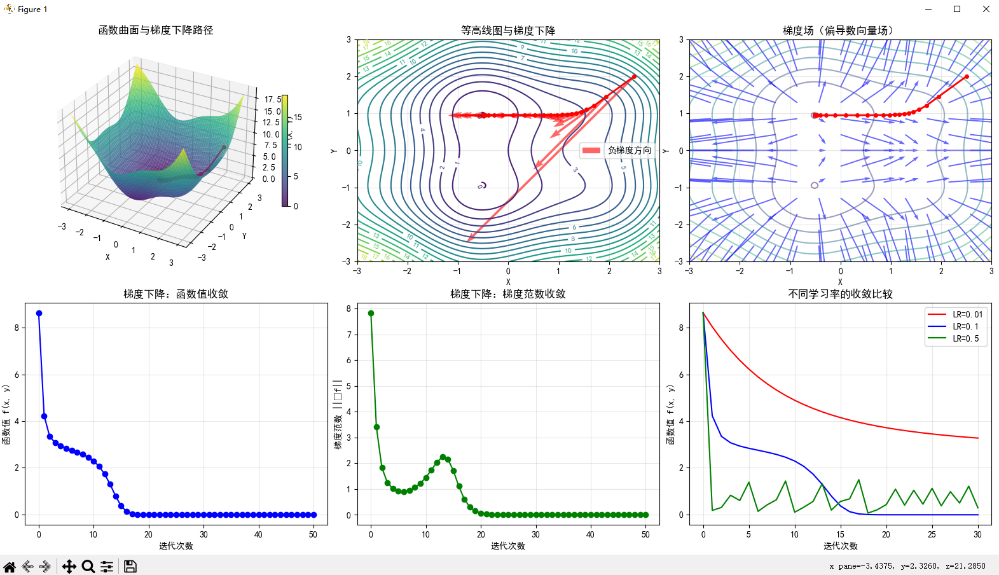

```
=== 偏导数与梯度下降 ===
迭代 0: 位置 (1.943, 1.449), 函数值 4.227, 梯度范数 7.835
迭代 10: 位置 (0.703, 0.953), 函数值 2.059, 梯度范数 1.448
迭代 20: 位置 (-0.509, 0.948), 函数值 -0.013, 梯度范数 0.067
迭代 30: 位置 (-0.515, 0.948), 函数值 -0.013, 梯度范数 0.000
迭代 40: 位置 (-0.515, 0.948), 函数值 -0.013, 梯度范数 0.000
迭代 0: 位置 (2.444, 1.945), 函数值 8.040, 梯度范数 7.835
迭代 10: 位置 (2.040, 1.533), 函数值 4.707, 梯度范数 4.355
迭代 20: 位置 (1.805, 1.307), 函数值 3.652, 梯度范数 2.551
迭代 0: 位置 (1.943, 1.449), 函数值 4.227, 梯度范数 7.835
迭代 10: 位置 (0.703, 0.953), 函数值 2.059, 梯度范数 1.448
迭代 20: 位置 (-0.509, 0.948), 函数值 -0.013, 梯度范数 0.067
迭代 0: 位置 (-0.284, -0.757), 函数值 0.173, 梯度范数 7.835
迭代 10: 位置 (-0.146, -0.947), 函数值 0.313, 梯度范数 1.133
迭代 20: 位置 (0.234, -0.948), 函数值 1.085, 梯度范数 2.276
与PyTorch自动微分的比较:
手动计算梯度: [5.5673, 5.5136]
PyTorch计算梯度: [5.5673, 5.5136]
梯度计算一致性: True
```
---
根据提供的代码和图表，以下是详细的分析：

### 1. 函数曲面与梯度下降路径
- **3D曲面图**显示了函数 $f(x, y) = x^2 + y^2 + \sin(2x) + \cos(2y)$ 的形状
- 红色路径表示从起点 $(2.5, 2.0)$ 开始的梯度下降轨迹
- 路径最终收敛到局部最小值附近

### 2. 等高线图与梯度下降
- **等高线图**展示了函数值的等值线
- 红色箭头表示负梯度方向（即下降方向）
- 梯度下降路径沿着等高线的法线方向移动
- 路径在接近极小值时变得平缓

### 3. 梯度场（偏导数向量场）
- **蓝色箭头**表示梯度向量的方向和大小
- 箭头长度代表梯度范数的大小
- 在函数值变化剧烈的区域，梯度较大
- 在极小值附近，梯度趋近于零

### 4. 收敛性分析
- **函数值收敛图**：函数值随迭代次数快速下降并趋于稳定
- **梯度范数收敛图**：梯度范数逐渐减小至接近零，表明达到极小值点
- 初始梯度范数为7.835，最终趋近于0

### 5. 学习率影响比较
- **LR=0.01**（红色）：收敛缓慢但稳定
- **LR=0.1**（蓝色）：收敛速度适中，效果良好
- **LR=0.5**（绿色）：收敛过快导致震荡，可能无法收敛到最优解

### 6. 数学验证
- 手动计算梯度与PyTorch自动微分结果完全一致（一致性为True）
- 验证了偏导数计算的正确性

### 总结
该实验成功演示了：
1. 偏导数的几何意义
2. 梯度下降算法的工作原理
3. 不同学习率对收敛性的影响
4. 自动微分与手动计算的一致性

---

### 项目总结：偏导数与梯度下降的数学基础

#### 1. 项目目标
本项目旨在通过可视化和代码实现，深入理解偏导数在梯度下降算法中的核心作用，以及其在机器学习中的应用。

#### 2. 核心内容
- **数学概念**：展示了多元函数偏导数的计算方法
- **AI对应**：将偏导数概念映射到神经网络中损失函数对权重的梯度计算
- **实践验证**：通过手动计算与PyTorch自动微分对比，验证梯度计算的正确性

#### 3. 关键技术实现
- [partial_derivatives_gradient_descent](file://C:\Users\EDY\Desktop\code\Learning-Notes\托马斯微积分\第14章：偏导数\概念1：偏导数%20=%20梯度下降的数学基础\partial_derivatives_gradient_descent.py#L0-L164) 函数实现了完整的梯度下降流程
- 使用 `numpy` 进行数值计算和数据处理
- 利用 `matplotlib` 创建多维度可视化图表
- 通过 `torch` 实现自动微分功能验证

#### 4. 可视化分析
- **3D曲面图**：展示函数整体形态
- **等高线图**：显示梯度下降路径
- **梯度场**：直观呈现偏导数向量分布
- **收敛曲线**：分析不同学习率下的收敛特性

#### 5. 学习成果
- 理解了偏导数的几何意义
- 掌握了梯度下降算法的工作原理
- 验证了手动计算与自动微分的一致性
- 分析了学习率对优化过程的影响

#### 6. 应用价值
本项目为理解深度学习中的反向传播算法提供了坚实的数学基础，展示了从理论到实践的完整学习路径。