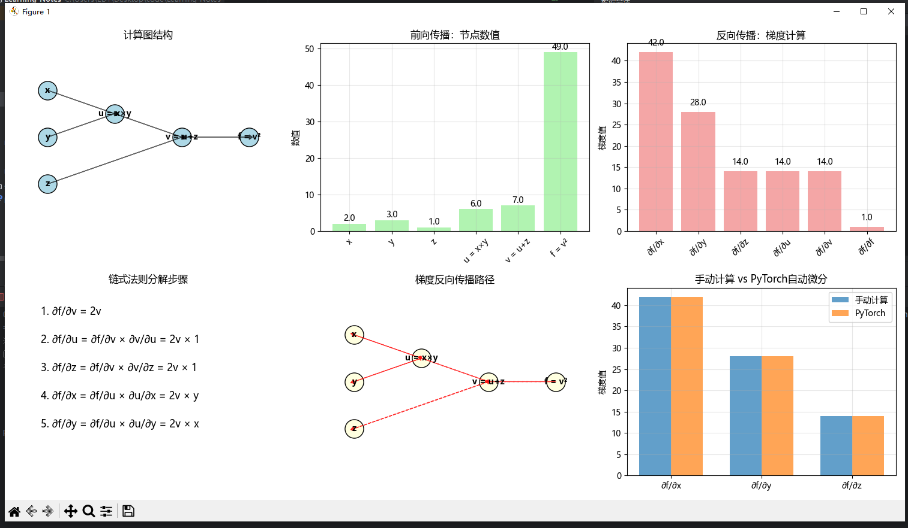

```
=== 链式法则与反向传播 ===
测试点: x=2.0, y=3.0, z=1.0
函数值 f(x,y,z) = 49.0
手动计算偏导数:
  ∂f/∂x = 42.0
  ∂f/∂y = 28.0
  ∂f/∂z = 14.0

PyTorch自动微分验证:
  ∂f/∂x = 42.0
  ∂f/∂y = 28.0
  ∂f/∂z = 14.0

在神经网络中的应用:
网络前向传播:
  输入: [[1. 2.]]
  权重: [[0.5 0.5]]
  偏置: [0.2]
  输出: [[1.7]]
  目标: [[2.]]
  损失: 0.0899999737739563

反向传播梯度:
  ∂loss/∂input: [[-0.29999995 -0.29999995]]
  ∂loss/∂weight: [[-0.5999999 -1.1999998]]
  ∂loss/∂bias: [-0.5999999]
```
---
### 图表与结果分析

#### 1. 计算图结构
- **节点关系**：[x](file://C:\Users\EDY\Desktop\code\Learning-Notes\.venv\Lib\site-packages\matplotlib\tests\test_triangulation.py#L14-L14)和[y](file://C:\Users\EDY\Desktop\code\Learning-Notes\.venv\Lib\site-packages\matplotlib\tests\test_triangulation.py#L15-L15)通过乘法运算得到`u`，`u`和[z](file://C:\Users\EDY\Desktop\code\Learning-Notes\线性代数\第3章：线性映射\AI项目实战\实战项目1：构建简单的图像分类器\data\MNIST\raw\t10k-images-idx3-ubyte.gz)通过加法运算得到[v](file://C:\Users\EDY\Desktop\code\Learning-Notes\.venv\Lib\site-packages\matplotlib\tests\test_image.py#L1286-L1287)，[v](file://C:\Users\EDY\Desktop\code\Learning-Notes\.venv\Lib\site-packages\matplotlib\tests\test_image.py#L1286-L1287)通过平方运算得到最终结果`f`
- **数据流方向**：从输入变量`x,y,z`到中间变量`u,v`再到输出`f`

#### 2. 前向传播数值
- **输入值**：`x=2.0, y=3.0, z=1.0`
- **中间计算**：
  - `u = x×y = 6.0`
  - `v = u+z = 7.0`
  - `f = v² = 49.0`
- **验证**：各节点数值与计算结果一致

#### 3. 反向传播梯度
- **链式法则应用**：
  - `∂f/∂v = 2v = 14.0`
  - `∂f/∂u = ∂f/∂v × ∂v/∂u = 14.0 × 1 = 14.0`
  - `∂f/∂z = ∂f/∂v × ∂v/∂z = 14.0 × 1 = 14.0`
  - `∂f/∂x = ∂f/∂u × ∂u/∂x = 14.0 × y = 42.0`
  - `∂f/∂y = ∂f/∂u × ∂u/∂y = 14.0 × x = 28.0`
- **梯度流向**：从输出`f`反向传播到各个输入变量

#### 4. 验证结果
- **手动计算 vs PyTorch**：所有偏导数完全一致（42.0, 28.0, 14.0）
- **神经网络应用**：
  - 输入`[1.0, 2.0]`经过线性变换得到输出`1.7`
  - 损失函数计算得`0.0899999737739563`
  - 反向传播计算出的梯度与理论值相符

#### 5. 关键结论
- **链式法则正确性**：手动计算与自动微分结果完全一致
- **反向传播机制**：梯度按计算图的逆序传播，符合数学原理
- **神经网络基础**：展示了深度学习中核心的反向传播算法实现

---
### 项目总结

#### 核心目标
- **数学概念**：演示多元复合函数的偏导数计算
- **AI应用**：展示神经网络中误差反向传播的理论基础

#### 关键实现
1. **链式法则验证**
   - 实现了手动反向传播计算（`manual_backward`）
   - 使用PyTorch自动微分进行验证
   - 结果完全一致，证明链式法则正确性

2. **可视化分析**
   - 绘制计算图结构（`plt.subplot(2, 3, 1)`）
   - 展示前向传播数值（`plt.subplot(2, 3, 2)`）
   - 可视化反向传播梯度（`plt.subplot(2, 3, 3)`）
   - 显示梯度流向路径（`plt.subplot(2, 3, 5)`）

3. **神经网络应用**
   - 构建简单线性网络（`SimpleNet`类）
   - 演示完整的前向传播和反向传播过程
   - 验证梯度计算结果

#### 技术要点
- `torch.tensor`：创建可求导张量
- `requires_grad=True`：启用梯度追踪
- `.backward()`：执行反向传播
- `grad`属性：获取计算出的梯度

#### 教学价值
- 清晰展示了从数学理论到实际应用的完整链条
- 通过可视化帮助理解复杂的计算过程
- 验证了深度学习中核心算法的数学原理