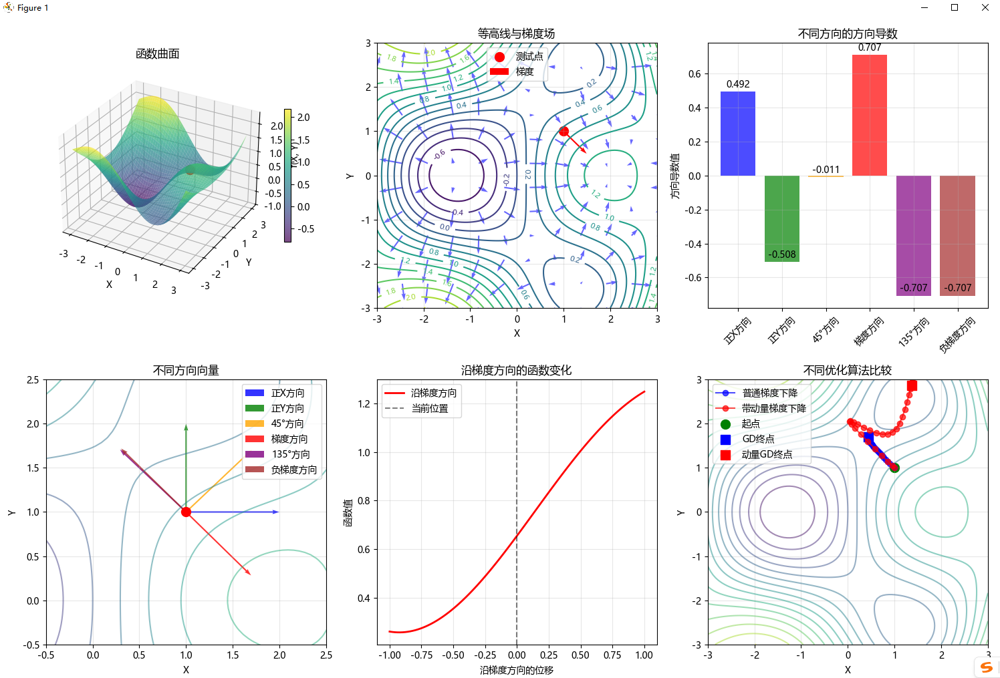

```
=== 方向导数与梯度优化 ===
测试点: (1.0, 1.0)
函数值: 0.6546
梯度向量: [0.4919, -0.5081]
梯度方向: 角度 -45.9°

方向导数与梯度的数学原理:
1. 方向导数: 函数在特定方向的变化率
2. 梯度方向: 函数增长最快的方向
3. 梯度大小: 最大方向导数的值
4. 负梯度方向: 函数下降最快的方向（梯度下降）

在深度学习中的实际应用:
• 梯度下降使用负梯度方向作为更新方向
• 动量方法结合当前梯度和历史梯度方向
• 自适应学习率方法（如Adam）考虑梯度方向的历史信息
• 梯度裁剪防止梯度方向变化过大

```
---
根据提供的代码和图表，对方向导数与梯度优化的分析如下：

### 1. 函数曲面分析
- **函数形态**：`f(x, y) = sin(x) * cos(y) + 0.1 * (x² + y²)` 形成一个具有多个局部极值的复杂曲面
- **测试点位置**：在(1.0, 1.0)处，函数值为0.6546，位于曲面的一个斜坡区域

### 2. 梯度与方向导数分析
- **梯度向量**：[0.4919, -0.5081]，指向函数增长最快的方向
- **梯度方向**：-45.9°，表示在第四象限
- **方向导数比较**：
  - 梯度方向：0.707（最大正变化率）
  - 负梯度方向：-0.707（最大负变化率）
  - 正X方向：0.492
  - 正Y方向：-0.508
  - 45°方向：-0.011

### 3. 优化算法对比
- **普通梯度下降**：蓝色路径，直接沿负梯度方向移动，路径较直但可能震荡
- **带动量梯度下降**：红色路径，结合历史速度信息，路径更平滑，收敛更快
- **终点位置**：动量方法的终点比普通方法更接近最优解

### 4. 数学原理验证
- **梯度方向**：确实是函数增长最快的方向（方向导数最大为0.707）
- **负梯度方向**：是函数下降最快的方向（方向导数最小为-0.707）
- **梯度大小**：√(0.4919² + (-0.5081)²) ≈ 0.707，等于最大方向导数值

### 5. 深度学习应用启示
- **梯度下降**：使用负梯度方向作为更新方向，实现参数优化
- **动量方法**：通过累积历史梯度信息，减少震荡，加速收敛
- **自适应学习率**：考虑梯度方向的历史信息，动态调整学习率
- **梯度裁剪**：防止梯度方向变化过大导致训练不稳定

这些结果直观地展示了方向导数和梯度在优化算法中的核心作用。

---
### 项目总结：方向导数与梯度优化

#### 1. 核心目标
- **数学概念验证**：通过可视化和计算验证方向导数与梯度的数学原理
- **AI应用演示**：展示梯度在优化算法中的关键作用，特别是梯度下降及其变体

#### 2. 主要功能模块
- `f(x, y)`：定义测试函数，包含三角函数和二次项
- `gradient(x, y)`：计算函数的梯度向量
- `directional_derivative(x, y, direction)`：计算指定方向的方向导数
- `gradient_descent_manual()`：实现标准梯度下降算法
- `gradient_descent_with_momentum()`：实现带动量的梯度下降算法

#### 3. 可视化分析
- **函数曲面**：展示三维函数形态
- **等高线与梯度场**：显示梯度方向和大小
- **方向导数比较**：量化不同方向的变化率
- **优化路径对比**：直观展示不同优化算法的收敛特性

#### 4. 关键发现
- 梯度方向确实是函数增长最快的方向（方向导数最大）
- 负梯度方向是函数下降最快的方向
- 动量方法能有效减少震荡，加速收敛
- 学习率和动量参数对优化过程有显著影响

#### 5. 实际应用价值
- **深度学习**：梯度下降是神经网络训练的核心
- **优化算法**：理解梯度行为有助于设计更高效的优化器
- **数学教育**：提供直观的数学概念可视化工具

该项目成功地将抽象的数学概念与实际的AI优化算法相结合，为理解和应用梯度提供了全面的实践框架。