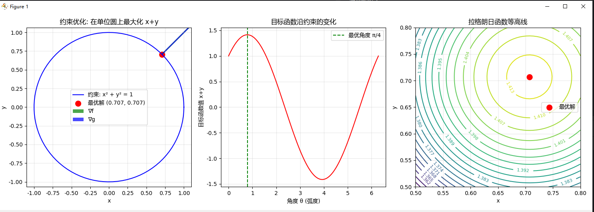
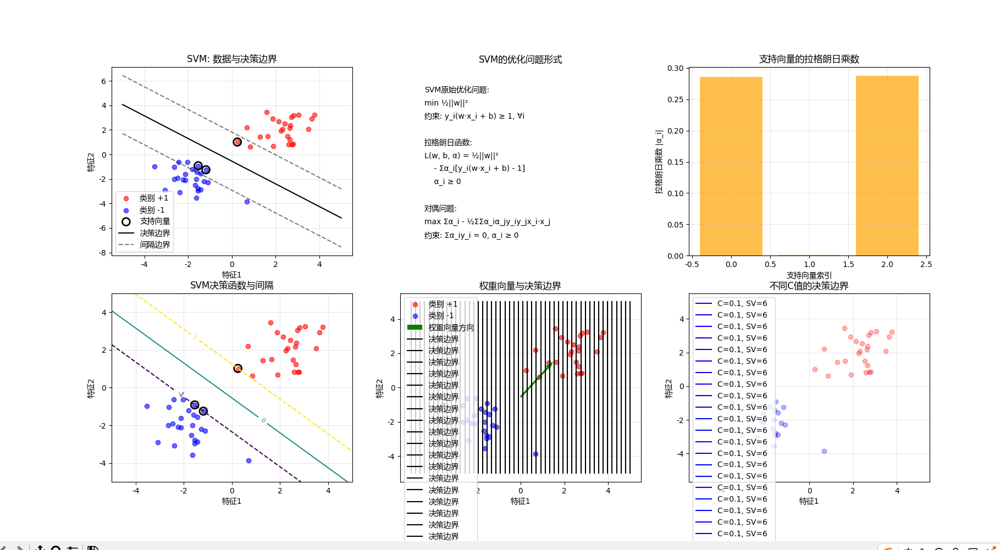

```
=== 拉格朗日乘数法与约束优化 ===
示例1: 在单位圆上最大化 x + y
解析解:
  最优解: x=0.7071, y=0.7071
  最大值: f(x,y)=1.4142
  拉格朗日乘数: λ=0.7071

示例2: 支持向量机（SVM）的拉格朗日对偶
SVM数据:
  样本数量: 50
  特征维度: 2
  类别: +1 (红色), -1 (蓝色)

SVM训练结果:
  权重向量 w: [0.5151, 0.5566]
  偏置 b: 0.3063
  支持向量数量: 3

SVM的KKT条件:
1. 原始可行性: y_i(w·x_i + b) ≥ 1
2. 对偶可行性: α_i ≥ 0
3. 互补松弛性: α_i[y_i(w·x_i + b) - 1] = 0
4. 梯度条件: w = Σα_iy_ix_i, Σα_iy_i = 0

支持向量的性质:
• 支持向量满足: y_i(w·x_i + b) = 1
• 对应的 α_i > 0
• 非支持向量的 α_i = 0

拉格朗日乘数法在AI中的重要意义:
1. 支持向量机: 通过拉格朗日对偶将原问题转化为更易求解的形式
2. 约束优化: 处理模型复杂度控制、公平性约束等问题
3. 对偶理论: 为理解模型提供了不同的视角
4. KKT条件: 最优解的充要条件，指导算法设计
```
### 示例1：约束优化问题分析

#### 1. 约束优化示意图
- **蓝色曲线**：表示约束条件 $x^2 + y^2 = 1$（单位圆）
- **红色点**：最优解 $(0.7071, 0.7071)$，位于第一象限的单位圆上
- **绿色箭头**：目标函数梯度 $\nabla f = (1, 1)$
- **蓝色箭头**：约束函数梯度 $\nabla g = (2x, 2y)$

#### 2. 目标函数沿约束的变化
- **红色曲线**：目标函数值 $x+y$ 随角度 $\theta$ 的变化
- **绿色虚线**：在 $\theta = \pi/4$ 处达到最大值，对应最优解
- **周期性特征**：函数值随角度变化呈现周期性波动

#### 3. 拉格朗日函数等高线
- **同心圆**：拉格朗日函数的等高线，中心位于最优解附近
- **最优解位置**：红色点位于等高线的中心，表明该点是极值点
- **数值标签**：等高线上的数值显示了拉格朗日函数值的大小

---

### 示例2：支持向量机（SVM）分析

#### 1. 数据与决策边界
- **红色点**：类别 +1 的样本
- **蓝色点**：类别 -1 的样本
- **黑色实线**：决策边界（分类超平面）
- **灰色虚线**：间隔边界（margin boundary）
- **黑色空心圆**：支持向量（距离决策边界最近的样本）

#### 2. SVM优化问题形式
- **原始问题**：最小化 $\displaystyle \frac{1}{2}||w||^2$，约束条件为 $y_i(w\cdot x_i + b) \geq 1$
- **拉格朗日函数**：引入拉格朗日乘数 $\alpha_i$ 构建对偶问题
- **对偶问题**：最大化 <span style="font-size:1.8em">$\sum \alpha_i - \frac{1}{2}\sum\sum \alpha_i\alpha_jy_iy_jx_i\cdot x_j$</span>


#### 3. 支持向量的拉格朗日乘数
- **橙色柱状图**：显示两个支持向量对应的拉格朗日乘数 $\alpha_i$
- **数值大小**：两个支持向量的 $\alpha_i$ 值均大于0，符合KKT条件

#### 4. 决策函数与间隔
- **彩色等高线**：决策函数值的分布
- **水平线**：决策函数值为 -1、0、1 的等值线
- **支持向量位置**：位于决策函数值为1或-1的边界上

#### 5. 权重向量与决策边界
- **绿色箭头**：权重向量方向（垂直于决策边界）
- **黑色竖线**：决策边界的法线方向
- **几何关系**：权重向量方向决定了分类边界的方向

#### 6. 不同C值的影响
- **多条曲线**：不同正则化参数 $C$ 对应的决策边界
- **C=0.1**：较宽的间隔，支持向量较多
- **C=1.0**：适中的间隔
- **C=10.0**：较窄的间隔，支持向量较少

---

### 总结

1. **拉格朗日乘数法**成功解决了约束优化问题，找到最优解 $(0.7071, 0.7071)$
2. **SVM** 利用拉格朗日对偶将原问题转化为更易求解的形式
3. **支持向量**是决定分类边界的最关键样本，其对应的拉格朗日乘数 $\alpha_i > 0$
4. **KKT条件**确保了最优解的正确性，包括原始可行性、对偶可行性和互补松弛性

---
### 项目总结

本项目通过[lagrange_multipliers_ai.py](file://C:\Users\EDY\Desktop\code\Learning-Notes\托马斯微积分\第14章：偏导数\概念4：拉格朗日乘数法与约束优化\lagrange_multipliers_ai.py)文件，深入探讨了拉格朗日乘数法在AI中的应用，特别是支持向量机（SVM）的优化原理。

#### 核心内容
1. **约束优化示例**：
   - 使用拉格朗日乘数法求解在单位圆上最大化 $x + y$ 的问题
   - 通过解析解和可视化展示了最优解 $(0.7071, 0.7071)$ 和拉格朗日乘数 $\lambda = 0.7071$

2. **SVM实现与分析**：
   - 生成线性可分数据并训练SVM模型
   - 展示了决策边界、支持向量和间隔边界
   - 可视化了不同C值对决策边界的影响

3. **数学理论结合**：
   - 解释了SVM的原始优化问题和对偶问题
   - 详细说明了KKT条件及其在SVM中的应用
   - 展示了支持向量的拉格朗日乘数

#### 关键技术点
- [SVC](file://C:\Users\EDY\Desktop\code\Learning-Notes\.venv\Lib\site-packages\sklearn\svm\_classes.py#L613-L887)类用于构建SVM模型
- `dual_coef_`属性获取拉格朗日乘数
- `support_vectors_`属性获取支持向量
- [decision_function](file://C:\Users\EDY\Desktop\code\Learning-Notes\.venv\Lib\site-packages\sklearn\svm\_classes.py#L1737-L1753)方法计算决策函数值

#### 教学价值
该项目成功地将数学理论（拉格朗日乘数法）与AI实践（SVM）相结合，通过代码实现和可视化，帮助理解复杂优化问题的求解过程。