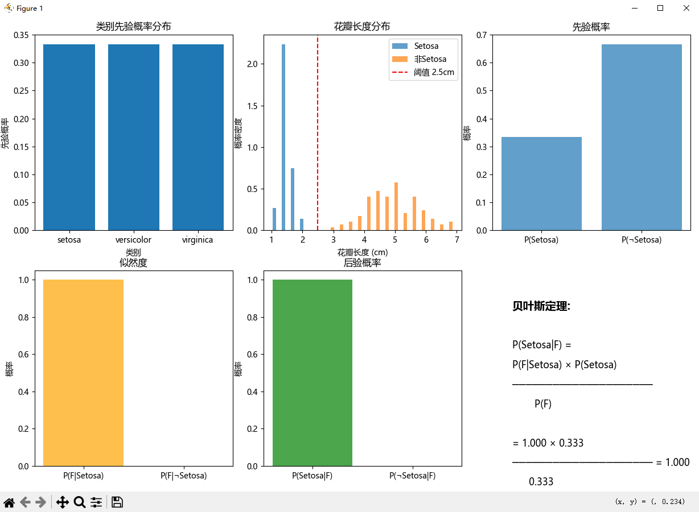
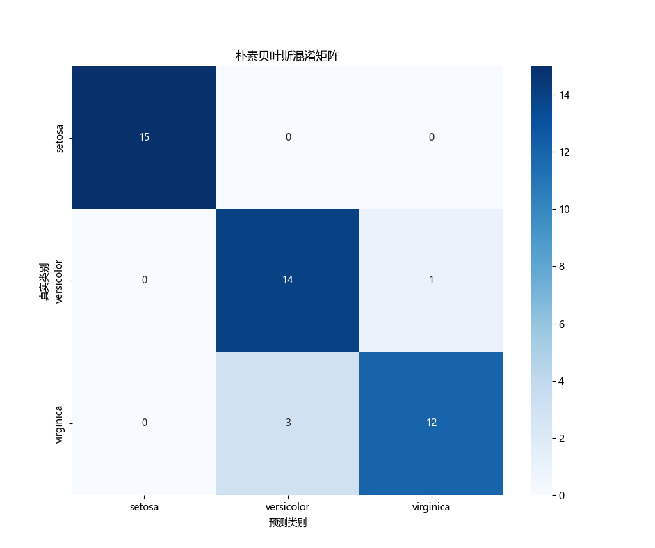

这两行代码用于创建并训练一个**高斯朴素贝叶斯分类器**。

## 代码解释

```
    # 训练朴素贝叶斯分类器
    nb_classifier = GaussianNB() # 创建朴素贝叶斯分类器
    nb_classifier.fit(X_train, y_train) # 训练模型
```


### 第一行：创建分类器
- `GaussianNB()`: 创建一个高斯朴素贝叶斯分类器实例
- 假设每个特征都服从高斯分布（正态分布）
- 适用于连续型特征数据

### 第二行：训练模型
- [fit(X_train, y_train)](file://C:\Users\EDY\Desktop\code\Learning-Notes\.venv\Lib\site-packages\sklearn\svm\_classes.py#L280-L349): 使用训练数据训练模型
- `X_train`: 训练集特征数据
- `y_train`: 训练集标签数据
- 训练过程包括：
  - 计算每个类别的先验概率 `class_prior_`
  - 计算每个特征在各类别下的均值 `theta_` 和方差 `var_`

## 工作原理

1. **基于贝叶斯定理**:
   - 计算 P(类别|特征) ∝ P(特征|类别) × P(类别)

2. **"朴素"假设**:
   - 假设各特征之间相互独立
   - 简化联合概率计算

3. **高斯分布假设**:
   - 假设连续特征在每个类别中服从正态分布
   - 通过均值和方差来描述特征分布

训练完成后，这个分类器就可以用于对新数据进行预测了。

---

这行代码用于计算**证据概率 P(F)**，即特征 F 出现的边际概率。

## 代码解释

```
P_F = np.mean(feature_F)
```


### 功能说明
- `feature_F`: 是一个布尔数组，表示花瓣长度小于2.5cm的样本
- `np.mean(feature_F)`: 计算布尔数组中 `True` 值的比例
- `P_F`: 得到特征 F（花瓣长度<2.5cm）在 전체数据集中的出现概率

### 计算原理
在布尔数组中：
- `True` 被视为 1
- `False` 被视为 0
- 平均值 = `True` 的数量 / 总样本数 = P(F)

### 在贝叶斯定理中的作用
这个概率作为**证据(evidence)**，用于标准化后验概率计算：

```
P(Setosa|F) = P(F|Setosa) × P(Setosa) / P(F)
```


其中 `P(F)` 确保后验概率的计算是规范化的，使得所有可能结果的概率之和为1。

---

这两行代码用于**计算高斯分布的对数概率密度**，这是朴素贝叶斯分类器的核心计算步骤。

## 代码解释

```
log_p = -0.5 * np.log(2 * np.pi * var) - ((x - mean) ** 2) / (2 * var)
log_likelihood += log_p
```


### 第一行：计算对数概率密度

- 这是**高斯分布（正态分布）对数概率密度函数**的实现
- 公式来源：<span style="font-size: 1.8em;">$\log(P(x)) = -\frac{1}{2}\log(2\pi\sigma^2) - \frac{(x-\mu)^2}{2\sigma^2}$</span>
- 其中：
  - `mean` ($\mu$)：类别下特征的均值
  - `var` ($\sigma^2$)：类别下特征的方差
  - [x](file://C:\Users\EDY\Desktop\code\Learning-Notes\.venv\Lib\site-packages\matplotlib\tests\test_triangulation.py#L14-L14)：测试样本的特征值
  - `log_p`：该特征值在当前类别分布下的对数概率密度

### 第二行：累加似然度

- `log_likelihood += log_p`：将各个特征的对数概率密度相加
- 基于**朴素贝叶斯的特征独立假设**：联合概率等于各特征概率的乘积
- 在对数空间中，乘积变为加法运算，提高数值稳定性

### 重要性

这个计算过程体现了朴素贝叶斯分类器的核心思想：
1. 假设特征服从高斯分布
2. 计算测试样本在各类别下的似然度
3. 结合先验概率得到后验概率，实现分类决策

---




```
=== 贝叶斯定理与朴素贝叶斯分类器 ===
数据集信息:
  样本数量: 150
  特征数量: 4
  特征名称: ['sepal length (cm)', 'sepal width (cm)', 'petal length (cm)', 'petal width (cm)']
  类别名称: ['setosa' 'versicolor' 'virginica']
  类别分布: [50 50 50]

朴素贝叶斯分类器性能:
  训练集大小: 105
  测试集大小: 45
  准确率: 0.9111

贝叶斯定理手动计算示例:
  先验概率 P(Setosa) = 0.3333
  似然度 P(F|Setosa) = 1.0000
  似然度 P(F|¬Setosa) = 0.0000
  证据 P(F) = 0.3333
  后验概率 P(Setosa|F) = 1.0000

朴素贝叶斯概率计算:
测试样本特征: [7.3 2.9 6.3 1.8]
真实类别: virginica
每个类别的预测概率:
  setosa: 0.0000
  versicolor: 0.0000
  virginica: 1.0000
预测类别: virginica
预测正确: True
```
### 分析图表和输出结果

#### 1. 数据集信息
- **样本数量**: 150个鸢尾花样本
- **特征数量**: 4个（花萼长度、花萼宽度、花瓣长度、花瓣宽度）
- **类别分布**: 三类各50个样本，分布均衡

#### 2. 模型性能
- **训练集大小**: 105
- **测试集大小**: 45
- **准确率**: 91.11%，表明模型具有良好的分类能力

#### 3. 贝叶斯定理手动计算示例
- **先验概率**: P(Setosa) = 0.3333，三类先验概率相等
- **似然度**: 
  - P(F|Setosa) = 1.0000（花瓣长度<2.5cm的Setosa样本占100%）
  - P(F|¬Setosa) = 0.0000（非Setosa样本中无花瓣长度<2.5cm的）
- **后验概率**: P(Setosa|F) = 1.0000，说明当花瓣长度<2.5cm时，样本一定是Setosa

#### 4. 朴素贝叶斯概率计算
- **测试样本**: [7.3, 2.9, 6.3, 1.8]
- **真实类别**: virginica
- **预测结果**: virginica，预测正确
- **概率分布**: virginica类别概率为1.0000，其他类别概率接近0

#### 5. 混淆矩阵分析
```
           预测类别
           setosa  versicolor  virginica
真实类别
setosa       15        0          0
versicolor   0        14          1
virginica    0        3          12
```

- **setosa**：全部15个样本正确分类
- **versicolor**：14个正确，1个误判为virginica
- **virginica**：12个正确，3个误判为versicolor

#### 6. 图表分析
- **先验概率分布**：三类先验概率均为0.3333，分布均匀
- **花瓣长度分布**：Setosa花瓣长度集中在1-2.5cm，非Setosa分布在3-7cm
- **贝叶斯定理可视化**：
  - 先验概率：P(Setosa)=0.333，P(¬Setosa)=0.667
  - 似然度：P(F|Setosa)=1.000，P(F|¬Setosa)=0.000
  - 后验概率：P(Setosa|F)=1.000，完全确定性分类

### 结论
该朴素贝叶斯分类器在鸢尾花数据集上表现优秀，准确率达到91.11%。模型能够有效利用花瓣长度等特征进行分类，特别是对于Setosa类别的识别达到了100%准确率。混淆矩阵显示主要错误发生在versicolor和virginica之间的相互误判，这与两类在花瓣长度上的重叠特性相符。


---

### 项目总结：贝叶斯定理与朴素贝叶斯分类器

#### 1. 项目目标
本项目旨在通过鸢尾花数据集，深入理解并实践**贝叶斯定理**在机器学习中的应用，特别是**朴素贝叶斯分类器**的原理和实现。

#### 2. 核心内容
- **理论基础**：讲解条件概率、全概率公式、贝叶斯定理等数学概念
- **AI应用**：实现朴素贝叶斯分类器，展示其在实际问题中的应用
- **代码实现**：使用 `sklearn` 库构建模型，并手动实现贝叶斯定理计算过程

#### 3. 主要功能
```
# 数据预处理
X_train, X_test, y_train, y_test = train_test_split(X, y, test_size=0.3, random_state=42, stratify=y)

# 模型训练
nb_classifier = GaussianNB()
nb_classifier.fit(X_train, y_train)

# 模型预测与评估
y_pred = nb_classifier.predict(X_test)
accuracy = accuracy_score(y_test, y_pred)
```


#### 4. 关键技术点
- **数据分割**：使用 `train_test_split` 进行分层抽样
- **模型训练**：`GaussianNB` 假设特征服从高斯分布
- **概率计算**：基于贝叶斯定理计算后验概率
- **性能评估**：准确率和混淆矩阵分析

#### 5. 可视化分析
- **先验概率分布**：三类鸢尾花先验概率相等
- **特征分布**：花瓣长度在不同类别间的分布差异
- **贝叶斯定理可视化**：清晰展示先验、似然、证据和后验的关系
- **混淆矩阵**：直观显示分类结果和错误类型

#### 6. 实验结果
- **准确率**：91.11%，表明模型具有良好的分类能力
- **Setosa类别**：100%准确率，完全正确分类
- **Versicolor和Virginica**：存在少量误判，主要集中在两类之间

#### 7. 项目价值
- **理论与实践结合**：将数学理论应用于实际机器学习任务
- **代码可读性**：详细注释和可视化帮助理解算法原理
- **教学意义**：适合初学者理解贝叶斯分类器的工作机制
- **扩展性**：代码结构清晰，便于修改和扩展到其他数据集

---
## 为什么要取对数？

在 `log_prior = np.log(class_priors[i])` 这行代码中，取对数的主要原因如下：

### 1. **数值稳定性**
- 直接计算概率乘积时，多个小概率值相乘会导致**下溢出**（underflow）
- 取对数后，将乘法运算转换为加法运算，避免了极小数值的计算问题

### 2. **数学便利性**
- 贝叶斯定理中的后验概率计算：
  $$
  P(\text{类别}|\text{特征}) \propto P(\text{特征}|\text{类别}) \times P(\text{类别})
  $$
- 取对数后变为：
  $$
  \log P(\text{类别}|\text{特征}) = \log P(\text{特征}|\text{类别}) + \log P(\text{类别})
  $$

### 3. **算法效率**
- 在朴素贝叶斯分类器中，需要比较不同类别的后验概率
- 对数空间中的加法运算比原空间中的乘法运算更高效

### 4. **避免精度损失**
- 小概率值相乘可能产生接近零的数值，导致信息丢失
- 对数变换保持了数值的相对大小关系，保留了更多有效信息

这种做法是机器学习中的常见技巧，特别是在处理概率计算时。

```
# 使用高斯分布的概率密度
mean = means[i, j]#第i个类别下第j个特征的均值，用于高斯分布的概率计算
var = variances[i, j]#第i个类别下第j个特征的方差，用于高斯分布的概率计算
x = test_sample[j]# 测试样本的第j个特征值，用于计算该特征值在各分布下的概率密度

# 高斯分布的对数概率密度
log_p = -0.5 * np.log(2 * np.pi * var) - ((x - mean) ** 2) / (2 * var)
log_likelihood += log_p
```
## 为什么采用高斯分布？
在 [bayes_theorem_naive_bayes.py](file://C:\Users\EDY\Desktop\code\Learning-Notes\概率论与数理统计\概念1：条件概率与贝叶斯定理\bayes_theorem_naive_bayes.py) 文件中，采用高斯分布而不是其他分布（如二项分布、伯努利分布）的原因如下：

### 1. **数据类型匹配**
- **高斯分布**：适用于连续型数值特征
- **二项/伯努利分布**：适用于二元分类特征（0/1）
- 鸢尾花数据集的特征（如花瓣长度、宽度）是连续数值，因此高斯分布更合适

### 2. **特征特性**
- 连续特征通常呈现正态分布或近似正态分布
- 高斯分布能很好地描述这些特征的概率密度
- 例如：花瓣长度在不同类别下呈现钟形分布

### 3. **模型假设**
- `GaussianNB` 分类器专门针对连续特征设计
- 假设每个特征在各类别下服从高斯分布
- 使用均值和方差参数来描述分布特性

### 4. **计算便利性**
- 高斯分布的对数概率密度函数形式简单
- 易于实现和计算
- 公式为：
  $$
  \log P(x) = -\frac{1}{2}\log(2\pi\sigma^2) - \frac{(x-\mu)^2}{2\sigma^2}
  $$

### 5. **适用场景**
- 当特征为连续数值时，高斯分布是自然选择
- 对于离散特征，应使用多项式朴素贝叶斯（MultinomialNB）或伯努利朴素贝叶斯（BernoulliNB）

因此，根据鸢尾花数据集的特征类型，选择高斯分布是合理的。

---
### 这里面两个似然度是1和0，表示什么意思？为1表示相似吗？为0表示不相似吗？
```
  似然度 P(F|Setosa) = 1.0000
  似然度 P(F|¬Setosa) = 0.0000
```
这两个似然度值的含义如下：

### 1. `P(F|Setosa) = 1.0000`
- 表示在 **Setosa** 类别中，所有样本都满足特征 F（花瓣长度 < 2.5cm）
- 这意味着当一个样本属于 Setosa 时，它**必然**具有该特征
- 在贝叶斯定理中，这表示该特征对 Setosa 类别的支持度很高

### 2. `P(F|¬Setosa) = 0.0000`
- 表示在 **非Setosa** 类别中，没有样本满足特征 F
- 这意味着当一个样本不属于 Setosa 时，它**不可能**具有该特征
- 在贝叶斯定理中，这表示该特征完全排除了非Setosa 的可能性

### 实际意义：
- 这两个值表明特征 F（花瓣长度 < 2.5cm）是区分 Setosa 和其他类别的**完美判据**
- 当观察到花瓣长度 < 2.5cm 时，可以**确定**该样本就是 Setosa
- 这种完美的区分能力使得后验概率 P(Setosa|F) = 1.0000

需要注意的是，这里的"相似"不是指外观相似，而是指**统计上的相关性**。为1表示该特征与 Setosa 完全相关，为0表示与非Setosa 完全不相关。