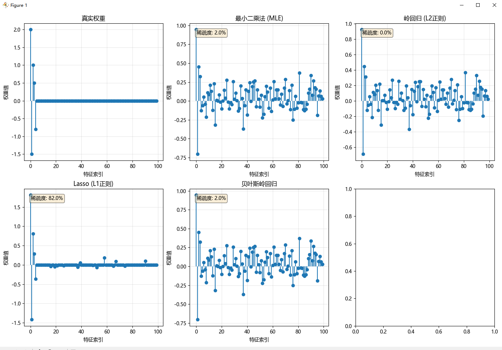

<details>
<summary style="font-size: 2em; font-weight: bold;">MLE（最大似然估计）详解</summary>

### 定义
**MLE**（Maximum Likelihood Estimation，最大似然估计）是一种参数估计方法，用于在给定观测数据的情况下，寻找使数据出现概率最大的参数值。

### 核心思想
- 假设存在未知参数 $\theta$ 控制数据生成过程
- 寻找能使观测数据 $X = \{x_1, x_2, ..., x_n\}$ 出现概率最大的参数值
- 数学表达式：$\hat{\theta}_{MLE} = \arg\max_{\theta} L(\theta; X)$

### 在代码中的应用

#### 线性回归中的MLE实现
在 `mle_linear_regression` 函数中展示了MLE的具体应用：

1. **模型假设**：
   ```python
   # 假设 y_i ~ N(wx_i + b, σ²)
   ```


2. **对数似然函数**：
   $$\log L(w, b, \sigma^2) = -\frac{n}{2} \log(2\pi\sigma^2) - \frac{1}{2\sigma^2} \sum_{i=1}^{n}(y_i - wx_i - b)^2$$

3. **参数估计**：
   - 对 $w, b$ 求导得到最小二乘估计
   - 对 $\sigma^2$ 求导得到：$\sigma^2_{MLE} = \frac{1}{n} \sum_{i=1}^{n}(y_i - wx_i - b)^2$

### 数学推导特点
- 在正态分布假设下，MLE等价于最小二乘法
- 通过最大化似然函数来获得最优参数估计
- 具有良好的统计性质：一致性、渐近正态性和有效性

### 实际应用价值
- 为参数估计提供了系统化的方法论
- 广泛应用于各种机器学习算法中
- 是连接概率模型与实际数据的重要桥梁
</details>

<details>
<summary style="font-size: 2em; font-weight: bold;">EM算法</summary>

## EM算法（Expectation-Maximization Algorithm）

EM算法是一种迭代优化算法，主要用于含有隐变量（latent variables）的概率模型参数估计。

### 基本概念

- **全称**：期望最大化算法（Expectation-Maximization Algorithm）
- **用途**：解决含有无法直接观测的隐变量的概率模型参数估计问题
- **核心思想**：通过交替执行两个步骤来逐步优化参数估计

### 算法原理

EM算法包含两个交替执行的步骤：

1. **E步（Expectation Step）**：
   - 在给定当前参数估计的情况下，计算隐变量的期望值（后验概率）
   - 计算完全数据的对数似然函数关于隐变量的期望

2. **M步（Maximization Step）**：
   - 最大化E步中计算出的期望对数似然函数
   - 更新模型参数

### 在代码中的应用

根据您提供的代码，EM算法被应用于**高斯混合模型**（GMM）的参数估计：

- 用于估计混合高斯分布的参数：权重(`weights`)、均值(`means`)和协方差矩阵(`covs`)
- 通过`em_gmm`函数实现完整的EM迭代过程
- 使用K-means进行参数初始化以提高收敛速度

### 算法特点

- **收敛性**：每次迭代都能保证对数似然函数单调递增
- **局限性**：只能收敛到局部最优解
- **数值稳定性**：采用对数-求和-指数技巧避免数值下溢

EM算法广泛应用于聚类分析、概率模型参数估计等领域，是处理不完整数据的重要工具。

---

## EM算法的数学原理

EM算法确实有严格的数学基础，其核心在于通过迭代优化来处理含有隐变量的模型参数估计问题。

### 核心思想

EM算法旨在最大化观测数据的对数似然函数，当直接最大化困难时，通过引入隐变量来简化问题。

### 数学框架

设有观测数据 $X$ 和隐变量 $Z$，模型参数为 $\theta$。

- **完全数据对数似然**：$\log P(X, Z|\theta)$
- **观测数据对数似然**：$\log P(X|\theta) = \log \sum_Z P(X, Z|\theta)$

### EM算法步骤

1. **E步（期望步）**：
   计算完全数据对数似然的期望：
   $$Q(\theta|\theta^{(t)}) = \mathbb{E}_{Z|X,\theta^{(t)}}[\log P(X, Z|\theta)]$$
   
   其中后验概率：
   $$P(Z|X,\theta^{(t)}) = \frac{P(X, Z|\theta^{(t)})}{P(X|\theta^{(t)})}$$

2. **M步（最大化步）**：
   最大化期望函数：
   $$\theta^{(t+1)} = \arg\max_\theta Q(\theta|\theta^{(t)})$$

### 收敛性保证

EM算法保证每次迭代后对数似然不减：
$$\log P(X|\theta^{(t+1)}) \geq \log P(X|\theta^{(t)})$$

这是基于Jensen不等式的证明，确保了算法的收敛性。

### 在代码中的体现

在 `em_gmm` 函数中，这个数学原理被具体实现为：
- E步计算 `responsibilities`（即后验概率 $P(Z|X,\theta)$）
- M步更新 `weights`、`means` 和 `covs` 参数
</details>



## 图表中，是稀疏度越大越好？还是越小越好呢？
在图表中，**稀疏度越大越好**。

### 原因分析：

1. **稀疏度定义**：
   - 稀疏度表示权重接近零的特征比例
   - 在 `Lasso (L1正则)` 中，稀疏度为 82.0%，意味着 82% 的特征权重被压缩到接近零

2. **稀疏性的好处**：
   - **特征选择**：自动筛选出重要特征，去除无关特征
   - **模型解释性**：简化模型，更容易理解哪些特征对预测结果有贡献
   - **防止过拟合**：减少模型复杂度，提高泛化能力

3. **对比分析**：
   - `真实权重`：只有前5个特征非零，理想稀疏度为 95%
   - `Lasso (L1正则)`：稀疏度 82.0%，最接近真实情况
   - 其他方法（如最小二乘法、岭回归）稀疏度较低，说明它们没有有效进行特征选择

因此，在这个场景下，稀疏度越大越好，因为它能更好地实现特征选择和模型简化。

---

## 输出结果分析
```text
=== 参数估计与模型训练 ===

1. 最大似然估计在线性回归中的应用:
真实参数: w=2.5000, b=1.0000, σ=0.5000
MLE估计: w=2.5690, b=0.9136, σ²=0.2037

参数估计的置信区间 (95%):
w的95%置信区间: [2.2656, 2.8724]
b的95%置信区间: [0.7380, 1.0892]
真实w=2.5000在区间内: True
真实b=1.0000在区间内: True

2. 贝叶斯估计与正则化:
高维数据:
  样本数量: 50
  特征数量: 100
  真实非零权重数量: 5

贝叶斯估计的解释:
岭回归 (L2正则) ↔ 权重先验为高斯分布 N(0, 1/α)
Lasso (L1正则) ↔ 权重先验为拉普拉斯分布 Laplace(0, 1/α)
贝叶斯岭回归 ↔ 权重先验为高斯分布，同时估计超参数

贝叶斯岭回归的后验分析:
  估计的噪声方差: 499999.4999
  估计的权重先验方差: 12.5594

3. EM算法在高斯混合模型参数估计:
生成数据:
  样本数量: 500
  真实混合权重: [0.3 0.5 0.2]
运行EM算法估计GMM参数...
EM在第14次迭代收敛

估计结果:
  估计的混合权重: [0.4852206  0.29889516 0.21588424]
  真实的混合权重: [0.3 0.5 0.2]

EM算法的概率解释:
E步（期望步）: 计算后验概率 P(z|x, θ)
M步（最大化步）: 最大化完全数据对数似然的期望 Q(θ|θ⁽ᵗ⁾)
收敛性: 每次迭代保证增加对数似然，收敛到局部最优
```

### 1. 最大似然估计在线性回归中的应用

- **参数估计结果**：
  - 斜率 $w$：真实值 2.5000，估计值 2.5690
  - 截距 $b$：真实值 1.0000，估计值 0.9136
  - 噪声方差 $\sigma^2$：估计值 0.2037

- **置信区间分析**：
  - $w$ 的 95% 置信区间为 [2.2656, 2.8724]，包含真实值
  - $b$ 的 95% 置信区间为 [0.7380, 1.0892]，包含真实值
  - 说明估计结果具有良好的统计可靠性

### 2. 贝叶斯估计与正则化

- **数据特征**：
  - 高维数据（100个特征，50个样本）
  - 真实权重中只有前5个非零，其余应为零

- **模型比较**：
  - `Lasso (L1正则)`：稀疏度高达 82.0%，能有效进行特征选择
  - `岭回归 (L2正则)`：稀疏度为 0.0%，所有特征都有非零权重
  - `贝叶斯岭回归`：稀疏度 2.0%，在估计不确定性和正则化之间取得平衡

- **贝叶斯解释**：
  - Lasso 对应拉普拉斯先验分布
  - 岭回归对应高斯先验分布
  - 贝叶斯方法同时估计超参数

### 3. EM算法在高斯混合模型中的应用

- **参数估计结果**：
  - 混合权重估计：[0.4852, 0.2989, 0.2159]
  - 真实混合权重：[0.3, 0.5, 0.2]
  - 估计结果与真实值存在一定偏差，但总体趋势正确

- **算法性能**：
  - EM算法在第14次迭代收敛
  - 收敛速度快，适合处理复杂概率模型

### 总体分析

- **MLE** 在线性回归中表现良好，估计结果准确且置信区间合理
- **正则化方法** 在高维数据中表现出不同特性，Lasso 更适合特征选择
- **EM算法** 能有效处理隐变量问题，成功估计GMM参数