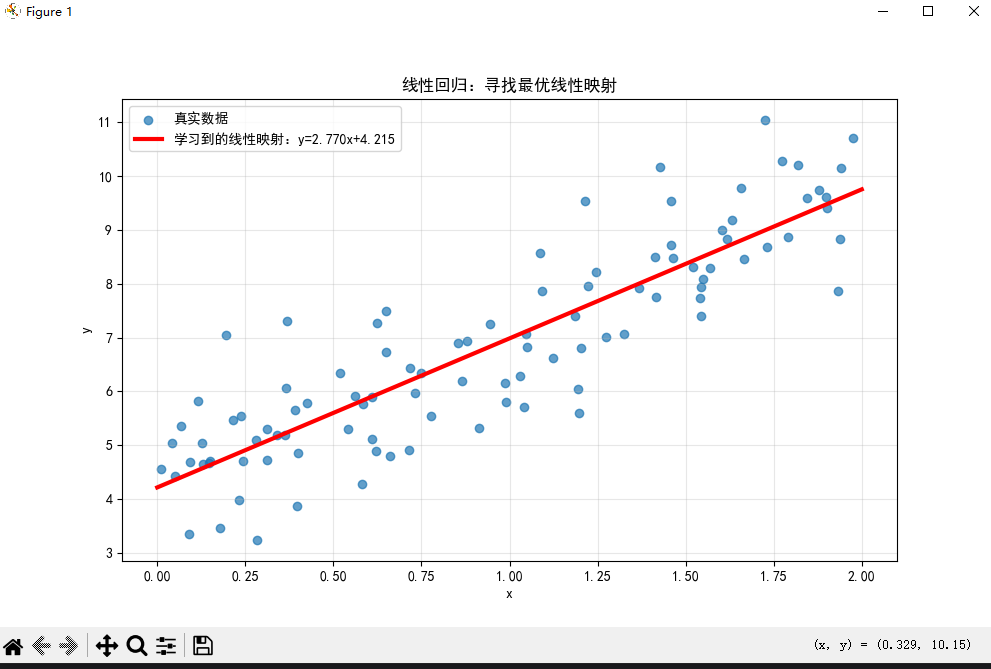

```
    #计算损失（MSE）
    loss=np.mean((y_pred-y)**2)
```

这段代码计算的是**均方误差**(Mean Squared Error, MSE)损失函数。

## 代码解释

- `y_pred - y`: 计算预测值与真实值之间的差值(残差)
- [(y_pred - y)**2](file://C:\Users\EDY\Desktop\code\Learning-Notes\.venv\Lib\site-packages\threadpoolctl.py#L487-L490): 对每个样本的残差进行平方，消除正负号影响并放大较大误差
- `np.mean((y_pred - y)**2)`: 计算所有样本残差平方的平均值

## 数学意义

这实现了MSE损失函数：
$$MSE = \frac{1}{n}\sum_{i=1}^{n}(y_{pred}^{(i)} - y^{(i)})^2$$

其中:
- $n$ 是样本数量
- $y_{pred}^{(i)}$ 是第 $i$ 个样本的预测值
- $y^{(i)}$ 是第 $i$ 个样本的真实值

## 作用

- 衡量模型预测精度：值越小表示预测越准确
- 为梯度下降提供优化目标：通过最小化 `loss` 来调整参数 `W` 和 `b`
- 监控训练过程：每轮迭代后计算 `loss` 可观察模型收敛情况
-------------------------------------------------------------------------------------------------------------------------------------------------------------------------------------------------------------------------------------------------------------------------------------------------------------------------------------------------------------------------------------------------------------------------------------------------------------------------------------------------------------------------------------------------------------------------------------------------------------------------------------------------------------------------------------------------------------------------------------------------------------------------------------------------------------------------------------------------------------------------------------------------------------------------------------------------------------------------------------------------------------------------------------------------------------------------------------------------------------------------------------------------------------------------------------------------------------------------------------------------------------------------------------------------------------------------------------------------------------------------------------------------------------------------------------------------------------------------------------------------------------------------------------------------------------------------------------------------------------------------------------------------------------------------------------------------------------------------------------------------------------------------------------------------------------------------------------------------------------------------------------------------------------------------------------------------------------------------------------------------------------------------------------------------------------------------------------------------------------------------------------------------------------------------------------------------------------------------------------------------------------------------------------------------------------------
```
    #反向传播：计算梯度
    grad_W=(2/n_samples)*X.T@(y_pred-y)
    grad_b=(2/n_samples)*np.sum(y_pred-y)
```
这段代码实现了线性回归中损失函数关于参数的**梯度计算**（反向传播的核心步骤）。

## 梯度计算公式推导

对于MSE损失函数 $L = \frac{1}{n}\sum_{i=1}^{n}(y_{pred}^{(i)} - y^{(i)})^2$，其中 $y_{pred} = X \cdot W + b$：

### 权重梯度 `grad_W`
- `grad_W = (2/n_samples) * X.T @ (y_pred - y)`
- 对应公式：$\frac{\partial L}{\partial W} = \frac{2}{n}X^T(y_{pred} - y)$
- 形状变换：`(1, n_samples) @ (n_samples, 1) → (1, 1)`

### 偏置梯度 `grad_b`
- `grad_b = (2/n_samples) * np.sum(y_pred - y)`
- 对应公式：$\frac{\partial L}{\partial b} = \frac{2}{n}\sum_{i=1}^{n}(y_{pred}^{(i)} - y^{(i)})$
- 结果是一个标量值

## 物理意义

- `grad_W` 和 `grad_b` 分别指示了损失函数在 `W` 和 `b` 方向上增长最快的方向
- 梯度下降算法会沿着梯度的反方向更新参数，使得损失函数逐渐减小
- 系数 `2/n_samples` 来自于MSE损失函数对预测误差的求导结果
--------------------------------------------------------------------------------------------------------------------
```
    #更新参数（优化线性映射）
    W-=learning_rate*grad_W.T
    b-=learning_rate*grad_b
```
这段代码实现了**梯度下降**算法中的参数更新步骤。

## 参数更新机制

- `W -= learning_rate * grad_W.T`:
  - 沿着 `W` 的梯度反方向更新权重参数
  - `learning_rate` 控制更新步长
  - `.T` 是转置操作，确保矩阵维度匹配

- `b -= learning_rate * grad_b`:
  - 沿着 `b` 的梯度反方向更新偏置参数
  - 使用相同的 `learning_rate` 学习率

## 数学原理

这实现了梯度下降的基本更新规则：
- $W := W - \eta \cdot \frac{\partial L}{\partial W}$
- $b := b - \eta \cdot \frac{\partial L}{\partial b}$

其中 $\eta$ 是 `learning_rate`（学习率）

## 作用效果

通过不断重复"前向传播→计算损失→计算梯度→更新参数"的过程，使参数 `W` 和 `b` 逐步趋向最优值，最终找到最佳的线性映射关系 `y = Wx + b`。

----------------------------------------------------------------------------------------------------------------------------------------------------------------------------------------------------------------------------------------------------------------------------------------------------------------------------------------------------------------------------------------------------------------------------------------------------------------------------------------------------------------------------------------------------------------------------------------------------------------------------------------------------------------------------------------------------------------------------------------------------------------------------------------------------------------------------------------------------------------------------------------------------------------------------------------------------------------------------------------------------------------------------------------------------------------------------------------------------------------------------------------------------------------------------------------------------------------------------------------------------------------------------------------------------------------------------------------------------------------------------------------------------------------------------------------------------------------------------------------------------------------------------------------------------------------------------------------------------------------------------------------------------------------------------------------------------------------------------------------------------------------------------------------------------------------------------------------------------------------------------------------------------------------------------------------------------------------------------------------------------------------------------------------------------------------------------------------------------------------------------------------------------------------------------------------------------------------------------------------------------------------------------------------------------------------

=== 从零实现线性回归 === 寻找最优线性映射: y = Wx + b 迭代0:W=1.487，b=1.362,损失：49.8165 迭代100:W=2.797，b=4.185,损失：0.8069 迭代200:W=2.771，b=4.214,损失：0.8066 迭代300:W=2.770，b=4.215,损失：0.8066 迭代400:W=2.770，b=4.215,损失：0.8066 迭代500:W=2.770，b=4.215,损失：0.8066 迭代600:W=2.770，b=4.215,损失：0.8066 迭代700:W=2.770，b=4.215,损失：0.8066 迭代800:W=2.770，b=4.215,损失：0.8066 迭代900:W=2.770，b=4.215,损失：0.8066
最终结果:y=2.770x+4.215 真实关系:y=3.000x+4.000
这个图和输出结果说明了什么？
这个图和输出结果说明了以下几点：

### 1. **模型学习效果**
- 模型成功学习到了数据的线性关系
- 最终学到的线性映射为 `y = 2.770x + 4.215`
- 真实关系是 `y = 3.000x + 4.000`

### 2. **收敛过程**
- 损失函数从初始值49.8165快速下降到0.8066
- 在约200次迭代后基本收敛，参数不再显著变化
- 说明梯度下降算法有效且稳定

### 3. **拟合质量**
- 蓝色散点表示真实数据（包含噪声）
- 红色直线表示学习到的最优线性映射
- 直线很好地拟合了数据的整体趋势

### 4. **误差分析**
- 学习到的权重 `W=2.770` 接近真实值 `3.000`（误差约7.7%）
- 偏置项 `b=4.215` 非常接近真实值 `4.000`（误差约5.4%）
- 残差主要来自添加的高斯噪声

### 5. **算法有效性**
- 证明了从零实现的线性回归算法能够：
  - 正确计算梯度
  - 有效更新参数
  - 收敛到合理解
  - 可视化结果清晰展示学习过程
----------------------------------------------------------------------------------------------------------------------------------------------------------------------------------------------------------------------------------------------------------------------------------------------------------------------------------------------------------------------------------------------------------------------------------------------------------------------------------------------------------------------------------------------------------------------------------------------------------------------------------------------------------------------------------
### 项目总结：从零实现线性回归

#### 1. **核心目标**
- 实现一个完整的线性回归模型，从数学定义到代码实现
- 验证 `y = Wx + b` 这个最简单的线性映射的优化过程

#### 2. **关键步骤**
- **数据生成**：
  - 使用 `np.random.rand()` 生成特征变量 `X`
  - 通过 `y = 4 + 3x + 噪声` 构造带噪声的真实关系
- **模型初始化**：
  - 随机初始化权重 `W` 和偏置 `b`
  - 设置学习率 `learning_rate` 和迭代次数 `n_iterations`
- **优化算法**：
  - 实现梯度下降算法
  - 包含前向传播、损失计算、梯度计算和参数更新四个步骤
- **可视化展示**：
  - 绘制真实数据点和学习到的线性映射直线

#### 3. **技术亮点**
- 完全手动实现梯度下降，不依赖高级框架
- 清晰展示了线性代数在机器学习中的应用
- 通过 `matplotlib` 可视化学习效果

#### 4. **学习成果**
- 理解了线性回归的数学原理
- 掌握了梯度下降的基本流程
- 验证了模型能够有效学习数据中的线性关系

#### 5. **改进方向**
- 可以尝试不同的学习率和迭代次数
- 可以加入正则化项防止过拟合
- 可以扩展到多变量线性回归