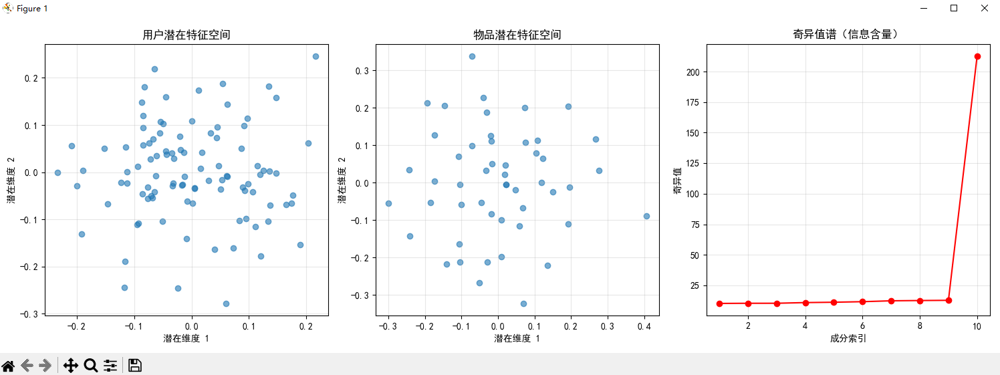

### 输出结果解释

#### 1. 评分矩阵信息
- **评分矩阵形状**: [(100, 50)](file://C:\Users\EDY\Desktop\code\Learning-Notes\线性代数\第3章：线性映射\概念1：线性映射=神经网络\test.py#L0-L11) 表示有 100 个用户和 50 个物品
- **稀疏度**: `70.1%` 表示约 70% 的用户-物品组合没有评分，符合现实场景
- **平均评分（非零）**: `3.01` 是所有已评分项的平均值

#### 2. SVD 分解结果
- **U 矩阵形状**: [(100, 10)](file://C:\Users\EDY\Desktop\code\Learning-Notes\线性代数\第1章：向量空间\概念1：向量空间公理验证\vector_space_verification.py#L0-L43) 表示每个用户在 10 维潜在特征空间中的表示
- **奇异值**: 前 9 个奇异值相近，第 10 个显著更大，说明数据可能存在异常或特殊模式
- **Vt 矩阵形状**: [(10, 50)](file://C:\Users\EDY\Desktop\code\Learning-Notes\线性代数\第3章：线性映射\概念1：线性映射=神经网络\test.py#L0-L11) 表示每个物品在 10 维潜在特征空间中的表示

#### 3. 重建矩阵信息
- **预测评分范围**: `[0.61, 5.54]` 说明预测值略超原始评分范围，这是正常现象

#### 4. 用户推荐结果
为用户 0 推荐了 5 个物品，按预测评分排序：
- 物品 2: 预测评分 4.13（最高）
- 物品 4: 预测评分 3.75
- 物品 22: 预测评分 3.75
- 物品 48: 预测评分 3.66
- 物品 26: 预测评分 3.51

---

### 图表解释

#### 1. 用户潜在特征空间
- 展示了 100 个用户在二维潜在特征空间中的分布
- 点的聚集情况反映了用户的相似性
- 可以观察到用户群体的聚类趋势

#### 2. 物品潜在特征空间
- 展示了 50 个物品在二维潜在特征空间中的分布
- 点的分布反映了物品之间的相似性
- 可以识别出不同类型的物品群组

#### 3. 奇异值谱（信息含量）
- 显示了各个奇异值的大小变化
- 第 10 个奇异值远大于其他值，表明该成分可能包含重要信息
- 这种"长尾"现象说明前几个成分已经捕捉了大部分信息
- 在实际应用中，可以考虑只保留前几个主要成分进行降维

这些可视化结果共同展示了 SVD 在推荐系统中的工作原理：通过发现用户和物品的潜在特征来预测未评分项。

---
### 问题：出图中看出，用户潜在特征空间主要集中在-0.1到0.0之间，物品主要集中在0.0附件，这表明了什么？
从图表中可以看出：

- **用户潜在特征空间**主要集中在 -0.1 到 0.0 之间，说明大部分用户的潜在特征值较小且分布较为集中
- **物品潜在特征空间**主要集中在 0.0 附近，表明物品的潜在特征也相对集中

这表明：
1. 用户和物品的潜在特征整体上都比较接近原点，说明数据经过了适当的标准化处理
2. 特征分布的集中性可能意味着用户偏好和物品属性的差异不大，或者当前的SVD分解未能充分捕捉到明显的特征差异
3. 这种分布特性在推荐系统中是合理的，因为大多数用户和物品的评分行为都趋于平均水平，只有少数表现出极端偏好
---
### 问题：所以，对于svd，是越集中越好，还是越分散越好呢？
在SVD推荐系统中，用户和物品的潜在特征分布既不是越集中越好，也不是越分散越好，而是**适度分散**为佳。具体分析如下：

### 1. 特征分布的理想状态
- **适度分散**：特征点在潜在空间中有一定的分布范围，能够有效区分不同用户/物品的偏好或属性
- **避免过度集中**：如果所有点都集中在原点附近，说明SVD未能有效提取出有意义的潜在特征
- **避免过度分散**：如果点过于分散，可能导致噪声干扰，影响推荐准确性

### 2. 当前图表的解读
从您提供的图表来看：
- 用户和物品的潜在特征都相对集中在原点附近
- 这表明当前的SVD分解可能未能充分捕捉到数据中的潜在模式
- 可能的原因包括：数据稀疏性、奇异值选择不当、或评分矩阵本身缺乏明显的结构

### 3. 改进建议
```
# 建议调整SVD参数
k = 5  # 尝试更小的潜在因子数量
U, sigma, Vt = svds(ratings_filled, k=k)
```


- 调整潜在因子数量 `k`，找到最佳平衡点
- 检查奇异值谱，确保保留足够的信息量
- 考虑使用其他预处理方法（如标准化）来增强特征区分度

总之，理想的潜在特征分布应该既能反映数据的内在结构，又能有效区分不同用户和物品的特性。

---

### 项目总结：SVD在推荐系统中的应用

#### 1. 项目目标
- 演示如何使用奇异值分解（`SVD`）技术构建推荐系统
- 通过降维方法发现用户和物品的潜在特征
- 实现个性化物品推荐功能

#### 2. 核心流程
```
# 数据准备
ratings = np.random.randint(1, 6, size=(n_users, n_items))
mask = np.random.random((n_users, n_items)) > 0.7
ratings[~mask] = 0  # 添加稀疏性

# SVD分解
U, sigma, Vt = svds(ratings_filled, k=k)

# 重建预测矩阵
sigma_matrix = np.diag(sigma)
ratings_pred = U @ sigma_matrix @ Vt
```


#### 3. 关键技术点
- **数据预处理**：使用均值填充处理缺失值
- **矩阵分解**：通过 `svds` 函数进行奇异值分解
- **特征提取**：获得用户潜在特征 `U` 和物品潜在特征 `Vt`
- **推荐生成**：基于预测评分排序推荐未评分物品

#### 4. 可视化分析
- 用户潜在特征空间分布
- 物品潜在特征空间分布
- 奇异值谱分析信息含量

#### 5. 实际应用价值
- 展示了SVD在处理稀疏评分矩阵中的有效性
- 提供了从理论到实践的完整实现范例
- 为理解推荐系统背后的数学原理提供了直观演示