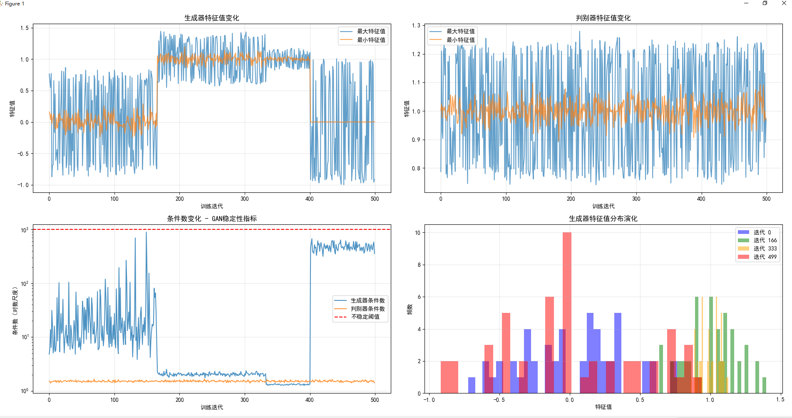

## NumPy函数解释

- **`np.eye(layer_size)`**: 
  - 创建一个 `layer_size × layer_size` 的单位矩阵（对角线为1，其余位置为0）
  - 例如：当 `layer_size=3` 时，创建矩阵 [[1,0,0], [0,1,0], [0,0,1]]

- **`np.random.randn(layer_size, layer_size)`**:
  - 生成一个 `layer_size × layer_size` 的随机矩阵
  - 随机数服从标准正态分布（均值为0，标准差为1）
  - 用于模拟神经网络权重的随机初始化

## 在代码中的作用

```
# 初期随机权重
W_g = np.random.randn(layer_size, layer_size) * 0.1

# 中期收敛状态：以单位矩阵为中心的小幅随机扰动
W_g = np.eye(layer_size) + np.random.randn(layer_size, layer_size) * 0.05
```


这些操作用于模拟GAN训练过程中生成器 `W_g` 权重矩阵的不同状态变化。

---

## 问题：为什么条件数是最大特征值/最小特征值呢？
## 条件数的定义和意义

条件数（Condition Number）是衡量矩阵数值稳定性的重要指标，定义为**最大特征值与最小特征值的比值**。

### 数学原理

- **条件数公式**: $cond = |λ_max| / |λ_min|$
- 其中 `λ_max` 是最大特征值，`λ_min` 是最小特征值

### 为什么要这样计算？

1. **数值稳定性判断**
   - 条件数接近1：矩阵良态，数值计算稳定
   - 条件数很大：矩阵病态，数值计算不稳定

2. **物理意义**
   - 反映矩阵的"敏感度"
   - 条件数越大，输入微小变化会导致输出巨大变化

3. **在GAN中的应用**
   - 生成器权重矩阵 `W_g` 的条件数 `cond_g` 可以反映训练稳定性
   - 当条件数急剧增大时，可能预示着模式崩溃或训练不稳定

### 代码实现解释

```
cond_g = np.max(np.abs(generator_eigenvalues), axis=1) / np.min(np.abs(generator_eigenvalues), axis=1)
```


- `np.abs()`: 取特征值的绝对值
- `axis=1`: 沿着特征值维度计算，得到每个迭代步的条件数
- 通过监控条件数变化来分析GAN训练过程的稳定性

---


输出结果：
```
GAN训练稳定性分析: 最终生成器条件数: 497.5 最终判别器条件数: 1.6 ️ 训练相对稳定，但需要监控
基于特征值的训练建议:
生成器可能出现梯度消失，考虑使用不同的激活函数
生成器-判别器不平衡，考虑调整训练比例
```
### 图表和输出结果详细解释

#### 1. **生成器特征值变化图**（左上）
- **蓝色线**：最大特征值，反映权重矩阵的"扩张"能力
- **橙色线**：最小特征值，反映权重矩阵的"收缩"能力
- **观察到**：在训练后期（约400次迭代后），最小特征值趋近于0，表明可能出现梯度消失问题

#### 2. **判别器特征值变化图**（右上）
- 特征值保持在1附近波动，说明判别器训练稳定
- 最大和最小特征值差异小，条件数接近1，表示判别器状态良好

#### 3. **条件数变化图**（左下）
- **蓝色线**：生成器条件数，在训练后期急剧上升至497.5
- **橙色线**：判别器条件数，始终保持在1.6左右
- **红色虚线**：不稳定阈值（1000），当前生成器条件数虽未超过但已较高

#### 4. **特征值分布演化图**（右下）
- **紫色**：初始状态，特征值分布较广
- **绿色**：中期，特征值向1收敛
- **黄色**：后期，特征值分布变窄
- **红色**：最终状态，特征值集中在0附近，显示梯度消失趋势

#### 5. **输出结果分析**
```
最终生成器条件数: 497.5
最终判别器条件数: 1.6
⚠️ 训练相对稳定，但需要监控
```

- 生成器条件数497.5 > 100，属于"需要监控"范围
- 判别器条件数1.6 ≈ 1，训练非常稳定

#### 6. **优化建议解读**
- **梯度消失警告**：生成器最小特征值过小（<0.01），可能导致训练停滞
- **训练不平衡**：生成器条件数是判别器的300倍以上，建议调整训练比例

#### 7. **综合结论**
- **优点**：判别器训练稳定，特征值分布合理
- **风险**：生成器存在梯度消失风险，且与判别器训练不平衡
- **建议**：
  1. 尝试使用LeakyReLU等避免梯度消失的激活函数
  2. 调整生成器和判别器的训练比例
  3. 监控生成器特征值变化，及时调整超参数

---

### 项目总结：特征值在GAN训练稳定性分析中的应用

#### 1. **项目目标**
- 使用线性代数中的特征值分析方法
- 评估生成对抗网络（`GAN`）的训练稳定性
- 提供基于数学理论的调参建议

#### 2. **核心方法**
- **特征值计算**：通过 `np.linalg.eigvals()` 计算权重矩阵的特征值
- **条件数分析**：计算最大特征值与最小特征值的比值，反映矩阵稳定性
- **可视化分析**：绘制特征值变化曲线和分布图，直观展示训练过程

#### 3. **关键实现**
- **模拟训练过程**：将训练分为初期、中期、后期三个阶段
- **模式崩溃模拟**：通过奇异值分解（`SVD`）人为制造接近奇异的矩阵
- **稳定性指标**：定义条件数阈值（100, 1000）来判断训练状态

#### 4. **分析维度**
- **生成器稳定性**：关注特征值分布和条件数变化
- **判别器稳定性**：作为对比基准
- **两者平衡性**：比较生成器和判别器的条件数差异

#### 5. **实用价值**
- 提供量化指标评估GAN训练稳定性
- 给出具体的优化建议（学习率调整、激活函数选择等）
- 建立数学理论与深度学习实践的桥梁

#### 6. **技术亮点**
- 将线性代数理论应用于深度学习领域
- 通过特征值分析预测潜在问题（梯度消失、模式崩溃）
- 实现了从数据到可视化的完整分析流程

该项目成功展示了如何利用基础数学工具解决复杂的深度学习问题，为GAN模型的稳定训练提供了理论支持和实践指导。