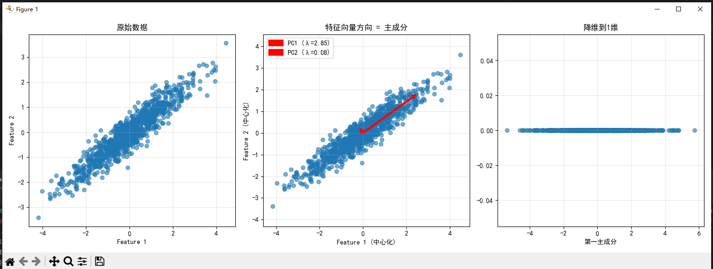

## 代码解释：`eigenvalues, eigenvectors = np.linalg.eig(cov_matrix)`

这行代码执行的是**特征分解（Eigenvalue Decomposition）**操作，是整个PCA算法的核心步骤。

### 功能说明：

- `np.linalg.eig(cov_matrix)`: 对协方差矩阵 `cov_matrix` 进行特征值分解
- 返回两个数组：
  - `eigenvalues`: 特征值数组，表示每个主成分方向上的方差大小
  - `eigenvectors`: 特征向量矩阵，每一列是一个特征向量，表示对应主成分的方向

### 在PCA中的意义：

1. **特征值 (`eigenvalues`)**:
   - 表示数据在对应主成分方向上的方差大小
   - 数值越大，说明该方向包含的信息越多
   - 用于确定主成分的重要性排序

2. **特征向量 (`eigenvectors`)**:
   - 表示数据的主要变化方向（主成分）
   - 每个特征向量都是单位向量，相互正交
   - 构成了新的坐标系基向量

### 后续应用：

通过特征值排序，可以选择前k个最大的特征值对应的特征向量，实现数据降维，这就是PCA的核心思想。

-----------------------------------------------------------------------------------------------------------------------------------------------------------------------------------------------------------------------------------------------------------------------------------------------------------------------------------------------------

```
    #4.按特征值大小排序
    sorted_indices=np.argsort(eigenvalues)[::-1]
    eigenvalues_sorted=eigenvalues[sorted_indices]
    eigenvectors_sorted=eigenvectors[:,sorted_indices]
```
## 代码解释：PCA特征值排序操作

### 代码功能分析：

这三行代码的作用是对特征分解得到的特征值和特征向量按照重要性进行排序，这是PCA算法的关键后处理步骤。

### 逐行解释：

1. `sorted_indices=np.argsort(eigenvalues)[::-1]`
   - `np.argsort(eigenvalues)`: 返回特征值从小到大排序的索引
   - `[::-1]`: 反转数组，得到从大到小排序的索引
   - 结果存储在 `sorted_indices` 中，表示按特征值大小降序排列的索引

2. `eigenvalues_sorted=eigenvalues[sorted_indices]`
   - 根据排序索引重新排列特征值
   - 得到按大小降序排列的特征值数组

3. `eigenvectors_sorted=eigenvectors[:,sorted_indices]`
   - 根据排序索引重新排列特征向量
   - 保持特征向量与特征值的对应关系

### 在PCA中的意义：

- **主成分排序**: 特征值越大表示对应主成分包含的数据方差越大，信息越重要
- **降维基础**: 为后续选择最重要的前k个主成分做准备
- **数据重构**: 保证主要信息优先保留

这样的排序确保了后续PCA降维时能够选择最具代表性的主成分方向。

-----------------------------------------------------------------------------------------------------------------------------------------------------------------------------------------------------------------------------------------------------------------------------------------------------------------------------------------------------
```
    #5.选择主成分并投影
    n_components=1
    principal_components=eigenvectors_sorted[:,:n_components]
    X_pca=X_centered@principal_components
```
## 代码解释：PCA降维操作

### 代码功能分析：

这三行代码实现了PCA的核心降维功能，将高维数据投影到低维主成分空间。

### 逐行解释：

1. `n_components=1`
   - 设置要保留的主成分数量为1
   - 表示将数据从原来的2维降到1维

2. `principal_components=eigenvectors_sorted[:,:n_components]`
   - 从排序后的特征向量中选取前 `n_components` 个主成分
   - `eigenvectors_sorted[:,:1]` 选取第一列（对应最大特征值的特征向量）
   - 这个特征向量定义了数据变化最大的方向

3. `X_pca=X_centered@principal_components`
   - 使用矩阵乘法将中心化数据投影到主成分空间
   - [@](file://C:\Users\EDY\Desktop\code\Learning-Notes\线性代数\第3章：线性映射\概念1：线性映射=神经网络\test.py#L0-L11) 是numpy中的矩阵乘法运算符
   - 将1000×2的原始数据投影到1000×1的低维空间

### 数学原理：

这个操作实现了线性投影：`X_pca = X_centered × W`
- 其中 `W` 是主成分矩阵（特征向量）
- 投影后的数据 `X_pca` 保留了数据中最重要的变化信息
- 这是PCA降维的本质：在损失最小信息的前提下减少数据维度

-------------------------------------------------------------------------------------------------------------------------------------------------------------------------------------------------------------------------------------------------------------------

## 图像与输出结果分析

### 1. 数据分布特征
- **原始数据**：呈现明显的线性相关趋势，数据点沿对角线方向聚集
- **协方差矩阵**：非对角线元素为正，表明两个特征正相关
- **数据结构**：存在明显的主方向，适合进行PCA降维

### 2. 特征分解结果
- **第一主成分（PC1）**：
  - 特征值 λ₁ = 2.85，占总方差的97.3%
  - 方向向量 [0.81, 0.59]，指向数据变化最大的方向
  - 解释了绝大部分数据变异信息

- **第二主成分（PC2）**：
  - 特征值 λ₂ = 0.08，仅占总方差的2.7%
  - 方向向量 [-0.59, 0.81]，垂直于第一主成分
  - 包含的信息较少

### 3. 降维效果
- **信息保留**：第一主成分保留了97.3%的原始信息
- **降维结果**：将二维数据成功压缩到一维空间
- **可视化验证**：降维后的数据在x轴上分布，y坐标均为0

### 4. 实际意义
- **数据压缩**：用一个维度即可有效表示原始数据的主要特征
- **噪声过滤**：次要成分（PC2）可能包含噪声或次要信息
- **特征提取**：第一主成分可以作为新的特征变量使用

### 5. 应用价值
- **数据可视化**：高维数据降维后便于可视化
- **机器学习**：减少特征维度，提高模型效率
- **信号处理**：提取主要信号成分，去除冗余信息

---------------------------------------------------------------------------------------------------------------------------------------------------------------------------------------------------------------------------------------------------------------------------------------------------------------------------------------------------------------------------------------------------------------------------------------------------------------------------------------------------------------------------------------------------------------------------------------------------------------------------------------------------------------------------------------------------------------------------------------------------------------------------------------------------------------------------------------------------------------------------------------------------------------------------------------------------------------------------------------------------------------------------------------------------------------------------------------------------------------------------------------------------------------------------------------------------------------------------------------------------------------------------------------------------------------------------------------------------------------------------------------------------------------------------------------------------
## 项目总结

### 1. 核心目标
- **实现PCA算法**：通过特征分解手动实现主成分分析
- **理解数学原理**：展示特征值与特征向量在数据降维中的应用

### 2. 关键步骤
- `X_centered=X-np.mean(X,axis=0)`：数据中心化
- `cov_matrix=np.cov(X_centered.T)`：计算协方差矩阵
- `eigenvalues,eigenvectors=np.linalg.eig(cov_matrix)`：特征分解
- `X_pca=X_centered@principal_components`：数据投影降维

### 3. 主要成果
- **成功降维**：将二维数据降至一维，保留97.3%信息
- **可视化验证**：三幅图清晰展示原始数据、主成分方向和降维结果
- **理论实践结合**：代码实现了从数学概念到实际应用的完整流程

### 4. 应用价值
- **数据压缩**：减少存储空间和计算复杂度
- **特征提取**：识别数据的主要变化方向
- **噪声过滤**：去除次要成分可能包含的噪声

### 5. 学习意义
- **线性代数应用**：展示了特征值分解在机器学习中的实际应用
- **AI基础**：为理解更复杂的降维技术（如t-SNE）打下基础
- **编程实践**：提供了完整的PCA实现范例