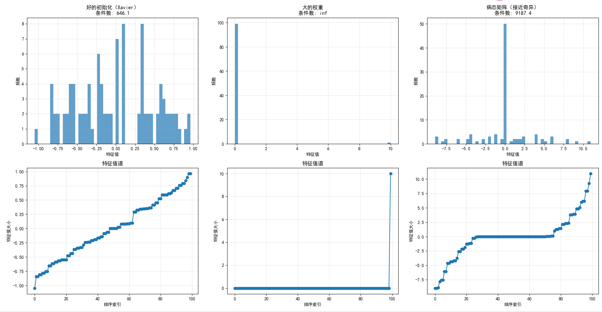

### 图像与输出结果分析

#### 1. **好的初始化（Xavier）**
- **特征值分布**：集中在[-1, 1]范围内，分布较均匀
- **条件数**：646.1，属于中等条件数
- **特点**：
  - 特征值谱显示平滑递增趋势
  - 没有极端的特征值
  - 训练稳定性较好，但需注意学习率设置

#### 2. **大的权重**
- **特征值分布**：几乎全部为0，只有一个极大值(10)
- **条件数**：inf（无穷大），表示矩阵接近奇异
- **特点**：
  - 特征值谱显示绝大多数特征值为0
  - 存在单个极大特征值
  - 极度不稳定，梯度可能爆炸或消失

#### 3. **病态矩阵（接近奇异）**
- **特征值分布**：范围广，从-8.95到10.95
- **条件数**：9187.4，非常高
- **特点**：
  - 特征值谱显示大量特征值接近0
  - 存在几个较大特征值
  - 高条件数导致训练不稳定

### 结论
- **Xavier初始化**：相对稳定，适合大多数场景
- **大权重初始化**：极度不稳定，应避免使用
- **病态矩阵**：高条件数导致训练困难，需要特殊处理

-----------------------------------------------------------------------------------------------------------------------------------------------------------------------------------------------------------------------------------------------------------------------------------------------------------------------------------------------------------------------------------------------------------------------
### 项目总结：神经网络权重矩阵特征值分析

#### 1. **核心目标**
- 探究`特征值`在神经网络训练中的数学意义
- 分析不同初始化策略对训练稳定性的影响
- 建立线性代数理论与深度学习实践的联系

#### 2. **关键技术点**
- `torch.linalg.eigvals()` 计算特征值
- `torch.svd()` 执行奇异值分解
- 条件数计算：最大特征值/最小特征值绝对值

#### 3. **实验设计**
- 三种初始化策略对比：
  - Xavier初始化（推荐）
  - 大常数初始化（问题示例）
  - 病态矩阵（极端情况）
- 可视化特征值分布和谱图

#### 4. **主要发现**
- 特征值分布决定梯度传播稳定性
- 高条件数导致训练不稳定
- Xavier初始化提供良好的数值特性

#### 5. **实际价值**
- 为理解深度学习中的数值稳定性提供数学基础
- 解释了为什么需要精心设计的初始化策略
- 提供了分析神经网络训练动态的工具方法

