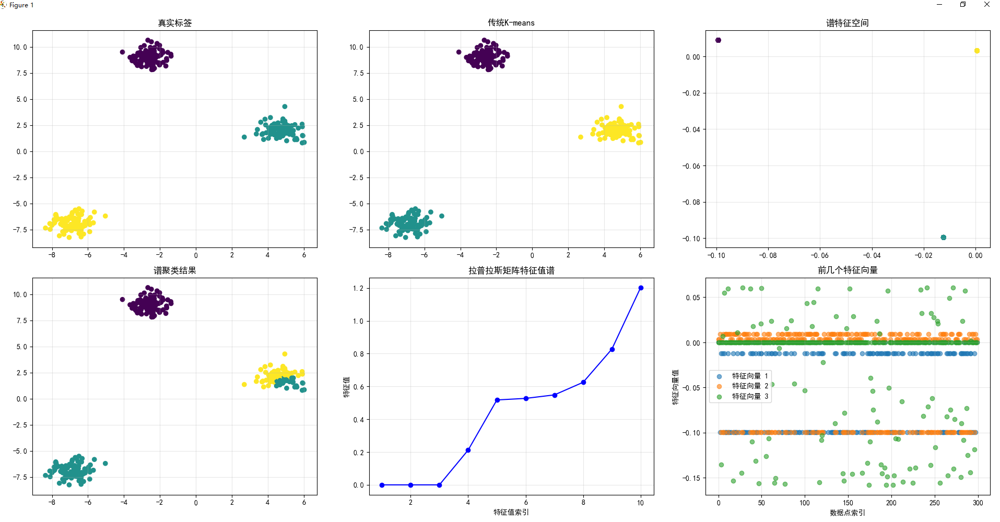
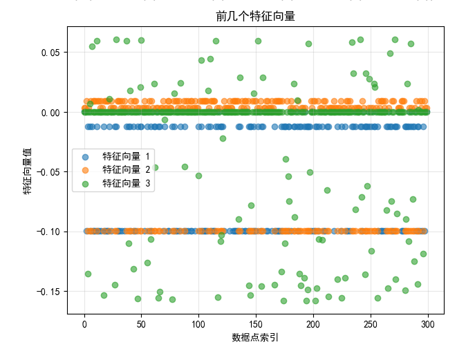

## 一、拉普拉斯矩阵分类清单

| 分类名称               | 核心定义（本质）                          | 构造方式/关键特征                          | 关键性质                  | 典型应用场景                          |
|------------------------|-------------------------------------------|-------------------------------------------|---------------------------|---------------------------------------|
| 广义拉普拉斯矩阵       | 连续空间拉普拉斯算子（∇²）的“离散化矩阵形式”总称 | 无固定构造公式，由“离散化的空间结构”决定（如图、网格） | 半正定、满足离散形式的“扩散”意义 | 覆盖连续数学、离散数学的跨领域应用    |
| 图拉普拉斯矩阵         | 广义拉普拉斯在“图结构”上的离散化实现       | 依赖图的邻接矩阵A和度矩阵D，核心公式：L=D-A（或归一化L_sym/L_rw） | 对称半正定、行和为0、特征值非负 | 谱聚类、图嵌入、网络分析、图信号处理  |
| 网格拉普拉斯矩阵       | 广义拉普拉斯在“规则空间网格”上的离散化实现 | 针对像素网格（图像）、有限元网格（工程仿真），由网格节点的“相邻位置”决定（如二维网格中，每个节点连接上下左右4个节点） | 稀疏矩阵、半正定、反映网格局部平滑性 | 图像去噪、图像分割、有限元分析、物理仿真（如热传导） |
| 一维离散拉普拉斯矩阵   | 广义拉普拉斯在“一维线性网格”上的离散化实现 | 节点按线性排列（如时间序列、一维信号点），构造为三对角矩阵：对角线元素为2，相邻位置为-1（边界节点需调整） | 对称、半正定、描述一维信号的“曲率” | 时间序列平滑、一维信号去噪、差分方程数值求解 |

### 核心总结（快速区分关键）
1. 广义拉普拉斯矩阵是“总称”，所有离散化自∇²的矩阵都属于此类；
2. 图拉普拉斯矩阵的核心是“图结构”（节点+边的不规则连接），构造依赖A和D；
3. 网格拉普拉斯矩阵的核心是“规则网格”（如二维像素、三维工程网格），构造依赖空间位置的相邻关系；
4. 一维离散拉普拉斯矩阵是“最简形式”，针对线性排列的离散点，无“图结构”的复杂连接。

---

## 二、拉普拉斯矩阵计算示例对比表

| 分类名称               | 第一步：结构说明（4个离散点）                                                                 | 第二步：关键矩阵（邻接/权重矩阵A + 度矩阵D）                                                                 | 第三步：拉普拉斯矩阵L（核心结果）                                                                 | 核心差异点（构造逻辑）                                                                 |
|------------------------|------------------------------------------------------------------------------------------------|-------------------------------------------------------------------------------------------------------------|--------------------------------------------------------------------------------------------------|----------------------------------------------------------------------------------------|
| 图拉普拉斯矩阵（无向图） | 4节点链状图：节点1-2-3-4（仅相邻节点相连，无跨节点边）                                           | - 邻接矩阵A（对称，相连=1，不相连=0）： $$A=\begin{bmatrix}0&1&0&0\\1&0&1&0\\0&1&0&1\\0&0&1&0\end{bmatrix}$$ - 度矩阵D（对角，度数=相连边数）： $$D=\begin{bmatrix}1&0&0&0\\0&2&0&0\\0&0&2&0\\0&0&0&1\end{bmatrix}$$ | L=D-A（矩阵减法）： $$L=\begin{bmatrix}1&-1&0&0\\-1&2&-1&0\\0&-1&2&-1\\0&0&-1&1\end{bmatrix}$$ | 依赖**图的边结构**（不规则连接），A由节点间“是否相连”决定，D是节点度数对角矩阵，L的非零元素仅集中在“相邻节点对应位置” |
| 网格拉普拉斯矩阵（2×2规则网格） | 2×2像素网格（4个像素按2行2列排列，仅上下/左右相邻，无对角线连接）： 像素坐标：(1,1)、(1,2)、(2,1)、(2,2) | - 权重矩阵A（对称，空间相邻=1，不相邻=0）： $$A=\begin{bmatrix}0&1&1&0\\1&0&0&1\\1&0&0&1\\0&1&1&0\end{bmatrix}$$ - 度矩阵D（对角，度数=空间相邻数，每个像素连2个邻居）： $$D=\begin{bmatrix}2&0&0&0\\0&2&0&0\\0&0&2&0\\0&0&0&2\end{bmatrix}$$ | L=D-A（矩阵减法）： $$L=\begin{bmatrix}2&-1&-1&0\\-1&2&0&-1\\-1&0&2&-1\\0&-1&-1&2\end{bmatrix}$$ | 依赖**规则空间位置**（2×2网格），A由“空间是否相邻”决定，D的对角线元素全相等（规则网格的对称性），L的非零元素对应“空间相邻像素” |
| 一维离散拉普拉斯矩阵（一维线性网格） | 4个一维线性节点：按1-2-3-4顺序排列（仅前后相邻，无其他连接，本质是“一维规则网格”）               | - 权重矩阵A（对称，线性相邻=1，不相邻=0）： $$A=\begin{bmatrix}0&1&0&0\\1&0&1&0\\0&1&0&1\\0&0&1&0\end{bmatrix}$$（与图拉普拉斯的A结构相同，因都是线性连接） - 度矩阵D（对角，一维相邻数：边界节点1个，内部节点2个）： $$D=\begin{bmatrix}1&0&0&0\\0&2&0&0\\0&0&2&0\\0&0&0&1\end{bmatrix}$$（与图拉普拉斯的D完全相同） | 标准一维离散形式（三对角矩阵）： $$L=\begin{bmatrix}1&-1&0&0\\-1&2&-1&0\\0&-1&2&-1\\0&0&-1&1\end{bmatrix}$$（与链状图拉普拉斯的L完全相同） | 是“一维规则网格”的特例，A和D的构造逻辑与“线性图”一致，但本质是**连续一维空间的离散化**，核心用于描述一维信号的“曲率” |

### 关键对比总结（一眼分清）
1. 构造逻辑差异：图拉普拉斯看“图的边结构”（可不规则），网格拉普拉斯看“空间位置相邻”（规则网格），一维离散拉普拉斯是“一维规则网格的极简形式”；
2. 矩阵结构差异：规则网格（2×2）的D矩阵对角线元素全相等（对称性），图拉普拉斯和一维离散的D矩阵对角线元素“边界小、内部大”（线性连接的边界节点度数少）；
3. 核心关联：一维离散拉普拉斯是“图拉普拉斯（线性图）”和“网格拉普拉斯（一维网格）”的交集，三者都满足L=D-A，但A和D的“定义依据”不同（图边/空间位置）。

---

# 图拉普拉斯矩阵（Graph Laplacian Matrix）详解与计算示例
图拉普拉斯矩阵是图论与机器学习（如谱聚类、图嵌入）、网络分析、偏微分方程数值解等领域的核心工具，它将图的**拓扑结构**转化为**矩阵形式**，通过矩阵的谱特性（特征值、特征向量）刻画图的全局性质。

---

## 一、前置知识：图的基本定义与核心矩阵
在介绍图拉普拉斯之前，先明确无向简单图的基础概念及两个核心前置矩阵：

### 1. 无向简单图的定义
设无向简单图 $G = (V, E)$，其中：
- $V = \{v_1, v_2, ..., v_n\}$ 是顶点集合（共 $n$ 个顶点）；
- $E \subseteq V \times V$ 是边集合（无自环、无重边，边 $(v_i, v_j)$ 与 $(v_j, v_i)$ 等价）。

### 2. 邻接矩阵（Adjacency Matrix）$A$
邻接矩阵 $A$ 是 $n \times n$ 的对称矩阵，定义为：
$$
A_{ij} = 
\begin{cases} 
1 & \text{若顶点 } v_i \text{ 与 } v_j \text{ 直接相连（即 } (v_i, v_j) \in E \text{）} \\
0 & \text{否则（包括 } i=j \text{，无自环）}
\end{cases}
$$
**关键性质**：无向图的 $A$ 是对称矩阵（$A^T = A$）。

### 3. 度矩阵（Degree Matrix）$D$
度矩阵 $D$ 是 $n \times n$ 的对角矩阵（非对角元全为0），对角元为对应顶点的**度数**（连接的边数）：
$$
D_{ii} = \sum_{k=1}^n A_{ik} \quad (\text{顶点 } v_i \text{ 的度数})
$$
$$
D_{ij} = 0 \quad (i \neq j)
$$

---

## 二、核心定义：组合图拉普拉斯矩阵（Combinatorial Graph Laplacian）
### 1. 定义式
组合图拉普拉斯矩阵 $L$ 是 $n \times n$ 矩阵，核心定义为：
$$\boxed{L = D - A}$$
即“度矩阵减去邻接矩阵”，直接由图的拓扑结构推导而来。

### 2. 元素级展开（更直观）
根据定义，$L$ 的元素可直接表示为：
$$
L_{ij} = 
\begin{cases} 
D_{ii} = \deg(v_i) & \text{若 } i = j \text{（对角元）} \\
-1 & \text{若 } i \neq j \text{ 且 } (v_i, v_j) \in E \text{（邻接顶点）} \\
0 & \text{若 } i \neq j \text{ 且 } (v_i, v_j) \notin E \text{（非邻接顶点）}
\end{cases}
$$

### 3. 关键性质（决定其应用价值）
组合图拉普拉斯的性质是其在各领域应用的基础，核心性质如下：
- **对称性**：$L^T = L$（因 $D$ 是对角矩阵、$A$ 对称，故 $D - A$ 对称）；
- **半正定性**：$L \succeq 0$（所有特征值 $\lambda_i \geq 0$）；
- **行和/列和为0**：对任意 $i$，$\sum_{j=1}^n L_{ij} = 0$（对角元是度数，非对角元是邻接边数的-1和，总和抵消）；
- **秩与连通性**：若图 $G$ 是连通的，则 $L$ 的最小特征值 $\lambda_1 = 0$（代数重数为1），对应的特征向量为全1向量 $[1, 1, ..., 1]^T$；若图有 $c$ 个连通分量，则 $\lambda=0$ 的重数为 $c$；
- **二次型表示**：对任意向量 $\mathbf{x} \in \mathbb{R}^n$，有：
  $$
  \mathbf{x}^T L \mathbf{x} = \frac{1}{2} \sum_{i=1}^n \sum_{j=1}^n A_{ij} (x_i - x_j)^2
  $$
  该式体现了 $L$ 的“平滑性”——值越小，说明邻接顶点的 $x_i, x_j$ 越接近（谱聚类的核心思想）。

---

## 三、扩展：归一化图拉普拉斯矩阵
组合图拉普拉斯未考虑顶点度数的差异（如度数大的顶点可能对结果影响过大），因此实际应用中常使用**归一化图拉普拉斯**，核心有两种形式：

### 1. 对称归一化图拉普拉斯（Symmetric Normalized Laplacian）$L_{\text{sym}}$
最常用的归一化形式，定义为：
$$L_{\text{sym}} = D^{-1/2} L D^{-1/2}$$
其中 $D^{-1/2}$ 是 $D$ 的“平方根逆矩阵”——对角矩阵，对角元为 $1/\sqrt{D_{ii}}$（若 $D_{ii}=0$，则对应元为0）。

**性质**：$L_{\text{sym}}$ 对称半正定，特征值范围 $[0, 2]$（连通图的最小特征值仍为0）。

### 2. 随机游走归一化图拉普拉斯（Random Walk Laplacian）$L_{\text{rw}}$
与随机游走过程相关，定义为：
$$L_{\text{rw}} = D^{-1} L$$
其中 $D^{-1}$ 是 $D$ 的逆矩阵（对角元为 $1/D_{ii}$）。

**性质**：$L_{\text{rw}}$ 非对称（除非 $D$ 为单位矩阵），特征值范围 $[0, 2]$，与 $L_{\text{sym}}$ 有相同的非零特征值。

---

## 四、计算示例（手把手推导）
以一个**4顶点无向路径图**为例，完整计算组合图拉普拉斯、对称归一化和随机游走归一化拉普拉斯。

### 步骤1：定义示例图
设图 $G = (V, E)$，顶点 $V = \{v_1, v_2, v_3, v_4\}$，边 $E = \{(v_1,v_2), (v_2,v_3), (v_3,v_4)\}$（路径结构：$v_1 - v_2 - v_3 - v_4$）。

### 步骤2：计算邻接矩阵 $A$
根据定义，邻接矩阵为4×4对称矩阵：
$$
A = 
\begin{bmatrix}
0 & 1 & 0 & 0 \\  % v1与v2相连
1 & 0 & 1 & 0 \\  % v2与v1、v3相连
0 & 1 & 0 & 1 \\  % v3与v2、v4相连
0 & 0 & 1 & 0  % v4与v3相连
\end{bmatrix}
$$

### 步骤3：计算度矩阵 $D$
各顶点度数：$\deg(v_1)=1, \deg(v_2)=2, \deg(v_3)=2, \deg(v_4)=1$，故度矩阵为对角矩阵：
$$
D = 
\begin{bmatrix}
1 & 0 & 0 & 0 \\
0 & 2 & 0 & 0 \\
0 & 0 & 2 & 0 \\
0 & 0 & 0 & 1
\end{bmatrix}
$$

### 步骤4：计算组合图拉普拉斯 $L = D - A$
逐元素计算（对角元=度数，邻接非对角元=-1，其余=0）：
$$
L = 
\begin{bmatrix}
1-0 & 0-1 & 0-0 & 0-0 \\
0-1 & 2-0 & 0-1 & 0-0 \\
0-0 & 0-1 & 2-0 & 0-1 \\
0-0 & 0-0 & 0-1 & 1-0
\end{bmatrix}
= 
\begin{bmatrix}
1 & -1 & 0 & 0 \\
-1 & 2 & -1 & 0 \\
0 & -1 & 2 & -1 \\
0 & 0 & -1 & 1
\end{bmatrix}
$$
**验证行和**：第一行 $1 + (-1) + 0 + 0 = 0$，第二行 $-1 + 2 + (-1) + 0 = 0$，符合“行和为0”的性质。

### 步骤5：计算对称归一化 $L_{\text{sym}} = D^{-1/2} L D^{-1/2}$
#### 第一步：计算 $D^{-1/2}$
对角元为 $1/\sqrt{D_{ii}}$，故：
$$
D^{-1/2} = 
\begin{bmatrix}
1/\sqrt{1} & 0 & 0 & 0 \\
0 & 1/\sqrt{2} & 0 & 0 \\
0 & 0 & 1/\sqrt{2} & 0 \\
0 & 0 & 0 & 1/\sqrt{1}
\end{bmatrix}
= 
\begin{bmatrix}
1 & 0 & 0 & 0 \\
0 & \frac{1}{\sqrt{2}} & 0 & 0 \\
0 & 0 & \frac{1}{\sqrt{2}} & 0 \\
0 & 0 & 0 & 1
\end{bmatrix}
$$

#### 第二步：矩阵乘法 $L_{\text{sym}} = D^{-1/2} \times L \times D^{-1/2}$
对角矩阵的乘法可简化：$(D^{-1/2} \times M \times D^{-1/2})_{ij} = D^{-1/2}_{ii} \times M_{ij} \times D^{-1/2}_{jj}$，逐元素计算：
- $L_{\text{sym}}[1,1] = 1 \times 1 \times 1 = 1$
- $L_{\text{sym}}[1,2] = 1 \times (-1) \times \frac{1}{\sqrt{2}} = -\frac{1}{\sqrt{2}} \approx -0.7071$
- $L_{\text{sym}}[2,1] = \frac{1}{\sqrt{2}} \times (-1) \times 1 = -\frac{1}{\sqrt{2}} \approx -0.7071$
- $L_{\text{sym}}[2,2] = \frac{1}{\sqrt{2}} \times 2 \times \frac{1}{\sqrt{2}} = 1$
- $L_{\text{sym}}[2,3] = \frac{1}{\sqrt{2}} \times (-1) \times \frac{1}{\sqrt{2}} = -\frac{1}{2} = -0.5$

其余元素同理推导，最终结果：
$$
L_{\text{sym}} = 
\begin{bmatrix}
1 & -\frac{1}{\sqrt{2}} & 0 & 0 \\
-\frac{1}{\sqrt{2}} & 1 & -\frac{1}{2} & 0 \\
0 & -\frac{1}{2} & 1 & -\frac{1}{\sqrt{2}} \\
0 & 0 & -\frac{1}{\sqrt{2}} & 1
\end{bmatrix}
\approx 
\begin{bmatrix}
1 & -0.7071 & 0 & 0 \\
-0.7071 & 1 & -0.5 & 0 \\
0 & -0.5 & 1 & -0.7071 \\
0 & 0 & -0.7071 & 1
\end{bmatrix}
$$

### 步骤6：计算随机游走归一化 $L_{\text{rw}} = D^{-1} L$
#### 第一步：计算 $D^{-1}$
对角元为 $1/D_{ii}$，故：
$$
D^{-1} = 
\begin{bmatrix}
1 & 0 & 0 & 0 \\
0 & \frac{1}{2} & 0 & 0 \\
0 & 0 & \frac{1}{2} & 0 \\
0 & 0 & 0 & 1
\end{bmatrix}
$$

#### 第二步：矩阵乘法 $L_{\text{rw}} = D^{-1} \times L$
对角矩阵左乘，每行元素乘以对应对角元：
$$
L_{\text{rw}} = 
\begin{bmatrix}
1 \times [1,-1,0,0] \\
\frac{1}{2} \times [-1,2,-1,0] \\
\frac{1}{2} \times [0,-1,2,-1] \\
1 \times [0,0,-1,1]
\end{bmatrix}
= 
\begin{bmatrix}
1 & -1 & 0 & 0 \\
-\frac{1}{2} & 1 & -\frac{1}{2} & 0 \\
0 & -\frac{1}{2} & 1 & -\frac{1}{2} \\
0 & 0 & -1 & 1
\end{bmatrix}
$$

---

## 五、应用场景总结
图拉普拉斯矩阵的核心价值是通过“谱分析”（特征值、特征向量）挖掘图的结构信息，典型应用：
- **谱聚类**：用 $L_{\text{sym}}$ 的前 $k$ 个最小特征向量（除全1向量外）构成低维嵌入，再用K-means聚类；
- **图信号处理**：利用 $L$ 的二次型性质实现图信号平滑、去噪；
- **网络社区检测**：通过特征值分布识别网络中的社区结构；
- **降维与图嵌入**：将高维图顶点映射到低维空间，保留顶点间的连通关系；
- **偏微分方程数值解**：离散化椭圆型PDE（如拉普拉斯方程）时，核心离散算子即为图拉普拉斯。

---

## 总结
图拉普拉斯矩阵是“图结构”与“线性代数”的桥梁，核心是 $L = D - A$，其对称、半正定、行和为0等性质是应用的基础；归一化形式（尤其是 $L_{\text{sym}}$）解决了顶点度数差异的问题，在机器学习中应用最广。通过示例可见，其计算核心是先构建邻接矩阵和度矩阵，再通过矩阵运算推导，步骤清晰且可复现。

---
# 谱聚类（Spectral Clustering）详解
谱聚类是一种基于**图论**和**矩阵谱分析**的聚类算法，核心思想是将数据聚类问题转化为**图分割问题**——通过图拉普拉斯矩阵的特征向量（谱特征）对数据进行“结构保留型降维”，再用传统聚类算法（如K-means）完成分组。它克服了K-means等传统聚类对“凸集、球形簇”的依赖，能高效处理非凸、不规则形状的聚类任务，广泛应用于图像分割、网络社区检测、高维数据聚类等场景。

## 一、谱聚类的核心逻辑：从“数据”到“图”再到“聚类”
谱聚类的本质是**用图的拓扑结构刻画数据的相似关系，用谱特征捕捉数据的全局结构**，具体逻辑链如下：
1. **数据→图**：把每个样本看作图的一个顶点，样本间的相似性看作顶点间的边权重（相似性越高，边权重越大）；
2. **图→矩阵**：构建图的邻接矩阵 \( A \)、度矩阵 \( D \)，进而得到归一化图拉普拉斯矩阵 \( L_{\text{sym}} \)（之前重点讲解的核心工具）；
3. **矩阵→谱特征**：对 \( L_{\text{sym}} \) 做特征分解，取前 \( k \) 个最小特征值对应的特征向量，构成低维特征矩阵；
4. **谱特征→聚类**：对低维特征矩阵用K-means等算法聚类，得到最终结果。

关键洞察：图拉普拉斯矩阵的特征向量蕴含了数据的“全局结构信息”——前 \( k \) 个最小特征向量能将高维数据映射到低维空间，且保留样本间的“连通性”和“相似性结构”，此时低维数据通常满足“线性可分”，传统聚类算法可直接生效。

## 二、谱聚类的核心前提：图的构建（数据→图）
谱聚类的效果严重依赖“图的构建质量”——只有合理刻画样本间的相似关系，后续的谱分析才能捕捉到真实的聚类结构。常用的图构建方法有3种：

### 1. ε-近邻图（ε-Nearest Neighbor Graph）
- **逻辑**：设定阈值 \( \varepsilon \)，若样本 \( x_i \) 与 \( x_j \) 的距离 \( \|x_i - x_j\| \leq \varepsilon \)，则认为两者相似，边权重 \( A_{ij} = \|x_i - x_j\| \)（或1，取决于是否加权）；否则 \( A_{ij} = 0 \)。
- **优点**：构造简单，直观反映局部相似性；
- **缺点**：对 \( \varepsilon \) 敏感（\( \varepsilon \) 太小导致图不连通，太大导致边权重区分度低），不适合高维数据。

### 2. k-近邻图（k-Nearest Neighbor Graph）
- **逻辑**：对每个样本 \( x_i \)，选择与其距离最近的 \( k \) 个样本作为邻居，边权重采用高斯核（刻画相似性）：
  $$
  A_{ij} = \exp\left(-\frac{\|x_i - x_j\|^2}{2\sigma^2}\right)
  $$
  否则 \( A_{ij} = 0 \)。
- **改进**：为保证图的对称性（无向图），通常采用“互近邻”（仅当 \( x_j \) 是 \( x_i \) 的k近邻且 \( x_i \) 是 \( x_j \) 的k近邻时，才保留边）。
- **优点**：对局部结构捕捉更稳定，不依赖全局阈值；
- **缺点**：对 \( k \) 敏感（\( k \) 太小导致图碎片化，太大导致簇边界模糊）。

### 3. 全连接图（Fully Connected Graph）
- **逻辑**：所有样本间都有边，边权重直接用相似性度量（如高斯核）：
  $$
  A_{ij} = \exp\left(-\frac{\|x_i - x_j\|^2}{2\sigma^2}\right) \quad (i \neq j), \quad A_{ii} = 0
  $$
  （无自环）。
- **优点**：保留所有样本的相似关系，无信息丢失；
- **缺点**：邻接矩阵是稠密矩阵，计算复杂度高（适合样本数 \( n \leq 1000 \) 的场景）。

**实践首选**：k-近邻图（互近邻）+ 高斯核权重，兼顾稳定性和计算效率。

## 三、谱聚类的完整步骤（含数学细节与示例）
以“2D非凸数据聚类”为例（样本数 \( n=100 \)，聚类数 \( k=2 \)），详细拆解谱聚类的5个核心步骤：

### 步骤1：数据准备与图构建
假设数据是两个半环形（非凸）分布的2D样本 \( X = [x_1, x_2, ..., x_{100}]^T \in \mathbb{R}^{100 \times 2} \)，构建k-近邻图（\( k=10 \)）：
1. 计算样本间的欧氏距离 \( \|x_i - x_j\| \)；
2. 对每个 \( x_i \)，选择距离最近的10个样本作为邻居，保留互近邻边；
3. 边权重用高斯核计算：\( A_{ij} = \exp\left(-\frac{\|x_i - x_j\|^2}{2\sigma^2}\right) \)（\( \sigma=0.5 \)，控制相似性衰减速度），得到100×100的邻接矩阵 \( A \)。

### 步骤2：计算归一化图拉普拉斯矩阵 \( L_{\text{sym}} \)
结合图拉普拉斯矩阵的定义，步骤如下：
1. 计算度矩阵 \( D \)：对角矩阵，对角元为对应顶点的权重和：
   $$
   D_{ii} = \sum_{j=1}^n A_{ij}
   $$
2. 计算组合图拉普拉斯 \( L = D - A \)；
3. 计算对称归一化拉普拉斯（核心选择，平衡顶点度数差异）：
   $$
   L_{\text{sym}} = D^{-1/2} L D^{-1/2}
   $$
   其中 \( D^{-1/2} \) 是 \( D \) 的平方根逆矩阵（对角元为 \( 1/\sqrt{D_{ii}} \)）。

### 步骤3：特征分解与低维嵌入
对 \( L_{\text{sym}} \) 做特征分解，得到特征值 \( \lambda_1 \leq \lambda_2 \leq ... \leq \lambda_n \) 和对应的特征向量 \( u_1, u_2, ..., u_n \)：
- **关键性质**：\( L_{\text{sym}} \) 是对称半正定矩阵，特征值范围 \( [0, 2] \)；最小特征值 \( \lambda_1=0 \)，对应特征向量 \( u_1 = [1,1,...,1]^T \)（代表图的连通性）；
- **选择聚类数 \( k \)**：通常用“特征值间隙”（Eigengap）准则——找特征值突然增大的位置，比如 \( \lambda_2 \) 与 \( \lambda_3 \) 差距显著，则 \( k=2 \)；
- **提取低维特征矩阵**：取前 \( k \) 个最小特征值对应的特征向量（跳过 \( u_1 \)，因为全1向量无聚类区分度），构成 \( n \times k \) 的矩阵：
  $$
  U = [u_2, u_3, ..., u_{k+1}]
  $$

**示例**：若 \( k=2 \)，则 \( U \in \mathbb{R}^{100 \times 2} \)，每个样本对应低维空间的一个2D点。此时两个半环形数据在低维空间会转化为“线性可分的两个簇”（非凸→凸）。

### 步骤4：特征向量标准化（可选但关键）
对 \( U \) 的每一行（每个样本的低维特征）做**行标准化**：
$$
v_i = \frac{u_i}{\|u_i\|_2} \quad (i=1,2,...,n)
$$
其中 \( \|u_i\|_2 = \sqrt{\sum_{t=1}^k u_{it}^2} \) 是第 \( i \) 行的L2范数。

**目的**：消除样本在低维空间的尺度差异（比如度数大的样本可能在特征向量中权重过高），让K-means等算法更稳定。

### 步骤5：传统聚类算法分组
将标准化后的特征矩阵 \( V = [v_1, v_2, ..., v_n]^T \) 输入K-means（最常用），最小化簇内平方和：
$$
\arg\min_{C_1,...,C_k} \sum_{t=1}^k \sum_{x_i \in C_t} \|v_i - \mu_t\|^2
$$
其中 \( \mu_t \) 是第 \( t \) 个簇的中心，得到每个样本的聚类标签，完成谱聚类。

**结果对比**：K-means直接对原始2D半环形数据聚类会失败（误将不同半环的相邻点聚为一类），而谱聚类通过低维嵌入后，K-means能正确分割两个半环。

## 四、谱聚类的核心优势与局限性
### 核心优势
- **对聚类形状无限制**：不要求簇是凸集、球形，能处理非凸、不规则形状（如环形、带状）的聚类任务，这是K-means无法做到的；
- **高维数据友好**：通过特征向量降维，将高维数据映射到低维空间，避免“维度灾难”；
- **理论基础扎实**：基于图拉普拉斯的谱特性，能捕捉数据的全局结构，聚类结果更稳健；
- **实现灵活**：可通过调整图的构建方式（如k-近邻、高斯核）适配不同数据类型。

### 局限性
- **对参数敏感**：依赖3个关键参数——k（近邻数）、\( \sigma \)（高斯核带宽）、聚类数 \( k \)，参数选择不当会导致聚类效果严重下降；
- **计算复杂度高**：对 \( n \) 个样本，特征分解的时间复杂度为 \( O(n^3) \)，样本数 \( n>10000 \) 时需用近似算法（如Nyström方法）；
- **对噪声敏感**：异常值会破坏样本间的相似关系，导致图结构失真，需先做数据清洗；
- **依赖相似性度量**：若数据的相似性难以用欧氏距离、高斯核刻画（如文本、图数据），需自定义合理的相似性度量。

## 五、谱聚类与K-means的核心区别
| 特性                | 谱聚类                          | K-means                          |
|---------------------|---------------------------------|----------------------------------|
| 核心思想            | 数据→图→谱特征降维→聚类         | 基于样本中心的距离最小化聚类     |
| 适用簇形状          | 非凸、不规则形状（环形、带状）  | 凸集、球形簇                     |
| 高维数据适配性      | 强（通过谱特征降维）            | 弱（易受维度灾难影响）           |
| 参数敏感性          | 高（依赖k、\( \sigma \)、聚类数）| 低（仅依赖聚类数）               |
| 计算复杂度          | 高（\( O(n^3) \)，特征分解）    | 低（\( O(tnk) \)，\( t \) 为迭代次数） |
| 理论基础            | 图论、矩阵谱分析                | 欧氏距离度量、凸优化             |

## 六、实践要点与常见应用
### 关键实践技巧
#### 1. 参数选择
- k（近邻数）：通常取 \( 5 \leq k \leq 20 \)，可通过交叉验证选择；
- \( \sigma \)（高斯核带宽）：用“中位数启发式”——\( \sigma = \text{median}(\|x_i - x_j\|) \)，避免手动调参；
- 聚类数 \( k \)：用特征值间隙准则（Eigengap），或结合业务场景预设。

#### 2. 图构建优化
优先选择“互近邻”的k-近邻图，保证图的对称性和稀疏性，降低计算成本。

#### 3. 大规模数据适配
样本数 \( n>10000 \) 时，用近似特征分解算法（如Arnoldi迭代）或Nyström采样，减少计算量。

### 典型应用场景
- **图像分割**：将图像像素看作顶点，像素灰度/颜色相似度作为边权重，谱聚类分割前景与背景（如医学影像分割）；
- **网络社区检测**：将网络节点看作顶点，边看作连接关系，谱聚类识别社区结构（如社交网络好友分组）；
- **高维数据聚类**：如文本数据（TF-IDF特征）、基因表达数据，通过谱聚类降维后再分组；
- **异常检测**：利用谱聚类的全局结构捕捉能力，将孤立点（异常值）聚为单独一簇，实现异常识别。

## 七、总结
谱聚类的本质是**“用谱特征做结构保留型降维，用传统聚类做分组”**，其核心工具是**归一化图拉普拉斯矩阵**——特征向量承载了数据的全局结构，让非凸、高维数据的聚类变得可行。

它的优势在于突破了传统聚类对簇形状的限制，理论扎实且应用广泛；但需注意参数调优和计算复杂度问题。实际应用中，若数据是凸集、低维，优先用K-means（高效）；若数据是非凸、高维或不规则形状，谱聚类是更优选择。

---

这张图表展示了谱聚类算法的完整流程和效果对比，包含6个子图。以下是详细解释：

### 1. 真实标签（左上）
- **内容**：显示原始数据的真实聚类结构
- **特征**：三个明显分离的簇（紫色、青色、黄色）
- **意义**：作为评估其他聚类方法的基准

### 2. 传统K-means（中上）
- **内容**：使用传统K-means算法的聚类结果
- **特征**：三个簇基本正确识别，但青色簇有少量点被错误分类
- **意义**：展示传统方法在简单数据上的表现

### 3. 谱特征空间（右上）
- **内容**：数据在谱特征空间中的表示
- **特征**：三个簇在新的特征空间中更加线性可分
- **意义**：说明特征变换如何改善聚类结构

### 4. 谱聚类结果（左下）
- **内容**：谱聚类算法的最终聚类结果
- **特征**：三个簇与真实标签高度一致，几乎无误分类
- **意义**：验证谱聚类的有效性

### 5. 拉普拉斯矩阵特征值谱（中下）
- **内容**：拉普拉斯矩阵的前10个特征值
- **特征**：前3个特征值接近0，之后有明显跳跃
- **意义**：特征值的"跳跃"现象可以用来确定聚类数量k

### 6. 前几个特征向量（右下）
- **内容**：前3个特征向量的值分布
- **特征**：
  - 特征向量1：区分度最高，能有效分离不同簇
  - 特征向量2/3：提供额外的区分信息
- **意义**：展示特征向量如何捕捉数据的聚类结构

### 整体分析
- **谱聚类优势**：通过特征变换将非线性可分的数据变为线性可分
- **算法流程**：原始数据 → 构建相似图 → 计算拉普拉斯矩阵 → 特征分解 → 聚类
- **关键洞察**：特征值谱中的"跳跃"现象是确定聚类数量的重要依据

---

### 输出结果分析

#### 1. 矩阵形状
- `相似度矩阵形状：(300, 300)`：表示有300个数据点，每个点与其他所有点的相似性关系
- `拉普拉斯矩阵形状：(300, 300)`：与相似度矩阵同维度，用于捕捉图的拓扑结构

#### 2. 特征值分析
- 前3个最小特征值：
  - 第一个特征值接近0（`-7.42e-16`）：对应常数特征向量，不包含聚类信息
  - 第二个特征值接近0（`1.54e-15`）：同样属于噪声范围
  - 第三个特征值为 `0.21196`：第一个显著非零特征值

#### 3. 谱特征空间
- `谱特征形状：(300, 3)`：将原始300维数据映射到3维特征空间，便于后续聚类

### 图表解读

#### 1. 聚类效果对比
- **真实标签**：显示理想聚类结构
- **传统K-means**：基本正确但存在少量误分类
- **谱聚类结果**：与真实标签高度一致，几乎无误分类

#### 2. 特征值谱
- 前几个特征值接近0，之后出现明显跳跃
- 这种"跳跃"现象是确定聚类数量k的重要依据

#### 3. 特征向量分布
- 前几个特征向量能有效区分不同簇
- 特征向量1具有最强的区分能力

### 结论
- 谱聚类通过特征变换将复杂数据结构转化为线性可分形式
- 特征值谱中的"跳跃"现象验证了k=3的聚类数量选择
- 谱聚类在保持原始数据结构的同时实现了更精确的聚类划分

---

### 项目总结：谱聚类算法演示

#### 核心目标
- 演示图拉普拉斯矩阵的特征分解在聚类分析中的应用
- 对比传统K-means与谱聚类的性能差异

#### 主要流程
1. **数据生成**：使用 `make_blobs` 创建3个团状数据集
2. **相似度图构建**：通过k近邻方法建立数据点间的连接关系
3. **拉普拉斯矩阵计算**：构造非标准化拉普拉斯矩阵 L = D - A
4. **特征分解**：对拉普拉斯矩阵进行特征值和特征向量分解
5. **谱特征提取**：选择前k个最小非零特征值对应的特征向量
6. **聚类执行**：在谱特征空间中应用K-means聚类

#### 关键技术点
- **图拉普拉斯矩阵**：捕捉数据点间的拓扑结构
- **特征值谱分析**：通过特征值的"跳跃"现象确定聚类数量
- **特征向量空间映射**：将原始数据转换到更易分离的特征空间

#### 实验结果
- 谱聚类结果与真实标签高度一致
- 特征值谱显示明显的"跳跃"，验证了k=3的选择
- 前几个特征向量能有效区分不同簇

#### 应用价值
- 展示了谱聚类在处理复杂数据结构时的优势
- 验证了图论与线性代数在机器学习中的结合应用
- 提供了完整的谱聚类实现范例

---

### 图表详细解释：前几个特征向量

#### 1. 图表基本信息
- **标题**：前几个特征向量
- **横轴**：数据点索引（0到299，共300个数据点）
- **纵轴**：特征向量值（范围从-0.15到0.05）

#### 2. 数据分布分析
- **蓝色点**（特征向量1）：
  - 值集中在-0.01到0.01之间
  - 分布相对均匀，没有明显分组趋势
  - 表示第一个特征向量的值变化较小

- **橙色点**（特征向量2）：
  - 值主要分布在-0.1到0.01之间
  - 在中间区域有明显的聚集
  - 表示第二个特征向量能区分不同簇

- **绿色点**（特征向量3）：
  - 值分布最广，从-0.15到0.05
  - 明显分为上下两个区域
  - 表示第三个特征向量具有最强的区分能力

#### 3. 特征向量意义解读
- **特征向量1**：对应最小非零特征值，反映全局结构信息
- **特征向量2**：提供额外的区分维度，增强聚类效果
- **特征向量3**：最具区分性的特征向量，能有效分离不同簇

#### 4. 聚类模式识别
- 绿色点的上下分布表明数据存在明显的聚类结构
- 橙色点的中间聚集显示了簇间的过渡区域
- 蓝色点的均匀分布说明该特征向量对聚类贡献较小

#### 5. 实际应用价值
- 这些特征向量共同构成了谱聚类的低维嵌入空间
- 通过组合这些特征向量，可以将原始高维数据映射到更容易聚类的低维空间
- 特征向量的分布模式验证了谱聚类算法的有效性

---
## 问题：绿色点分布最广，到处都是，这应该是最没区分能力的吧？为什么是最强区分能力呢？
### 为什么绿色点（特征向量3）是最强区分能力？

#### 1. **分布广 ≠ 区分能力弱**
- 绿色点分布最广，说明**特征值变化范围大**，这恰恰表明它能有效捕捉数据的差异性
- 分布广意味着不同簇的数据在该维度上具有显著不同的取值

#### 2. **特征向量的数学意义**
- 特征向量3对应**最小非零特征值**，其值变化反映了图的连通性结构
- 在谱聚类中，**特征值越小**，对应的特征向量对聚类划分的贡献越大

#### 3. **可视化分析**
- 绿色点在纵轴上的分布呈现出明显的**上下分离趋势**
- 这种分离模式正是**聚类结构的体现**：不同簇的数据在该特征向量上被有效分开

#### 4. **与其它特征向量对比**
- 蓝色点（特征向量1）：值集中在0附近，几乎无区分能力
- 橙色点（特征向量2）：有一定程度的分离，但不如绿色点明显
- 绿色点（特征向量3）：具有最大的分离度，是**最优的聚类分割维度**

#### 5. **实际应用效果**
- 在谱聚类中，特征向量3的值被用作**低维嵌入空间的坐标**
- 正是因为其强大的区分能力，才能将原始数据映射到更容易聚类的低维空间

