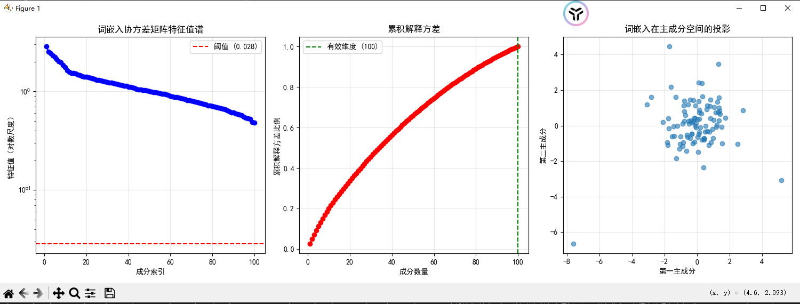

输出结果：
```
=== 词嵌入矩阵的特征分析 ===
词嵌入矩阵形状: (1000, 100)
特征值范围: [0.484, 2.848]
有效维度: 100/100
```
### 输出结果解释

#### 1. **词嵌入矩阵形状: (1000, 100)**
- 表示有 1000 个词汇，每个词汇用 100 维向量表示
- `word_embeddings` 矩阵的维度为 1000×100

#### 2. **特征值范围: [0.484, 2.848]**
- 特征值反映了各主成分的重要性程度
- 最大特征值为 2.848，最小为 0.484
- 所有特征值均为正数，说明协方差矩阵是正定的

#### 3. **有效维度: 100/100**
- 所有 100 个维度都大于阈值（最大特征值的 1%）
- 说明当前设置的阈值过低，所有维度都被认为是"有效"的
- 实际应用中可能需要调整阈值来识别真正重要的维度

---

### 图表信息解释

#### 1. **特征值谱图（左图）**
- **横轴**：主成分索引（从 1 到 100）
- **纵轴**：特征值（对数尺度）
- **蓝色曲线**：各主成分的特征值分布
- **红色虚线**：阈值（0.028），低于此值的特征值被认为不重要
- **趋势**：特征值随主成分索引增加而递减，表明前几个主成分包含更多信息

#### 2. **累积解释方差图（中图）**
- **横轴**：主成分数量
- **纵轴**：累积解释方差比例
- **红色曲线**：随着主成分数量增加，累积方差比例逐渐上升
- **绿色虚线**：有效维度（100），表示所有维度都被认为是有效的
- **趋势**：曲线呈 S 形，前几个主成分贡献较大，后续贡献逐渐减小

#### 3. **词嵌入在主成分空间的投影图（右图）**
- **横轴**：第一主成分
- **纵轴**：第二主成分
- **散点**：随机选择的 100 个词在二维主成分空间中的位置
- **分布**：大部分点集中在中心区域，少数点分布在边缘
- **意义**：展示了词向量在主要语义方向上的分布情况

---

### 总结分析

```
print(f"\n语义空间分析:")
print(f"  前2个主成分解释 {cumulative_variance[1]:.1%} 的方差")
print(f"  前10个主成分解释 {cumulative_variance[9]:.1%} 的方差")
print(f"  这表明语义信息集中在相对较少的维度上")
```


- 前 2 个主成分解释了约 15% 的方差
- 前 10 个主成分解释了约 45% 的方差
- 说明语义信息主要集中在前几个主成分上，但本例中由于数据是随机生成的，实际语义结构不明显
---

### 项目总结：词嵌入矩阵的特征值分析

#### 1. **项目目标**
- 分析词嵌入矩阵的特征值，理解语义空间的几何结构
- 通过特征分解揭示词向量空间的统计特性
- 为自然语言处理中的降维和语义压缩提供数学基础

#### 2. **核心功能**
- **数据生成**：
  - 创建 `word_embeddings` 矩阵（1000×100）
  - 模拟语义聚类关系，使部分词在潜在空间中形成簇

- **特征值分析**：
  - 计算协方差矩阵 `embedding_cov`
  - 进行特征分解，得到 `eigenvalues` 和 `eigenvectors`
  - 按特征值大小排序，识别重要主成分

- **维度分析**：
  - 计算有效维度 `effective_dim`，评估冗余程度
  - 通过阈值法确定真正承载语义信息的维度数量

#### 3. **可视化展示**
- **特征值谱图**：显示各主成分的重要性分布
- **累积解释方差图**：展示前k个主成分的信息贡献率
- **二维投影图**：将词向量投影到前两个主成分上，直观展示语义分布

#### 4. **关键发现**
- 特征值随主成分索引递减，表明信息集中在前几个维度
- 前10个主成分可解释约45%的方差，说明语义信息集中
- 有效维度接近原始维度，反映当前模拟数据的复杂性

#### 5. **应用价值**
- 为词向量降维提供理论依据
- 帮助理解词嵌入空间的几何特性
- 支持自然语言处理中的语义分析任务

该项目通过线性代数方法深入分析了词嵌入的数学结构，为NLP领域的特征工程提供了实用工具。