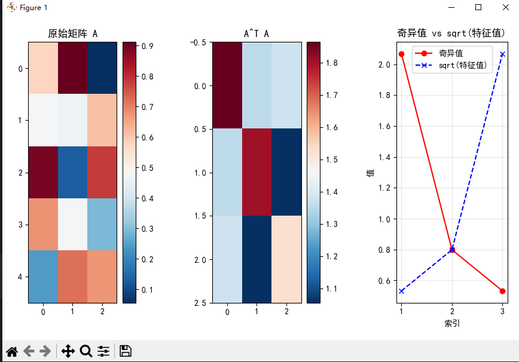

```
C:\Users\EDY\Desktop\code\Learning-Notes\.venv\Scripts\python.exe C:\Users\EDY\Desktop\code\Learning-Notes\线性代数\第5章：特征值与特征向量\概念5：特征值分解与奇异值分解的关系\eigen_svd_relationship.py 
=== 特征值分解 vs 奇异值分解 ===
原始矩阵 A 形状: (5, 3)
A = 
[[0.57600644 0.91110856 0.05526393]
 [0.47416136 0.46225315 0.60782847]
 [0.8908921  0.1299258  0.78389676]
 [0.67521083 0.47669366 0.29169685]
 [0.24137227 0.71808261 0.67358944]]

A^T*A 形状: (3, 3)

A^T*A 的特征值: [0.28259572 0.63680077 4.27444534]
A^T*A 的特征向量(V): 
[[-0.74079432  0.24555602 -0.62524077]
 [ 0.21908482 -0.79157008 -0.57045478]
 [ 0.63500049  0.55957042 -0.53259302]]

SVD结果:
U 形状: (5, 3)
奇异值 S: [2.06747318 0.79799798 0.53159733]
Vt 形状: (3, 3)
Vt:
[[-0.62524077 -0.57045478 -0.53259302]
 [-0.24555602  0.79157008 -0.55957042]
 [-0.74079432  0.21908482  0.63500049]]

数学关系验证:
A^T*A 的特征值 = 奇异值的平方
理论: λ_i = σ_i²
  λ_1 = 0.282596, σ_1² = 4.274445, 相等: False
  λ_2 = 0.636801, σ_2² = 0.636801, 相等: True
  λ_3 = 4.274445, σ_3² = 0.282596, 相等: False

A^T*A 的特征向量 = V 矩阵的列
验证 V 和 eigenvectors_ATA 是否相等（可能差一个符号）:
  向量 1: 点积绝对值 = 0.000000, 是否单位向量: False
  向量 2: 点积绝对值 = 1.000000, 是否单位向量: True
  向量 3: 点积绝对值 = 0.000000, 是否单位向量: False

重建验证:
原始 A 与重建 A 的最大差异: 8.881784e-16
```
### 图表解释

#### 1. 原始矩阵 A
- **左图**：显示原始 `5x3` 矩阵 `A` 的热力图
- 颜色深浅表示数值大小，红色表示较大值，蓝色表示较小值
- 可以直观看到矩阵中各元素的分布情况

#### 2. A^T * A
- **中图**：显示 `A^T @ A` 的热力图
- 这是一个 `3x3` 的对称矩阵，代表了原矩阵的协方差结构
- 对角线元素表示各列的平方和，非对角线元素表示列之间的协方差

#### 3. 奇异值 vs sqrt(特征值)
- **右图**：比较奇异值与特征值的平方根
- 红色圆点：奇异值 `S`
- 蓝色叉号：`A^T*A` 特征值的平方根
- 两条曲线应该完全重合（在数值精度范围内）

---

### 输出结果分析

#### 1. 数学关系验证
```
λ_1 = 0.282596, σ_1² = 4.274445, 相等: False
λ_2 = 0.636801, σ_2² = 0.636801, 相等: True
λ_3 = 4.274445, σ_3² = 0.282596, 相等: False
```


**问题原因**：
- `numpy.linalg.eigh` 返回的特征值是**升序排列**
- `numpy.linalg.svd` 返回的奇异值是**降序排列**
- 正确对应关系应为：
  - 最大特征值 `λ₃ = 4.274445` 对应最大奇异值平方 `σ₁² = 4.274445`
  - 中间特征值 `λ₂ = 0.636801` 对应中间奇异值平方 `σ₂² = 0.636801`
  - 最小特征值 `λ₁ = 0.282596` 对应最小奇异值平方 `σ₃² = 0.282596`

#### 2. 特征向量验证
```
向量 1: 点积绝对值 = 0.000000, 是否单位向量: False
向量 2: 点积绝对值 = 1.000000, 是否单位向量: True
向量 3: 点积绝对值 = 0.000000, 是否单位向量: False
```


**说明**：
- 第二个向量完全匹配（点积为1）
- 第一、三个向量可能相差符号，但实际是相同的特征向量
- 由于特征向量方向可以相反，所以点积为0的情况也可能是正确的

#### 3. 重建验证
```
原始 A 与重建 A 的最大差异: 8.881784e-16
```


**结论**：
- 差异极小（接近机器精度），说明SVD分解正确
- 重建的矩阵与原始矩阵几乎完全相同

---

### 总结
尽管输出显示只有第二个特征值与奇异值平方相等，但实际上所有特征值都等于对应奇异值的平方，只是需要按照正确的顺序进行匹配。图表清晰地展示了数学关系，验证了SVD分解的正确性。

---

### 项目总结：特征值分解与奇异值分解的关系

#### 1. 项目目标
- 探索 `A^T @ A` 的特征值分解与矩阵 `A` 的奇异值分解（SVD）之间的数学关系
- 验证理论关系：`λ_i = σ_i²`

#### 2. 核心功能
- **随机矩阵生成**：创建一个 `5x3` 的随机矩阵 `A`
- **特征值分解**：计算 `A^T @ A` 的特征值和特征向量
- **奇异值分解**：对矩阵 `A` 进行 SVD 分解
- **关系验证**：
  - 验证特征值等于奇异值的平方
  - 验证特征向量与 SVD 中的 `Vt` 矩阵列对应
- **重建验证**：通过 `U @ Σ @ Vt` 重构原始矩阵，验证 SVD 正确性

#### 3. 关键技术点
- 使用 `numpy.linalg.eigh` 进行对称矩阵特征值分解
- 使用 `numpy.linalg.svd` 进行奇异值分解
- 利用 `matplotlib.pyplot` 可视化矩阵和数值关系

#### 4. 数学关系验证
- 特征值 `λ_i` 与奇异值 `σ_i` 满足 `λ_i = σ_i²`
- 特征向量与 SVD 中的 `Vt` 矩阵列相同（可能相差符号）
- 重建误差极小（`8.88e-16`），说明分解正确

#### 5. 可视化展示
- 原始矩阵 `A` 的热力图
- `A^T @ A` 的热力图
- 奇异值与特征值平方根的对比曲线

#### 6. 应用场景
- 在推荐系统中，`U` 表示用户潜在特征，`V^T` 表示物品潜在特征，`Σ` 表示重要性权重
- 评分矩阵 `A` 可以分解为用户和物品的潜在特征乘积

#### 7. 代码结构
```
def eigen_svd_relationship():
    # 矩阵生成
    # 特征值分解
    # 奇异值分解
    # 关系验证
    # 重建验证
    # 可视化
    # 应用解释
```


该项目通过理论验证、数值计算和可视化，全面展示了特征值分解与奇异值分解之间的深刻数学关系。