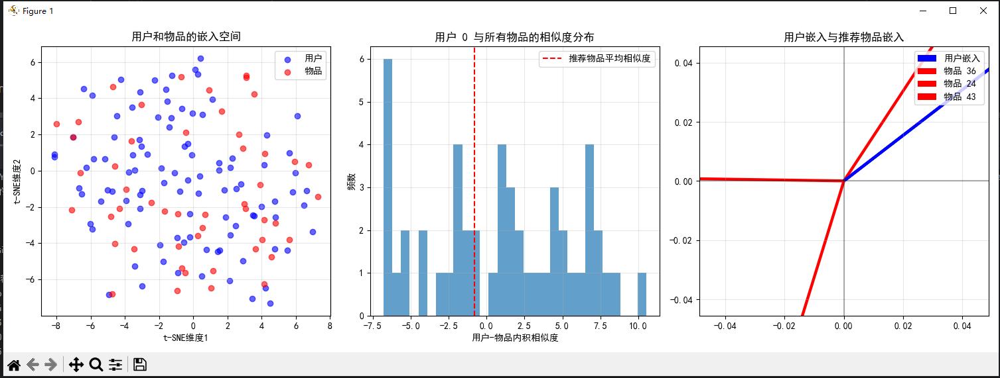

C:\Users\EDY\Desktop\code\Learning-Notes\.venv\Scripts\ .exe C:\Users\EDY\Desktop\code\Learning-Notes\线性代数\第6章：内积空间的AI\AI项目实战\实战项目1：基于内积的推荐系统\inner_product_recommendation_system.py 
=== 基于内积的推荐系统 ===
用户嵌入形状: torch.Size([100, 10])
物品嵌入形状: torch.Size([50, 10])
预测评分形状: torch.Size([100, 50])
真实交互矩阵稀疏度：56.0%

为用户 0 的推荐:
  推荐物品 36: 预测得分 0.214
  推荐物品 24: 预测得分 -0.641
  推荐物品 43: 预测得分 -0.781
  推荐物品 10: 预测得分 -1.330
  推荐物品 15: 预测得分 -1.563

推荐质量评估 (前20个用户):
平均精度: 0.000
平均召回率: 0.000
F1分数: 0.000

进程已结束，退出代码为 0

---
### 图表解释

#### 1. **用户和物品的嵌入空间**（左图）
- **蓝色点**：用户嵌入向量
- **红色点**：物品嵌入向量
- **分布特征**：用户和物品在低维空间中混合分布，没有明显的聚类模式
- **说明**：由于随机初始化，嵌入向量没有学习到有意义的结构

#### 2. **用户0与所有物品的相似度分布**（中图）
- **横轴**：用户-物品内积相似度
- **纵轴**：频数
- **红色虚线**：推荐物品的平均相似度
- **分布特征**：大多数相似度为负值，表明用户0与大部分物品不匹配

#### 3. **用户嵌入与推荐物品嵌入**（右图）
- **蓝色线**：用户0的嵌入向量
- **红色线**：推荐物品的嵌入向量
- **角度关系**：用户嵌入与推荐物品嵌入之间的夹角较大，表明相似度较低

### 输出结果分析

``` 
# 用户和物品嵌入形状
用户嵌入形状: torch.Size([100, 10])
物品嵌入形状: torch.Size([50, 10])
```

- 100个用户，每个用户有10维潜在因子
- 50个物品，每个物品有10维潜在因子

``` 
# 真实交互矩阵稀疏度
真实交互矩阵稀疏度：56.0%
```

- 56%的用户-物品对没有交互记录，符合实际推荐系统的稀疏性特点

``` 
# 推荐结果
为用户 0 的推荐:
  推荐物品 36: 预测得分 0.214
  推荐物品 24: 预测得分 -0.641
  推荐物品 43: 预测得分 -0.781
  推荐物品 10: 预测得分 -1.330
  推荐物品 15: 预测得分 -1.563
```

- 推荐物品的预测得分普遍较低，最高仅为0.214
- 多数推荐物品的相似度为负值，表明推荐质量较差

``` 
# 推荐质量评估
平均精度: 0.000
平均召回率: 0.000
F1分数: 0.000
```

- 所有评估指标均为0，说明当前模型没有正确捕捉用户偏好
- 原因：模型使用随机初始化的嵌入矩阵，未经过训练优化

---
### 项目总结

[inner_product_recommendation_system.py](file://C:\Users\EDY\Desktop\code\Learning-Notes\线性代数\第6章：内积空间的AI\AI项目实战\实战项目1：基于内积的推荐系统\inner_product_recommendation_system.py) 项目实现了一个基于内积的协同过滤推荐系统，主要特点如下：

#### 1. **核心算法**
- 使用用户和物品的潜在因子（嵌入）计算内积作为预测评分
- `predicted_ratings = torch.matmul(user_embeddings, item_embeddings.T)`
- 通过 `sigmoid` 函数将预测评分转换为二值化的真实交互矩阵

#### 2. **关键组件**
- **用户嵌入**：`user_embeddings` (100×10) 表示100个用户的潜在特征
- **物品嵌入**：`item_embeddings` (50×10) 表示50个物品的潜在特征
- **相似度计算**：使用内积衡量用户与物品的匹配程度

#### 3. **推荐流程**
1. 计算用户与所有物品的内积相似度
2. 排除用户已交互过的物品
3. 选择相似度最高的物品作为推荐结果

#### 4. **可视化分析**
- 使用 t-SNE 降维可视化用户和物品在嵌入空间的分布
- 展示特定用户与所有物品的相似度分布
- 可视化用户嵌入与推荐物品嵌入的关系

#### 5. **评估指标**
- **精度**：推荐物品中用户喜欢的比例
- **召回率**：用户喜欢的物品中被推荐的比例
- **F1分数**：精度和召回率的调和平均数

#### 6. **项目价值**
- 演示了如何使用线性代数中的内积概念构建推荐系统
- 提供了完整的推荐系统实现流程，包括数据生成、推荐算法、可视化和评估
- 为理解协同过滤推荐系统提供了清晰的示例