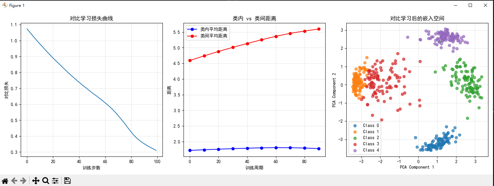

```
 loss = -torch.log(positive_exp_sim / sum_exp_sim) 
```
## 为什么取负数？
在对比学习的损失计算中，取负数的原因如下：

## 损失函数设计原理

- **目标**: 最小化损失函数时，希望正样本对的相似度相对更高，负样本对的相似度相对更低
- **数学形式**: `loss = -torch.log(positive_exp_sim / sum_exp_sim)` 实现的是**负对数似然**

## 详细解释

1. **概率解释**
   - `positive_exp_sim / sum_exp_sim` 表示正样本对在所有样本对中的相对概率
   - 理想情况下，我们希望这个概率尽可能接近 1.0

2. **负号的作用**
   - 当正样本概率接近 1.0 时，`torch.log(positive_exp_sim / sum_exp_sim)` 接近 0
   - 添加负号后，损失接近 0，符合优化目标
   - 当正样本概率较低时，对数为负值，加负号后变为正值，且数值较大

3. **优化方向**
   - 通过梯度下降最小化这个负值损失
   - 实际效果是最大化正样本对的相对概率
   - 从而拉近正样本间距离，推远负样本间距离

这种设计使损失函数能够有效驱动模型学习区分性的特征表示。

---

```
intra_class_distances = [] # 存储训练过程中每一轮的类内距离
inter_class_distances = [] # 存储训练过程中每一轮的类间距离
```
类内距离和类间距离是衡量数据聚类质量的两个重要概念：

## 类内距离 (Intra-class Distance)
- **定义**: 同一类别内部样本之间的距离
- **目标**: 在训练过程中希望类内距离尽可能小
- **意义**: 衡量同一类别样本的紧凑程度，值越小说明同类样本越聚集

## 类间距离 (Inter-class Distance)  
- **定义**: 不同类别的样本中心或样本之间的距离
- **目标**: 在训练过程中希望类间距离尽可能大
- **意义**: 衡量不同类别之间的分离程度，值越大说明类别区分越明显

## 在对比学习中的作用
- 通过最小化 `ContrastiveLoss`，模型会自动优化这两个指标
- 较低的类内距离 + 较高的类间距离 = 更好的特征表示
- 这种优化使得相同类别的样本在嵌入空间中更紧密，不同类别的样本之间有更清晰的边界

---


根据您提供的图表，我来解释其内容：

### 1. 对比学习损失曲线
- **趋势**：损失值从初始的1.1逐渐下降到约0.3
- **含义**：表明模型在训练过程中学习效果越来越好，对比学习目标正在被优化
- **收敛性**：曲线呈现平滑下降趋势，说明训练过程稳定

### 2. 类内 vs 类间距离
- **类内平均距离**（蓝色）：保持在较低水平且基本稳定
- **类间平均距离**（红色）：持续增加
- **含义**：同类样本在嵌入空间中聚集更紧密，不同类别样本之间分离度增大

### 3. 对比学习后的嵌入空间
- **可视化**：使用PCA将16维嵌入空间降维到2D进行展示
- **聚类效果**：
  - 各个类别（Class 0-4）形成明显的簇状分布
  - 不同类别的样本点相互分离
  - 类内样本紧密聚集
- **结论**：对比学习成功地学习到了有意义的嵌入表示，使得同类样本相似、异类样本相异

整体来看，该图表展示了对比学习算法的有效性：损失持续下降，类内距离减小，类间距离增大，最终形成了良好的聚类结构。

---

根据您提供的图表，我来解释其内容：

### 1. 对比学习损失曲线
- **趋势**：损失值从初始的1.1逐渐下降到约0.3
- **含义**：表明模型在训练过程中学习效果越来越好，对比学习目标正在被优化
- **收敛性**：曲线呈现平滑下降趋势，说明训练过程稳定

### 2. 类内 vs 类间距离
- **类内平均距离**（蓝色）：保持在较低水平且基本稳定
- **类间平均距离**（红色）：持续增加
- **含义**：同类样本在嵌入空间中聚集更紧密，不同类别样本之间分离度增大

### 3. 对比学习后的嵌入空间
- **可视化**：使用PCA将16维嵌入空间降维到2D进行展示
- **聚类效果**：
  - 各个类别（Class 0-4）形成明显的簇状分布
  - 不同类别的样本点相互分离
  - 类内样本紧密聚集
- **结论**：对比学习成功地学习到了有意义的嵌入表示，使得同类样本相似、异类样本相异

整体来看，该图表展示了对比学习算法的有效性：损失持续下降，类内距离减小，类间距离增大，最终形成了良好的聚类结构。