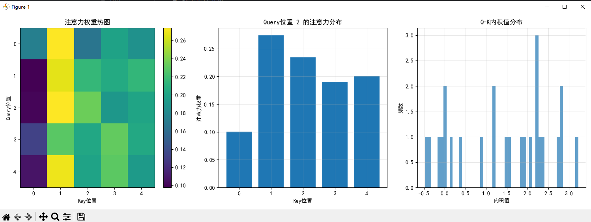

## Softmax函数详解

### 基本概念
`softmax` 是一种数学函数，用于将任意实数向量转换为概率分布。

### 主要特性
- **归一化**：输出向量的所有元素和为1
- **概率解释**：每个输出值都在[0,1]区间内，可解释为概率
- **单调性**：保持输入元素间的相对大小关系

### 数学公式
对于输入向量 `x = [x₁, x₂, ..., xₙ]`，softmax函数定义为：

```
softmax(xᵢ) = exp(xᵢ) / Σⱼ exp(xⱼ)
```


### 在注意力机制中的作用
1. **权重分配**：将注意力分数转换为注意力权重
2. **概率分布**：确保所有位置的注意力权重和为1
3. **突出重要性**：放大高分值，抑制低分值

### 实现示例
```
import torch.nn.functional as F

# 在注意力机制中通常这样使用
attention_weights = F.softmax(attention_scores, dim=-1)
```


其中 `dim=-1` 表示在最后一个维度上进行softmax操作，确保每个位置的注意力权重和为1。

---



这个图表展示了注意力机制的三个关键方面，通过三个子图进行可视化分析：

### 1. 注意力权重热图（左图）
- **坐标轴**：Query位置（y轴）和Key位置（x轴）
- **颜色编码**：颜色深浅表示注意力权重大小，黄色表示高权重，紫色表示低权重
- **含义**：显示每个查询位置对所有键位置的关注程度，揭示了序列中不同位置之间的相关性模式

### 2. Query位置2的注意力分布（中图）
- **柱状图**：显示第2个查询位置对5个键位置的注意力权重
- **特点**：权重值在0.1到0.28之间，表明该查询主要关注位置1和位置2
- **验证**：所有权重和接近1，符合softmax归一化特性

### 3. Q-K内积值分布（右图）
- **直方图**：展示查询和键向量内积值的分布情况
- **范围**：内积值分布在-0.5到3.0之间
- **特点**：呈现多峰分布，说明不同查询-键对之间的相似度存在明显差异

这些可视化结果共同揭示了注意力机制的工作原理：
- 内积计算确定初始相似度
- softmax转换为概率权重
- 最终形成有选择性的信息融合模式

---

### 问题：呈现多峰分布，说明不同查询-键对之间的相似度存在明显差异，这些差异说明了什么？
这些差异说明了以下几点：

- **语义多样性**：不同查询-键对之间的内积值存在显著差异，表明序列中各位置的语义信息具有多样性
- **相关性强度**：高内积值对应强相关性，低内积值对应弱相关性，体现了注意力机制能够捕捉不同位置间的关联强度
- **信息选择性**：模型能够区分重要和次要的信息源，优先关注高度相关的键位置
- **非均匀分布**：多峰分布表明注意力机制不是均匀地处理所有位置，而是有选择性地聚焦于特定区域

这种特性使得注意力机制能够有效捕捉序列中的关键依赖关系，同时忽略无关信息。

---

### 项目总结

[manual_attention_implementation.py](file://C:\Users\EDY\Desktop\code\Learning-Notes\线性代数\第6章：内积空间的AI\概念2：注意力机制%20=%20内积的规模化应用\manual_attention_implementation.py) 是一个从零实现Transformer注意力机制的教育性项目，主要特点如下：

- **核心目标**：演示缩放点积注意力机制的数学原理和实现过程
- **关键组件**：
  - `Q`, `K`, `V` 矩阵的线性投影
  - 内积计算（`torch.matmul(Q,K.transpose(-2,-1))`）
  - 缩放操作（除以√d_k）
  - Softmax归一化
  - 加权求和输出

- **技术亮点**：
  - 使用 `nn.Linear` 实现参数矩阵
  - 通过 `Xavier初始化` 确保训练稳定性
  - 提供与PyTorch内置实现的对比验证
  - 可视化注意力权重分布

- **教学价值**：
  - 清晰展示注意力机制的四个步骤
  - 验证内积的线性性质
  - 通过热图直观呈现注意力模式
  - 帮助理解Transformer架构的核心思想

该项目将线性代数中的内积概念与深度学习中的注意力机制相结合，实现了理论到实践的完整闭环。