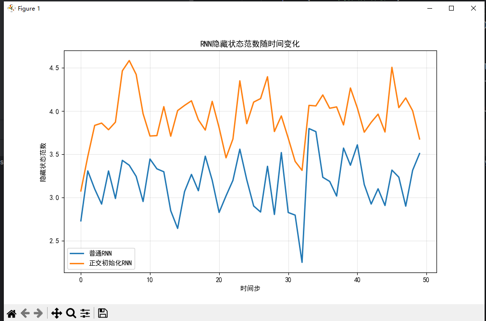

这个图表展示了RNN隐藏状态范数随时间步的变化情况，具体表示了以下内容：

- **横轴**：时间步（从0到50），表示RNN在不同时间点的序列长度
- **纵轴**：隐藏状态范数，表示RNN隐藏层向量的长度或能量

两条曲线分别代表：
- **蓝色线**：普通RNN的隐藏状态范数变化，显示出较大的波动和不稳定性
- **橙色线**：正交初始化RNN的隐藏状态范数变化，表现出更平滑和稳定的趋势

该图表直观地说明了正交初始化对RNN训练的重要性：
1. 普通RNN的隐藏状态范数波动剧烈，可能导致梯度爆炸或消失问题
2. 正交初始化RNN能更好地保持隐藏状态的稳定性，有助于缓解长期依赖问题
3. 正交初始化通过保持权重矩阵的正交性，使得信息在时间维度上传播时更加稳定

---

### 项目总结

[orthogonality_in_deep_learning.py](file://C:\Users\EDY\Desktop\code\Learning-Notes\线性代数\第6章：内积空间的AI\概念3：正交性与模型正则化\orthogonality_in_deep_learning.py) 项目系统地探索了**正交性**在深度学习中的三个关键应用：

#### 1. 正交初始化
- **核心方法**：使用 `torch.nn.init.orthogonal_` 对权重矩阵进行初始化
- **数学原理**：正交矩阵保持向量长度和角度不变，有助于缓解梯度消失/爆炸问题
- **验证方式**：通过比较随机初始化与正交初始化的 `W@W^T` 与单位矩阵的偏差来验证效果

#### 2. 正交正则化
- **实现方式**：在损失函数中添加正交约束项
- **计算公式**：`||W@W^T - I||_F^2`（弗罗贝尼乌斯范数）
- **实验设计**：对比不同正则化强度（λ=0.0, 0.001, 0.01）对模型训练的影响

#### 3. RNN中的正交性
- **应用场景**：RNN隐藏状态的稳定性分析
- **对比实验**：
  - 普通RNN（默认初始化）
  - 正交初始化RNN（`nn.init.orthogonal_`）
- **评估指标**：隐藏状态范数随时间步的变化趋势

### 项目价值
- **理论联系实际**：将线性代数中的正交性概念应用于深度学习实践
- **可视化分析**：通过图表直观展示正交性带来的稳定性提升
- **教学意义**：为理解深度学习中的初始化和正则化技术提供了清晰的示例