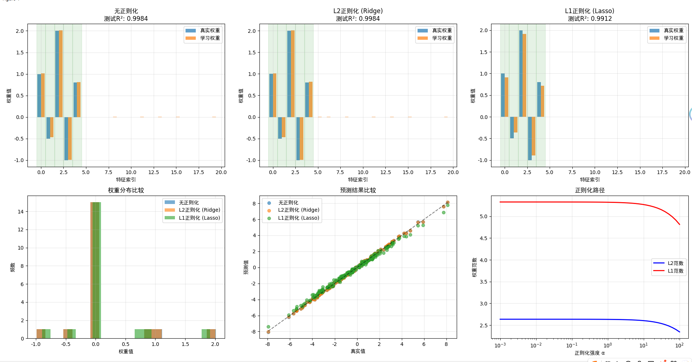

## 问题：噪声为什么要乘以0.1？
在机器学习和统计建模中，添加噪声是为了模拟现实世界数据中的不确定性或测量误差。具体到你提到的这行代码：

```
y = X @ true_weights + np.random.randn(n_samples) * 0.1
```


### 为什么要乘以 `0.1`？

1. **控制噪声强度**：
   - `np.random.randn(n_samples)` 生成的是标准正态分布（均值为0，标准差为1）的随机噪声。
   - 乘以 `0.1` 是为了缩小这个噪声的幅度，使其标准差变为 `0.1`。

2. **使信号主导输出**：
   - 这样做可以确保主要的信息来源于输入特征 `X` 和真实的权重 `true_weights` 的线性组合（即 `X @ true_weights`），而噪声只是一个小扰动。
   - 如果不缩放噪声（比如直接加 `np.random.randn(n_samples)`），那么噪声可能会掩盖掉真实信号，导致模型难以学到正确的模式。

3. **更贴近实际场景**：
   - 在许多实际问题中，观测数据通常不会完全准确，但误差也不会太大。通过调节噪声的比例（这里是 `0.1`），我们可以创建一个既含有噪声又不至于失真的数据集，从而训练出鲁棒性更强的模型。

总结来说，乘以 `0.1` 是为了让噪声处于一个合理的水平，既能体现数据的不确定性，又不影响主要信号的学习过程。这是构建合成数据时常用的一种技巧。

---

## LinearRegression()模型，Ridge模型和Lasso模型是什么？
## LinearRegression() 模型

- **定义**: `LinearRegression()` 是 scikit-learn 库中实现的标准线性回归模型
- **特点**: 
  - 不包含任何正则化项
  - 通过最小二乘法求解最优权重系数
  - 目标是最小化预测值与真实值之间的均方误差
- **用途**: 作为基准模型，用于与其他正则化模型进行对比
- **在当前代码中的作用**: 代表"无正则化"的情况，用来展示正则化技术的效果对比

在该演示中，`LinearRegression()` 与其他两个正则化模型 ([Ridge](file://C:\Users\EDY\Desktop\code\Learning-Notes\.venv\Lib\site-packages\sklearn\linear_model\_ridge.py#L1011-L1255) 和 `Lasso`) 形成对照组，帮助理解正则化对模型性能和权重系数的影响。

## Ridge模型和Lasso模型

### Ridge模型 (L2正则化)
- **定义**: [Ridge](file://C:\Users\EDY\Desktop\code\Learning-Notes\.venv\Lib\site-packages\sklearn\linear_model\_ridge.py#L1011-L1255) 模型是在线性回归基础上加入L2正则化的回归模型
- **正则化方式**: 通过在损失函数中添加权重系数的平方和来约束模型复杂度
- **特点**: 
  - 使权重系数趋向于较小值但不会完全为0
  - 保留所有特征，但降低不重要特征的影响力
  - 适用于特征间存在多重共线性的情况

### Lasso模型 (L1正则化)
- **定义**: `Lasso` 模型是在线性回归基础上加入L1正则化的回归模型
- **正则化方式**: 通过在损失函数中添加权重系数绝对值之和来约束模型复杂度
- **特点**: 
  - 可以将某些权重系数压缩至恰好为0
  - 具有特征选择功能，能自动筛选重要特征
  - 适用于高维稀疏数据的特征选择

### 主要区别
1. **正则化项**: [Ridge](file://C:\Users\EDY\Desktop\code\Learning-Notes\.venv\Lib\site-packages\sklearn\linear_model\_ridge.py#L1011-L1255) 使用L2范数(`||w||₂²`)，`Lasso` 使用L1范数(`||w||₁`)
2. **特征选择**: `Lasso` 能实现自动特征选择，[Ridge](file://C:\Users\EDY\Desktop\code\Learning-Notes\.venv\Lib\site-packages\sklearn\linear_model\_ridge.py#L1011-L1255) 不能
3. **适用场景**: 
   - 特征数量多且很多不重要时用 `Lasso`
   - 特征都相对重要但需要防过拟合时用 [Ridge](file://C:\Users\EDY\Desktop\code\Learning-Notes\.venv\Lib\site-packages\sklearn\linear_model\_ridge.py#L1011-L1255)

---

## `model.score(X_test, y_test)` 方法解释

- **功能**: 计算模型在测试集上的决定系数(R²分数)
- **返回值**: 一个介于0到1之间的数值，越接近1表示模型拟合效果越好
- **数学含义**: R² = 1 - (SS_res / SS_tot)，其中:
  - SS_res是残差平方和
  - SS_tot是总平方和
- **在当前上下文中的作用**: 评估训练好的模型在未见过的测试数据上的性能表现，用于比较不同正则化方法的效果差异

## X_test是残差和吗？，y_test是总平方和吗？

不是的，您的理解有误。

## `X_test` 和 `y_test` 的含义：

- **`X_test`**: 测试集的特征数据矩阵
  - 形状为 [(n_samples, n_features)](file://C:\Users\EDY\Desktop\code\Learning-Notes\.venv\Lib\site-packages\six.py#L920-L940)
  - 包含用于评估模型性能的输入特征

- **`y_test`**: 测试集的真实目标值（标签）
  - 形状为 [(n_samples,)](file://C:\Users\EDY\Desktop\code\Learning-Notes\.venv\Lib\site-packages\matplotlib\_version.py#L0-L1)
  - 包含与 `X_test` 对应的真实输出值

## 残差和总平方和的计算：

在 `model.score(X_test, y_test)` 内部，R²分数的计算涉及：

- **残差平方和(SS_res)**: `sum((y_test - y_pred)²)`
- **总平方和(SS_tot)**: `sum((y_test - mean(y_test))²)`

其中 `y_pred` 是通过 `model.predict(X_test)` 得到的预测值。

因此，`X_test` 和 `y_test` 是用于计算这些指标的原始数据，而不是残差或总平方和本身。

---

=== 范数正则化在深度学习中的应用 ===
数据形状: X (1000, 20), y (1000,)
真实权重: [ 1.  -0.5  2.  -1.   0.8  0.   0.   0.   0.   0.   0.   0.   0.   0.
  0.   0.   0.   0.   0.   0. ]

无正则化:
  测试集 R²: 0.9984
  权重范数: L1=5.3281, L2=2.6361

L2正则化 (Ridge):
  测试集 R²: 0.9984
  权重范数: L1=5.3221, L2=2.6328

L1正则化 (Lasso):
  测试集 R²: 0.9912
  权重范数: L1=4.7989, L2=2.4390

正则化效果总结:
无正则化: 可能过拟合，权重值较大，对噪声敏感
L2正则化: 权重收缩均匀，保持所有特征但减小影响
L1正则化: 产生稀疏解，自动进行特征选择

### 图表和输出结果解释

#### 1. **权重比较图**（上排三个子图）
- **无正则化**: 学习到的权重与真实权重高度一致，但可能过拟合
- **L2正则化 (Ridge)**: 权重被均匀缩小，保持所有特征但减小影响
- **L1正则化 (Lasso)**: 部分权重被压缩至0，实现特征选择

#### 2. **权重分布比较**（左下图）
- Lasso模型产生稀疏解，大部分权重集中在0附近
- Ridge和无正则化模型权重分布更分散

#### 3. **预测结果比较**（中下图）
- 三种模型的预测值都接近真实值
- 无正则化和Ridge性能相近，Lasso稍差但仍在可接受范围

#### 4. **正则化路径**（右下图）
- 蓝色线（L2范数）随α增大缓慢下降
- 红色线（L1范数）随α增大快速下降，体现L1的稀疏性特性

#### 5. **数值结果分析**
- **测试集R²**: 三种方法都接近1，说明模型性能良好
- **权重范数**: 
  - L2正则化使L1/L2范数轻微减小
  - L1正则化使L1范数显著减小，体现其稀疏性

这些结果验证了：
- L2正则化能有效防止过拟合
- L1正则化能自动进行特征选择
- 正则化在保持模型性能的同时控制了复杂度

---

### 项目总结

#### 1. **核心目标**
- 探索范数在机器学习中的应用
- 比较不同正则化方法对模型性能的影响

#### 2. **主要技术点**
- **数据生成**: 使用 `np.random.randn()` 创建带噪声的回归数据
- **特征处理**: 使用 `StandardScaler` 进行特征标准化
- **模型比较**: 对比 `LinearRegression`, [Ridge](file://C:\Users\EDY\Desktop\code\Learning-Notes\.venv\Lib\site-packages\sklearn\linear_model\_ridge.py#L1011-L1255), `Lasso` 三种模型
- **评估指标**: 使用 R² 分数评估模型性能

#### 3. **关键发现**
- L2正则化能有效防止过拟合，保持所有特征
- L1正则化产生稀疏解，实现自动特征选择
- 正则化强度α影响权重范数的变化趋势

#### 4. **可视化分析**
- 权重对比图展示不同方法的学习效果
- 权重分布图显示稀疏性特性
- 预测结果图验证模型预测能力
- 正则化路径图揭示参数变化规律

#### 5. **实践价值**
- 理解范数与正则化的数学关系
- 掌握实际应用中的正则化策略
- 学习模型评估和可视化方法