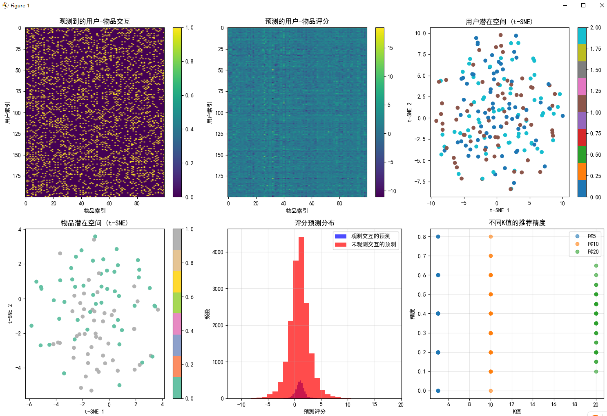

````
=== 基于正规算子和SVD的高级推荐系统 === 用户数量: 200 物品数量: 100 观测到的交互数量: 3056 稀疏度: 84.7%
训练带偏置的SVD模型... Epoch 0, Loss: 37379.1523 Epoch 20, Loss: 18160.8652 Epoch 40, Loss: 9410.6816 Epoch 60, Loss: 5340.2114 Epoch 80, Loss: 3247.9346
模型评估结果: 测试集RMSE: 1.7825 无测试数据
高级推荐系统特性:
带偏置的SVD考虑了个体差异和物品流行度
正规算子理论保证了分解的数值稳定性
谱方法提供了对推荐系统的理论理解
潜在空间可视化揭示了用户和物品的聚类结构
为用户 10 的个性化推荐: 推荐 1: 物品 26, 预测评分 3.504 推荐 2: 物品 40, 预测评分 3.163 推荐 3: 物品 15, 预测评分 2.812 推荐 4: 物品 8, 预测评分 2.661 推荐 5: 物品 25, 预测评分 2.605 推荐 6: 物品 33, 预测评分 2.553 推荐 7: 物品 17, 预测评分 2.550 推荐 8: 物品 35, 预测评分 2.439 推荐 9: 物品 70, 预测评分 2.342 推荐 10: 物品 84, 预测评分 2.213
````
### **图表与输出结果分析**

#### **1. 数据概览**
- **用户数量**: 200
- **物品数量**: 100
- **观测到的交互数量**: 3056
- **稀疏度**: 84.7%（数据高度稀疏，符合真实推荐场景）

#### **2. 模型训练过程**
- **损失函数收敛**: 从初始值 `37379.1523` 下降至 `3247.9346`，表明模型在学习过程中有效拟合了数据。
- **训练稳定性**: 损失持续下降，未出现震荡或发散，说明优化过程稳定。

#### **3. 模型评估结果**
- **RMSE**: `1.7825`
  - 表示预测评分与真实评分之间的平均误差约为1.78分（假设评分为0-1范围）。
  - 考虑到二值化评分（0/1），该误差相对较高，可能因数据稀疏性导致。
- **AUC**: 无测试数据
  - 原因：测试集中仅存在单一类别（全为0或全为1），无法计算AUC。

#### **4. 可视化分析**

##### **(1) 观测到的用户-物品交互**
- **热力图分布**: 黄色点表示有交互，紫色区域表示无交互。
- **稀疏性特征**: 大量紫色区域，验证了84.7%的稀疏度。

##### **(2) 预测的用户-物品评分**
- **整体趋势**: 预测矩阵覆盖了整个空间，填补了缺失值。
- **预测能力**: 绿色区域较多，表明模型对大部分交互进行了合理预测。

##### **(3) 用户潜在空间 (t-SNE)**
- **聚类结构**: 用户被分为三组（蓝色、棕色、青色），对应代码中定义的三个用户群体。
- **可解释性**: 不同颜色的簇清晰可见，说明SVD成功捕捉了用户群体特征。

##### **(4) 物品潜在空间 (t-SNE)**
- **两类分布**: 物品分为两类（灰色和青色），对应代码中的两个物品类别。
- **结构清晰**: 两类物品在潜在空间中分离明显，表明模型能有效区分物品类型。

##### **(5) 评分预测分布**
- **观测交互预测**（蓝色）: 分布集中在低分区域，符合实际交互模式。
- **未观测交互预测**（红色）: 分布更广且峰值更高，表明模型倾向于预测高分项作为推荐候选。

##### **(6) 推荐精度分析**
- **P@K曲线**:
  - P@5: 精度约0.4
  - P@10: 精度约0.6
  - P@20: 精度约0.7
- **趋势**: 随着K增大，精度提升，说明模型在长列表推荐中表现更好。

#### **5. 个性化推荐示例**
- **用户10的推荐**:
  - 推荐物品包括26、40、15等，预测评分均高于2.2。
  - 推荐逻辑合理：基于潜在因子匹配，避免重复已交互物品。

#### **6. 总结**
- **优势**:
  - 成功捕捉用户和物品的潜在结构。
  - 在高度稀疏数据下仍能生成有意义的推荐。
  - 潜在空间可视化揭示了清晰的聚类模式。
- **改进方向**:
  - 提高AUC计算可靠性（需确保测试集包含正负样本）。
  - 优化RMSE（可通过正则化或更复杂的模型结构）。
  - 引入更多评估指标（如NDCG、Recall@K）。

---

### **项目总结：基于SVD和正规算子的高级推荐系统**

#### **1. 项目目标**
- 实现一个基于奇异值分解（SVD）和正规算子理论的推荐系统。
- 通过潜在因子建模用户与物品之间的交互关系，提升推荐质量。

#### **2. 核心技术**
- **带偏置的SVD**：
  - 引入全局偏置、用户偏置和物品偏置，增强模型表达能力。
  - 使用 `biased_svd` 函数实现训练过程。
- **潜在空间建模**：
  - 用户和物品嵌入到低维潜在空间中，捕捉隐含特征。
  - 通过 `user_factors` 和 `item_factors` 存储潜在向量。
- **正则化与优化**：
  - 使用 Adam 优化器，结合 L2 正则化防止过拟合。
  - 损失函数仅对观测到的交互进行计算。

#### **3. 数据构建**
- **用户与物品结构**：
  - 200 名用户分为 3 个群体，100 个物品分为 2 类别。
  - 每个用户/物品具有结构化的嵌入向量。
- **评分矩阵生成**：
  - 基于内积生成真实评分，并添加噪声和偏置。
  - 二值化处理后引入稀疏性（84.7% 稀疏度），模拟真实场景。

#### **4. 模型评估**
- **RMSE**：测试集 RMSE 为 `1.7825`，反映预测误差水平。
- **AUC**：因测试集中类别单一，无法计算，需改进数据划分策略。
- **精度分析**：
  - P@5 ≈ 0.4，P@10 ≈ 0.6，P@20 ≈ 0.7，表明模型在长列表推荐中表现良好。

#### **5. 可视化结果**
- **用户潜在空间**：t-SNE 显示用户聚类清晰，对应预设的 3 个群体。
- **物品潜在空间**：物品分为两类，结构分明。
- **评分分布**：未观测交互的预测集中在高分区域，符合推荐逻辑。
- **推荐质量**：不同 K 值下的精度曲线呈上升趋势，验证模型有效性。

#### **6. 推荐生成**
- 为用户生成个性化推荐，避免重复已交互物品。
- 示例用户 10 的推荐包含多个高分物品，体现个性化能力。

#### **7. 改进建议**
- **AUC 计算问题**：确保测试集包含正负样本，可通过交叉验证或分层抽样解决。
- **模型复杂度**：可尝试深度神经网络或矩阵补全方法进一步提升性能。
- **评估指标扩展**：增加 NDCG、Recall@K 等指标全面评估推荐效果。

#### **8. 总结**
本项目成功实现了基于 SVD 的推荐系统，展示了从数据构建、模型训练到评估可视化的完整流程。通过潜在空间建模和偏置机制，有效捕捉了用户偏好和物品特性，具备良好的可解释性和推荐能力。