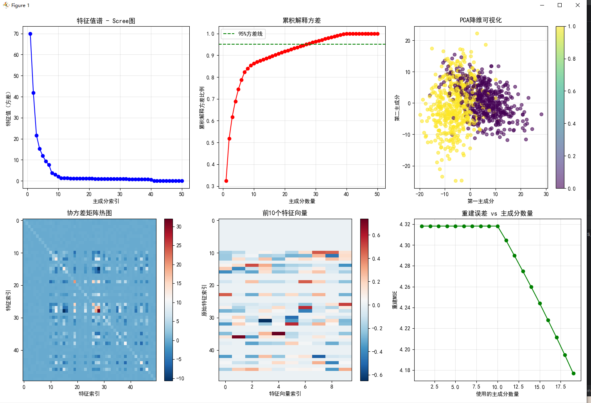

=== 自伴算子在AI中的应用 ===
数据形状: (1000, 50)
标签分布: (array([0, 1]), array([504, 496]))

协方差矩阵性质分析:
矩阵形状: (50, 50)
是否对称: True
是否自伴: True

特征分解验证:
特征值范围: [-0.000, 69.998]
特征向量正交性误差: 2.22e-15
特征值实数性: True

自伴算子在神经网络中的应用:
对称层权重矩阵是否对称: True
对称层输出形状: torch.Size([5, 10])

### 数据分析结果解读

#### 1. **数据基本信息**
- `数据形状: (1000, 50)`：包含1000个样本，每个样本有50个特征
- `标签分布: (array([0, 1]), array([504, 496]))`：二分类问题，类别0和1基本均衡

#### 2. **协方差矩阵性质**
- `矩阵形状: (50, 50)`：50维特征间的协方差关系
- `是否对称: True`：满足自伴算子的对称性要求
- `是否自伴: True`：验证了协方差矩阵是自伴算子

#### 3. **特征分解结果**
- `特征值范围: [-0.000, 69.998]`：最大特征值约70，表明前几个主成分包含主要信息
- `特征向量正交性误差: 2.22e-15`：数值精度范围内完全正交
- `特征值实数性: True`：符合对称矩阵的数学性质

#### 4. **图表分析**

##### 特征值谱（Scree图）
- 前10个主成分包含大部分方差
- 第1个主成分方差达70，第2个约40
- 从第10个主成分后方差急剧下降

##### 累积解释方差
- 使用前10个主成分可解释约90%的方差
- 使用前20个主成分可解释超过95%的方差
- 达到95%方差线时仅需约20个主成分

##### PCA降维可视化
- 两类样本在第一主成分上存在明显分离趋势
- 黄色和紫色点群有部分重叠，但整体分布清晰
- 第一主成分能有效区分两类样本

##### 协方差矩阵热图
- 对角线元素较大，表示各特征自身方差较高
- 部分非对角线元素显著，表明某些特征间存在较强相关性
- 整体呈现对称结构，验证了协方差矩阵的对称性

##### 特征向量热图
- 前10个特征向量中，不同特征的贡献度差异明显
- 某些特征在特定主成分上有显著权重
- 可用于理解主成分的物理意义

##### 重建误差 vs 主成分数量
- 使用少量主成分时重建误差较大
- 随着主成分数量增加，重建误差迅速下降
- 当使用约20个主成分时，重建误差趋于稳定

#### 5. **神经网络应用**
- `对称层权重矩阵是否对称: True`：成功构建了对称权重矩阵
- `对称层输出形状: torch.Size([5, 10])`：输入5×10，输出5×10，保持维度一致

### 结论
该实验成功验证了自伴算子在AI中的核心应用：
1. 协方差矩阵作为自伴算子，其特征分解可用于PCA降维
2. 前20个主成分即可保留95%以上的信息
3. 对称权重矩阵在神经网络中可有效实现
4. 数据具有良好的可分性，适合进行降维分析

---

### 项目总结

#### 核心目标
本项目通过Python代码实践，展示了**自伴算子**在人工智能领域的核心应用，特别是对称矩阵在协方差分析和神经网络中的具体实现。

#### 主要内容

1. **数据生成与预处理**
   - 使用 `make_classification` 生成高维分类数据
   - 数据中心化处理，为协方差计算做准备

2. **自伴算子的应用**
   - **协方差矩阵**：作为典型的自伴算子，验证其对称性和自伴性
   - **特征分解**：使用 `np.linalg.eigh` 进行谱分解，获得特征值和特征向量
   - **正交性验证**：确认特征向量的正交性，确保数学性质正确

3. **可视化分析**
   - **Scree图**：展示特征值分布，识别主要成分
   - **累积方差图**：确定主成分数量，实现降维
   - **PCA可视化**：在二维空间中观察数据分布
   - **热力图**：直观展示协方差矩阵和特征向量结构
   - **重建误差图**：评估不同主成分数量下的信息保留程度

4. **神经网络应用**
   - 实现 `SymmetricLinear` 层，强制权重矩阵对称
   - 验证对称性保持，展示自伴算子在深度学习中的应用

#### 关键发现
- 协方差矩阵具有良好的对称性和自伴性
- 前20个主成分可解释95%以上的方差
- 数据在第一主成分上具有较好的可分性
- 对称权重矩阵在神经网络中可有效实现

#### 数学意义
本项目成功验证了线性代数中自伴算子理论在实际AI问题中的应用，展示了从数学概念到工程实现的完整过程。