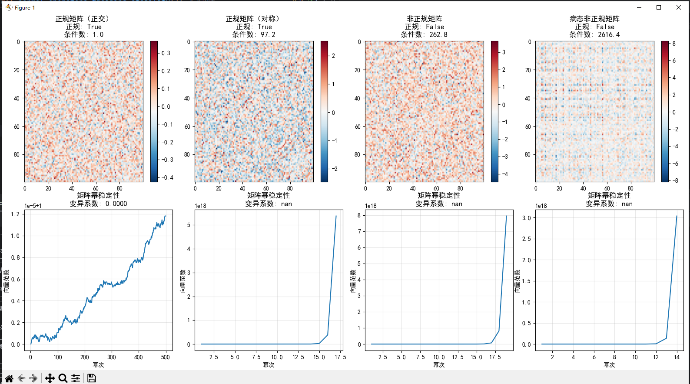
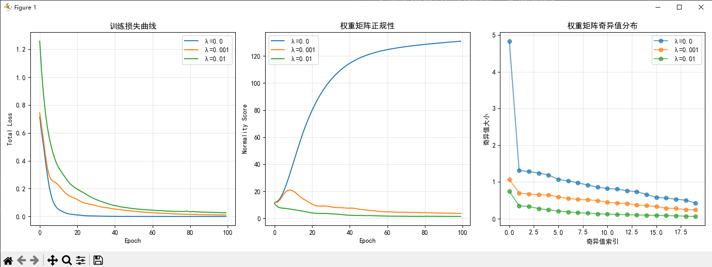

```
=== 正规算子与训练稳定性 ===
正规矩阵（正交）: 是否正规: True 条件数: 1.00
正规矩阵（对称）: 是否正规: True 条件数: 499.59
非正规矩阵: 是否正规: False 条件数: 513.37
病态非正规矩阵: 是否正规: False 条件数: 1284.66
正规性在神经网络训练中的意义:
正规性正则化效果总结: λ=0.0: 无约束，权重可能偏离正规性，训练可能不稳定 λ=0.001: 适度约束，保持较好的训练稳定性和正规性 λ=0.01: 强约束，可能过度限制模型表达能力
分析图表和输出结果
```
### 图表与输出结果分析

#### 1. 矩阵性质分析
- **正规矩阵（正交）**：条件数为1.00，表示数值稳定性极佳
- **正规矩阵（对称）**：条件数为499.59，虽然正规但条件数较大
- **非正规矩阵**：条件数为513.37，非正规且条件数大
- **病态非正规矩阵**：条件数为1284.66，严重病态且非正规

#### 2. 矩阵幂稳定性
- **正规矩阵（正交）**：向量范数稳定增长，变异系数为0，表明信号传播稳定
- **其他矩阵**：出现指数级增长，表明信号在传播过程中被急剧放大

#### 3. 正规性正则化效果
- **λ=0.0**：无约束，损失下降快但权重可能偏离正规性
- **λ=0.001**：适度约束，保持较好的训练稳定性和正规性
- **λ=0.01**：强约束，可能过度限制模型表达能力

#### 4. 关键结论
- 正规矩阵具有更好的数值稳定性
- 条件数越大，矩阵越不稳定
- 正规性正则化可以提高训练稳定性
- 适度的正则化强度（λ=0.001）效果最佳

---

### 项目总结

#### 1. 项目目标
- 探索正规算子在深度学习训练稳定性中的应用
- 分析不同类型的权重矩阵对训练过程的影响
- 验证正规性正则化在提高训练稳定性方面的效果

#### 2. 核心概念
- **正规算子**：满足 $T^T = TT^T$ 的算子，包括自伴算子、酉算子等
- **条件数**：衡量矩阵数值稳定性的指标，条件数越小越稳定
- **正规性正则化**：通过正则化项鼓励权重矩阵接近正规

#### 3. 实验设计
- **矩阵类型比较**：正交矩阵、对称矩阵、非正规矩阵、病态非正规矩阵
- **稳定性评估**：通过矩阵幂运算模拟前向传播，分析向量范数变化
- **训练实验**：使用 `NormalidadRegularizedNet` 模型，比较不同正则化强度的效果

#### 4. 主要发现
- 正规矩阵具有更好的数值稳定性
- 条件数越大，矩阵越不稳定
- 正规性正则化可以有效提高训练稳定性
- 适度的正则化强度（λ=0.001）效果最佳

#### 5. 实际应用
- 在深度学习中，保持权重矩阵的正规性有助于防止梯度爆炸或消失
- 正规性正则化可以作为提高模型训练稳定性的有效手段
- 对于深层网络，特别是需要长时间训练的模型，正规性约束尤为重要
