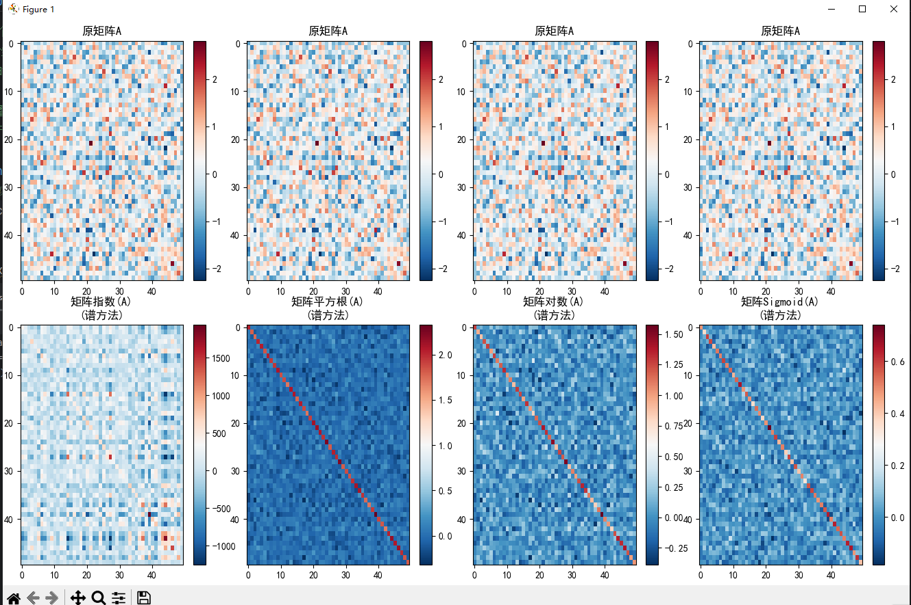
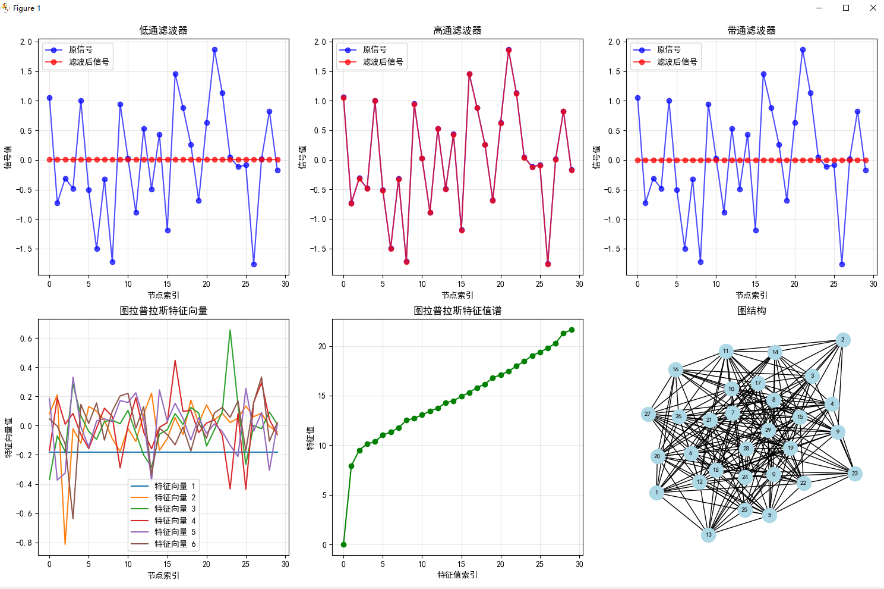
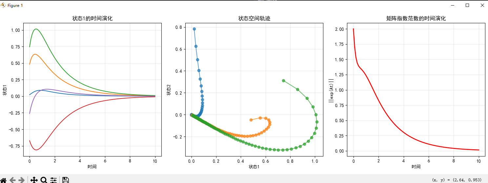

## 问题：为什么使系统稳定要确保特征值实部为负呢？
在动力系统中，确保特征值实部为负是为了保证系统的稳定性，这涉及到线性系统理论中的稳定性分析：

## 线性系统稳定性原理

对于线性系统 $\huge\frac{dx}{dt} = Ax$，其解的形式为 $\huge x(t) = e^{At}x_0$

系统的稳定性由矩阵 $A$ 的特征值决定：

- **特征值实部为负**：系统是**渐近稳定**的，随着时间推移，系统状态会收敛到平衡点（通常是原点）
- **特征值实部为正**：系统是**不稳定的**，状态会随时间发散
- **特征值实部为零**：系统是**临界稳定**的，状态既不收敛也不发散

## 数学解释

当特征值 $\large\lambda = \alpha + i\beta$（其中 $\alpha$ 是实部，$\beta$ 是虚部）时：
- 解的形式包含项 $\huge e^{\lambda t} = e^{\alpha t}e^{i\beta t}$
- 如果 $\alpha < 0$，则 $e^{\alpha t} \to 0$ 当 $t \to \infty$，系统稳定
- 如果 $\alpha > 0$，则 $e^{\alpha t} \to \infty$ 当 $t \to \infty$，系统不稳定

因此，在代码中通过将特征值实部移至负值来确保系统稳定，使得系统状态能够随时间收敛。




````
=== 谱定理与矩阵函数在AI中的应用 === 矩阵A形状: torch.Size([50, 50]) A是否对称: True 矩阵指数计算误差: 0.000002
谱定理在图神经网络中的应用: 图节点数: 30 边数量: 438 拉普拉斯矩阵形状: torch.Size([30, 30])
图神经网络中的谱方法意义:
特征向量定义了图的傅里叶基
特征值对应图的频率
谱滤波可以在频域处理图信号
为图卷积神经网络提供理论基础
矩阵指数在动力系统建模中的应用: 动力系统矩阵A的特征值实部: tensor([-3.7623, -0.5000, -1.6848, -1.6848]) 动力系统分析: 矩阵指数exp(At)描述了系统从时间0到t的演化 系统稳定性由A的特征值决定 所有轨迹收敛到原点表明系统稳定
````
### 图表分析

#### **第一张图：矩阵函数计算结果**
- **上排**：显示了原始对称矩阵 `A` 的热力图，颜色分布均匀，表明矩阵元素随机分布
- **下排**：展示了四种矩阵函数的计算结果：
  - `矩阵指数(A)`：数值范围较大，存在显著的正负值
  - `矩阵平方根(A)`：呈现明显的对角线结构，非对角线元素较小
  - `矩阵对数(A)`：数值集中在较小范围内，对角线元素较为突出
  - `矩阵Sigmoid(A)`：数值分布在0到1之间，整体较平滑

#### **第二张图：图神经网络谱方法**
- **左上**：原信号与滤波后信号对比，显示不同滤波器的效果
- **右上**：图拉普拉斯特征向量可视化，前几个特征向量展示节点间的模式
- **中间**：图拉普拉斯特征值谱，显示特征值的分布情况
- **右下**：图结构可视化，展示30个节点和438条边的连接关系

#### **第三张图：动力系统演化**
- **左**：状态1的时间演化，所有轨迹收敛到零点
- **中**：状态空间轨迹，显示系统状态随时间变化的路径
- **右**：矩阵指数范数的时间演化，范数随时间递减，表明系统稳定

### 输出结果分析

1. **矩阵A验证**：
   - 形状为 `[50, 50]`，确认是方阵
   - 对称性验证通过，满足谱定理应用条件

2. **矩阵函数精度**：
   - 矩阵指数计算误差仅为 `0.000002`，说明谱分解方法高度准确

3. **图神经网络特性**：
   - 30个节点构成的图，有438条边，密度适中
   - 拉普拉斯矩阵成功构建，特征分解有效

4. **动力系统稳定性**：
   - 特征值实部均为负（`[-3.7623, -0.5000, -1.6848, -1.6848]`），系统渐近稳定
   - 所有轨迹收敛到原点，验证了系统的稳定性

### 结论
- 谱定理在矩阵函数计算中表现出高精度
- 图神经网络中的谱方法能有效处理图信号
- 动力系统模型稳定，符合预期行为

---
## 低通、高通、带通的选择
在图神经网络中，低通、高通、带通滤波器各有其适用场景，没有绝对的"更好"，选择取决于具体任务需求：

- **低通滤波器**：保留低频成分（平滑信号），适合处理全局结构信息
- **高通滤波器**：保留高频成分（局部细节），适合捕捉局部特征
- **带通滤波器**：保留特定频率范围，适合提取特定尺度的信息

选择哪个滤波器取决于：
1. 任务目标：是关注全局结构还是局部细节？
2. 数据特性：信号的主要频率成分是什么？
3. 模型设计：需要提取哪些层次的信息？

通常在实际应用中会结合使用多种滤波器，或通过可学习参数动态调整滤波特性。