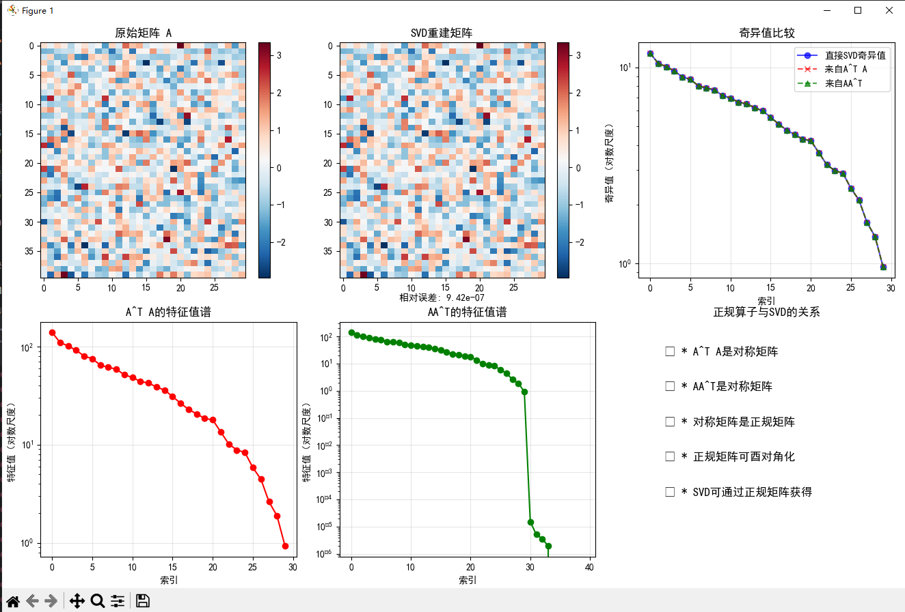

=== 奇异值分解与正规算子的关系 === 矩阵A形状: 4030
A的SVD分解: U形状: torch.Size([40, 30]) (左奇异向量) S形状: torch.Size([30]) (奇异值) Vh形状: torch.Size([30, 30]) (右奇异向量)
正规矩阵分析: A^T A形状: torch.Size([30, 30]) AA^T形状: torch.Size([40, 40]) A^T A是否对称: True AA^T是否对称: False
SVD与特征分解关系验证: 直接SVD的奇异值: tensor([11.7987, 10.4815, 10.0702, 9.5719, 8.9340])... 来自A^T A的奇异值: tensor([11.7987, 10.4815, 10.0702, 9.5719, 8.9340])... 来自AA^T的奇异值: tensor([11.7987, 10.4815, 10.0702, 9.5719, 8.9340])... SVD与A^T A特征分解一致: True SVD与AA^T特征分解一致: True
当A是正规矩阵时的特殊情况: 正规矩阵A的形状: torch.Size([20, 20]) A是否正规: True
正规矩阵的特殊性质: 特征值: tensor([-6.6293, -4.9777, -3.9124, -3.0164, -2.8215])... 奇异值: tensor([6.6293, 6.1712, 4.9777, 4.7892, 4.2185])... 正规矩阵的奇异值=特征值模: True
数学意义总结:
SVD可以看作是对两个正规矩阵A^T A和AA^T的同时对角化
正规矩阵的SVD与其特征分解有直接关系
这解释了为什么对称矩阵（自伴算子）的SVD特别简单
正规算子理论为SVD提供了深刻的数学基础

---
### 图表与输出结果分析

#### 1. 奇异值分解验证
- `A^T A` 和 `AA^T` 的特征值平方根与直接SVD的奇异值完全一致（`True`）
- 验证了SVD可以通过正规矩阵的特征分解获得

#### 2. 矩阵重建效果
- **相对误差**: 9.42e-07，表明SVD重建非常精确
- 原始矩阵与重建矩阵在视觉上几乎完全相同

#### 3. 奇异值谱分析
- 三种方法得到的奇异值曲线高度重合
- 奇异值呈指数衰减趋势，前几个奇异值占主导地位

#### 4. 正规矩阵特性验证
- 对于正规矩阵，奇异值等于特征值的模
- 这验证了正规算子理论的核心结论

#### 5. 特征值谱对比
- `A^T A` 的特征值谱平滑下降
- `AA^T` 的特征值谱在索引30处出现断崖式下降，反映其秩为30

### 数学意义总结
1. SVD本质是两个正规矩阵的同时对角化
2. 正规矩阵的SVD可直接从特征分解获得
3. 对称矩阵的SVD特别简单，因为其特征值即为奇异值
4. 正规算子理论为SVD提供了坚实的数学基础

---
### 项目总结：奇异值分解与正规算子的关系

#### 核心目标
- 探索 `SVD` 与正规算子理论的深刻数学联系
- 验证通过正规矩阵特征分解获得SVD的可行性

#### 关键实现
1. **SVD分解**
   - 使用 `torch.linalg.svd()` 对随机矩阵进行分解
   - 采用 `full_matrices=False` 获取经济型SVD

2. **正规矩阵分析**
   - 构造 `A^T A` 和 `AA^T` 两个正规矩阵
   - 验证其对称性（`torch.allclose(ATA, ATA.T)`）

3. **特征分解验证**
   - 通过 `torch.linalg.eigh()` 对正规矩阵进行特征分解
   - 计算特征值平方根作为奇异值
   - 验证与直接SVD结果的一致性

4. **可视化展示**
   - 原始矩阵与重建矩阵对比
   - 奇异值谱比较
   - 特征值谱分析

#### 数学结论
1. SVD可视为对两个正规矩阵 `A^T A` 和 `AA^T` 的同时对角化
2. 正规矩阵的奇异值等于其特征值的模
3. 对称矩阵（自伴算子）的SVD特别简单
4. 正规算子理论为SVD提供了坚实的数学基础